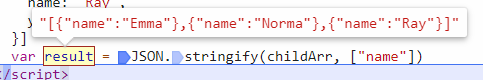

# JSON

JSON 的属性必须是加双引号（单引号也不行），值可以是任意类型

## JSON.Stringfy(内容, 过滤, 缩进)

对象转字符串

过滤可以是个数组，可以是个函数。

```js
var childArr = [
  {
    name: 'Emma',
    year: 12
  },
  {
    name: 'Norma',
    year: 12
  },
  {
    name: 'Ray',
    year: 12
  }
]
var result = JSON.stringify(childArr, ['name'])
```



缩进可以提高可读性  
只缩进不过滤

```js
JSON.stringify(childArr, undefined, 2)
```

## JSON.parse

JSON 字符串转对象  
[序列化限制](./006_complex_data.md#序列化对象)
