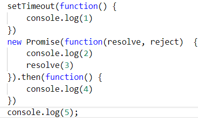
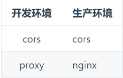
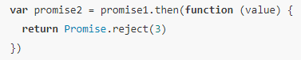
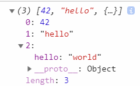

# 单线程与异步编程

## 任务队列

setTimeout 的第二个参数告诉浏览器要经过多久时间放到任务队列里。

经过这个时间，如果任务队列为空，立刻执行，否则等任务队列的其他代码执行后再执行 setTimeout


JS 是单线程的。

根据执行顺序进入队列，只要进程处于空闲状态，就会尽快执行队列里的代码

### 事件模型

事件（比如 click），只有当点击的时候才会把事件对应的函数放到任务队列内

### 回调模式

以 NodeJS 读取文件为例。readFile 会立刻进入任务队列，等到读取结束以后的，触发的回调才进入任务队列

```js
readFile('example.txt', function(err, contents) {
  if (err) {
    throw err
  }
  console.log(contents)
})
console.log('Hi!')
```

### macro task 与 micro task

以下事件属于宏任务：

- setInterval()

- setTimeout()

- ajax

- 鼠标键盘事件

以下事件属于微任务

Promise.then

- 当前执行栈执行完毕时会立刻先处理所有微任务队列中的事件，然后再去宏任务队列中取出一个事件。同一次事件循环中，微任务永远在宏任务之前执行。

- 所有 setTimeout()的回调都会进入到 setTimeout 任务队列，所有 then()回调都会进入到 then 队列




## 同源策略

源（origin）就是协议、域名和端口号

地址里面的协议（比如 HTTP 何 HTTPS）、域名和端口号均相同则属于同源

同源策略是浏览器的一个安全功能，不同源的客户端脚本在没有明确授权的情况下，不能读写对方资源。所以 a.com 下的 js 脚本采用 ajax 读取 b.com 里面的文件数据是会报错的

### 限制

- Cookie、web storage 和 IndexedDB 无法读取。

- DOM 无法获得。

- AJAX 请求不能发送。

不受同源策略限制的：

- 页面中的链接，重定向以及表单提交是不会受到同源策略限制的。

- 跨域资源的引入是可以的。但是 js 不能读写加载的内容。如嵌入到页面中的`<script src="..."></script>`，``，`<link>`，`<iframe>`等。

### 原因

虽然请求跨域了，实际上还是发出请求了

跨域是为了阻止用户读取到另一个域名下的内容，Ajax 可以获取响应，浏览器认为这不安全，所以拦截了响应。但是表单并不会获取新的内容，所以可以发起跨域请求

### 安全

#### CSRF(Cross-Site Request Forgery)跨站点请求伪造

比如用 get 请求的时候，url 里面是能看到参数的，比如 xxx?id=2

任何人都可以拿到甚至自己修改 id 是 3，服务器需要验证请求者是否有权限这个 url

构造出一个后端请求地址，诱导用户点击或者通过某些途径自动发起请求。如果用户是在登录状态下的话，后端就以为是用户在操作，从而进行相应的逻辑

- 解决方案

以 SSL 连接

每次请求都要带验证码。

get 改成 post 也没有用，使用 cookie 也不行，可以伪造

#### XSS

跨站脚本攻击，主要是前端层面的，用户在输入层面插入攻击脚本，改变页面的显示，或则窃取网站
cookie

预防方法：不相信用户的所有操作，对用户输入进行一个转义，不允许 js 对 cookie
的读写

### 解决跨域

跨域大概可以分为 iframe 的跨域和纯粹的跨全域请求

1. CORS（cross-origin resource sharing）跨域资源共享

利用自定义的 HTTP 头部让浏览器和服务器之间沟通

返回头里设置`Access-Control-Allow-Origin`，如果值是\*，那么可以接收任意域名的请求。否则要与与请求头(request
headers)中 Origin 一致才能生效

虽然设置 CORS 和前端没什么关系，但是通过这种方式解决跨域问题的话，会在发送请求时出现两种情况，分别为简单请求和复杂请求

- demo

服务端返回时增加响应头

Access-Control-Allow-Origin 前端的域名

Access-Control-Allow-Credentials true

Access-Control-Allow-Methods: GET POST PUT OPTIONS PATCH（运行跨域的请求类型）

Access-Control-Expose-Headers 允许前端发送的额外请求头

比如 NodeJS， [Express](../express/02_demo.md)

```js
require('http')
  .createServer((req, res) => {
    res.writeHead(200, {
      'Access-Control-Allow-Origin': 'http://localhost:8080'
    })
    res.end('这是你要的数据：1111')
  })
  .listen(3000, '127.0.0.1')
```

- 简单请求

以 Ajax 为例，当满足以下条件时，会触发简单请求

1.  使用下列方法之一：

GET，HEAD，POST

2.  HTTP 的头信息不超出以下几种字段

- Accept

- Accept-Language

- Content-Language

- Last-Event-ID

- Content-Type

3.  Content-Type 的值仅限于下列三者之一：

text/plain, multipart/form-data, application/x-www-form-urlencoded

不满足以上条件就会触发复杂请求

- 复杂请求

复杂请求来说，首先会发起一个预检请求，该请求是 option 方法的，通过该请求来知道服务端是否允许跨域请求。

- OPTIONS

可能对服务器数据产生副作用的 HTTP 请求方法

2. cookie

CORS 请求默认不发送 Cookie 和 HTTP 认证信息

如果要把 Cookie 发到服务器

1.  服务器设置 Access-Control-Allow-Credentials 是 true

2.  XMLHttpRequest 设置 withCredentials 为 true

```js
var xhr = new XMLHttpRequest()
xhr.withCredentials = true
```

3.  Access-Control-Allow-Origin 不可以是`*`，必须是具体的域名

#### 缺点

只支持 IE10+

3. JSONP(JSON with Padding)

本质上就是返回函数立即执行

利用 script 标签

script 不受限制，可以让服务器在 js 内返回内容

前台参数传递?func=xxx

后台接收 func 参数，返回函数

- demo

```html
<script>
  function jsonpCallback(data) {
    alert('获得 X 数据:' + data.x)
  }
</script>
<script src="http://127.0.0.1:3000?callback=jsonpCallback"></script>
```

- 缺点

  - 只能用在 get

  - 不能解决 iframe 之间的通信

4. 服务器代理

比如 NodeJs + webpack。比如 nginx

http-proxy-middleware

webpack 内置，可以使用 proxy 进行代理



- NodeJS demo

```js
const url = require('url')
const http = require('http')
const https = require('https')
//访问topics去请求cnodejs的API
const server = http
  .createServer((req, res) => {
    const path = url.parse(req.url).path.slice(1)
    if (path === 'topics') {
      https.get('https://cnodejs.org/api/v1/topics', resp => {
        let data = ''
        resp.on('data', chunk => {
          data += chunk
        })
        resp.on('end', () => {
          res.writeHead(200, {
            'Content-Type': 'application/json; charset=utf-8'
          })
          res.end(data)
        })
      })
    }
  })
  .listen(3000, '127.0.0.1')
```

5. WebSocket

只能传送简单的文本，JSON 要转成字符串

事件有 open, close, error, message。不支持 addEventListener

```js
let socket = new WebSocket('ws:35.201.238.65')
const messgae = {
  hell: 'world'
}
socket.send(JSON.stringify(messgae))
socket.onmessage(msg => {
  console.log(msg)
})
```

## XMLHttpRequest

Asynchronous JavaScript and XML（异步的 JavaScript 和 XML）

```js
let xhr = new XMLHttpRequest()
xhr.onreadystatechange = function() {
  if (xhr.readyState === 4) {
    // 4表示整个请求过程已经完毕.
    if ((xhr.status >= 200 && xhr.status < 300) || xhr.status === 304) {
      // 200 表示一个成功的请求
      alert(xhr.responseText) // 文本形式的内容
    }
  }
}
xhr.onerror = function() {
  //
}
xhr.open('GET', 'http://www.example.org/some.file', true) //true为异步，不写默认为true
xhr.send(null) //发送给服务的参数。比如查询条件
```

### 属性

#### readyState

请求/响应的活动阶段。0 表示还没调用 open, 4 表示接收到所有数据

#### timeout

毫秒为单位，超出后自动终止

`xhr.timeout = 2000;`

#### withCredentials

CORS 的情况下为 true 表示请求会携带 cookie

xhr.withCredentials = true;

### 方法

#### open

- get

url 如果要传参，都需要进行 encodeURIComponent 编码

- post

- 区别

浏览器后退时 get 无害，post 会重新提交请求

get 能被缓存，post 不能缓存

get 有长度限制，因为 url 有限制（由浏览器决定）。post 没有

get 只允许 ASCII 字符，post 编码类型无限制，可以用二进制

#### send

send 可以是字符串.send("hello")，也可以是对象{key: value}

#### setRequestHeader

设置头部

`xhr.setRequestHeader("MyHead", "MyValue")`

- Content-Type

设置 MIME 类型

#### abort

终止

### 其他

参考[知乎](https://zhuanlan.zhihu.com/p/25778815)

### demo

```js
let xhr = new XMLHttpRequest()
export function ajax(options) {
  let {
    url,
    type = 'GET',
    responseType = 'text',
    callback,
    data = null
  } = options
  if (!url) {
    return false
  }
  xhr.abort()
  xhr.responseType = responseType
  xhr.onreadystatechange = () => {
    if (xhr.readyState === 4) {
      // 4表示整个请求过程已经完毕.
      if ((xhr.status >= 200 && xhr.status < 300) || xhr.status === 304) {
        // 200 表示一个成功的请求
        callback({
          success: true,
          data: xhr.response
        })
      }
    }
  }
  xhr.onerror = err => {
    callback({
      success: false,
      data: err
    })
  }
  xhr.open(type, url, true) //true为异步，不写默认为true
  xhr.send(data)
}
```

#### postMessage

可以用在 service worker

## Promise

在 Promise 中无论是 then 还是 catch 方法，都会返回返回一个新的 Promise 对象



假如 then 函数执行返回 this 调用对象本身，那么 promise2 === promise1，promise2
状态也应该等于 promise1
。但是 promise2 是 reject，但是状态是不能改变的，所以应该是一个新的 Promise 对象

### 生命周期

以进行态(pending state)开始，表示未结束。处于 pending 状态的 promise 认为是未处理的(unsettled)

异步操作结束后，认为是已处理的 settled，已处理可分为两种状态

内部的 `[[PromiseState]]` 属性会被设置为 "pending" 、 "fulfilled" 或 "rejected"

- 已完成(fulfilled): 成功结束

- 已拒绝(rejected): 未成功结束，可能是一个错误，或由其他原因导致。

### then 与 catch

then 接受两个参数，第一个是 fulfilled 时调用，第二个是 rejected 时调用

catch 等于 then 的第二个调用

### 链式调用

返回值做为下一个 promise 的输入值

```js
const promise = new Promise((resolve, reject) => {
  reject('hello') //可以是resolve
})
promise
  .catch(value => {
    //resolve时改为then
    console.log(value) //"hello"
    return value + 'world'
  })
  .then(value => {
    console.log(value) // "helloworld"
  })
```

### Promise.all()

有一个被 reject 就不会进 p4 的 then

```js
let p1 = new Promise(function(resolve, reject) {
  resolve(42)
})
let p2 = new Promise(function(resolve, reject) {
  resolve('hello')
})
let p3 = new Promise(function(resolve, reject) {
  resolve({
    hello: 'world'
  })
})
let p4 = Promise.all([p1, p2, p3])
p4.then(value => {
  console.log(value)
})
```



### Promise.race()

看 resolve 和 reject 谁先进，then 和 catch 只会二选一

有一个 resolve 就立刻进 then，值只有最先 resolve 的值

有一个 reject 就立刻进 catch

```js
let p1 = new Promise(function(resolve, reject) {
  resolve(42)
})
let p2 = new Promise(function(resolve, reject) {
  resolve('hello')
})
let p3 = new Promise(function(resolve, reject) {
  reject({
    hello: 'world'
  })
})
let p4 = Promise.race([p1, p2, p3])
p4.then(value => {
  console.log(value) //42，不是数组
}).catch(value => {
  console.log(value) //不进
})
```

## Fetch

请求资源的接口

Fetch 提供了对 Request 和 Response（以及其他与网络请求有关的）对象的通用定义，除了 window 对象外还可以用在`service workers`、`Cache API`、又或者是其他处理请求和响应的方式

返回一个 promise 对象

两种写法

- fetch(url , options)

- fetch(Request 实例)

### reject 的情况

仅当网络故障时或请求被阻止时，才会标记为 reject

也就是即使服务器返回 500 或者 404 等等，也还是进 resolve

### options

`*`表示默认值

```js
fetch(url, {
  body: JSON.stringify({ answer: 42 }), // 请求头，和content-type格式要对应
  cache: 'no-cache', // *default, no-cache, reload, force-cache, only-if-cached
  credentials: 'same-origin', // include, same-origin, *omit
  headers: {
    'user-agent': 'Mozilla/4.0 MDN Example',
    'content-type': 'application/json'
  },
  method: 'POST', // *GET, POST, PUT, DELETE, etc.
  mode: 'cors', // no-cors, cors, *same-origin
  redirect: 'follow', // manual, *follow, error
  referrer: 'no-referrer' // *client, no-referrer
}).then(response => response.json()) // parses response to JSON
```

#### credentials

请求是否携带 cookie, 默认"omit"不带

### Headers

可以在 request 请求中被发送或者在 response 请求中被接收

request.headers/response.headers

[MDN](https://developer.mozilla.org/zh-CN/docs/Web/API/Headers)

```js
let myHeaders = new Headers({
  'Access-Control-Allow-Origin': '*',
  'Content-Type': 'text/plain'
})
```

- 增加：append(key, value)

```js
myHeaders.append('Content-Type', 'text/plain')
```

- 修改：set(key, value)

- 删除：delete(key)

- 获取：get(key)获取单个, getAll()获取所有

### Request

new Request(url, options)

options 不传, 默认 method 是"GET",

```js
const myRequest = new Request('http://localhost/flowers.jpg')
fetch(myRequest).then(response => response.json())
```

#### options

完整属性见[MDN](https://developer.mozilla.org/zh-CN/docs/Web/API/Request)

```js
const myRequest = new Request('http://localhost/api', {
  method: 'POST',
  body: '{"foo":"bar"}'
})
```

### Response

[MDN](https://developer.mozilla.org/zh-CN/docs/Web/API/Response)

在 service workder 内通常都是 new Response(响应内容, options);

```js
new Response('<h1>Service Unavailable</h1>', {
  status: 503,
  statusText: 'Service Unavailable',
  headers: new Headers({
    'Content-Type': 'text/html'
  })
})
```

#### options

- status: response 的状态码, 例如:200.

- statusText: 和状态码关联的状态消息, 例如: OK.

- headers: Headers 对象，对应 HTTP 的 header

#### response.headers

值是 Headers 对象

例如

```js
fetch(myRequest).then(function(response) {
  if (response.headers.get('content-type') === 'application/json') {
    return response.json().then(function(json) {
      // process your JSON further
    })
  } else {
    console.log("Oops, we haven't got JSON!")
  }
})
```

#### response.clone()

多次使用同一个 response，需要调用 clone 进行复制

```js
fetch(request).then(function(response) {
  cache.put(request, response.clone())
  return response
})
```

### 跨域

只能用 CORS，和 XMLHttpRequest 一样

```js
let myHeaders = new Headers({
  'Access-Control-Allow-Origin': '*',
  'Content-Type': 'text/plain'
})
fetch(url, {
  method: 'GET',
  headers: myHeaders,
  mode: 'cors'
}).then(res => {
  // TODO
})
```
