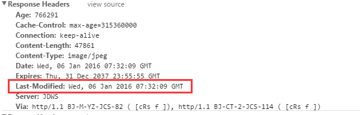

# 离线和存储

## 缓存

分为传统的浏览器缓存（通过 HTTP header）设置和 CacheStorage

传统缓存不能编程

CacheStorage 经常和 service worker()一起用，可以用 JS 进行增删改查

### 缓存读取优先级

1.  Service Worker

2.  Memory Cache（内存中的缓存）

- 一旦关闭 Tab 页面，内存中的缓存也就被释放了。由浏览器自己决定放什么文件在 Memory Cache

3.  Disk Cache（存储在硬盘中的缓存）

4.  Push Cache

- HTTP/2 才存在

5.  网络请求

### 传统的浏览器缓存


#### 缓存策略

分为强缓存和协商缓存

都是通过设置 HTTP Header 实现

1. 强缓存

state code 为 200

- Expires

绝对时间，GMT 格式

1.  第一次请求时，服务器返回 Expires 在 Header 中，浏览器缓存这个 header 信息

2.  当下次再次请求这个资源时，浏览器以请求的时间与这个 Expires 中的时间比对。如果小于这个时间，说明未过期，直接从本地缓存中获取，请求返回 200（from
    cache）

因为是绝对时间，可能浏览器和服务器存在时差

- Cache-Control

（优先级高，HTTP/1.1 以上）：相对时间。

1.  第一次请求时，服务器在 response header 中添加头 Cache-Control 的设置

浏览器接收到这个资源后，连同这个 header 和本次请求的时间缓存在浏览器端

2.  下一次再请求这个资源时，浏览器根据上一次请求的时间，这次请求的时间的时间差，去 Cache-control 中设置的时间差比较，如果小于 Cache-Control 中设置的时间差，那么说明未过期，直接从本地缓存中取，请求返回 200（from cache）

Cache-Control:max-age=5184000

2. 协商缓存

缓存过期了，就需要发起请求验证资源是否有更新。

- Last-Modified

配合 Cache-Control 使用



1.  浏览器在第一次访问资源时，服务器返回资源的同时，在 response header 中添加
    Last-Modified 的 header，值是这个资源在服务器上的最后修改时间，浏览器接收后缓存文件和 header

2.  浏览器下一次请求这个资源，浏览器检测到有
    Last-Modified 这个 header，于是添加 If-Modified-Since 这个 header，值是 Last-Modified 中的值

3.  服务器再次收到这个资源请求，根据 If-Modified-Since
    中的值与服务器中这个资源的最后修改时间对比

    - 如果没有变化，返回 304 和空的响应体

    - 如果 If-Modified-Since 的时间小于服务器中这个资源的最后修改时间，说明文件有更新，于是返回新的资源文件和 200

缺点：

- GMT 格式最多到秒，如果 1 秒内被修改多次的话，不能及时更新；

- 服务器只对比最后修改时间，会出现一种情况：只是文件重新生成，内容其实并没有变化

- ETag

解决 Last-Modified 的问题，配合 Cache-Control 使用

由服务器返回，内容为资源的唯一标识，生成规则由服务器决定

1.  客户端请求一个页面（A）。

2.  服务器返回页面 A，并在给 A 加上一个 ETag，值是这个资源的唯一标识，由服务器端生成。

3.  客户端展现该页面，并将页面连同 ETag 一起缓存。

4.  客户再次请求页面 A，并将上次请求时服务器返回的 ETag 一起传递给服务器。

5.  服务器检查该 ETag，并判断出该页面自上次客户端请求之后还未被修改，直接返回响应 304 和一个空的响应体

#### 用户行为与缓存

- 用户在地址栏回车、页面链接跳转、新开窗口、前进后退时，缓存是有效的

- 用户在点击浏览器刷新或按 F5 时，Last-Modified/Etag
  是有效的，但 Expires、Cache-Control 重置失效

- 用户在强制刷新按 Ctr+F5 时，缓存全部失效

#### 使用场景

- 频繁变动的资源，设置 Cache-Control: no-cache
  使浏览器每次都请求服务器，然后配合 ETag 或者 Last-Modified
  来验证资源是否有效

- 其他，打包时生成哈希值，代码变更才产生新文件，并让新文件进行强缓存 Cache-Control

### 应用缓存(application cache)

#### manifest file

描述文件中列出的都是需要下载的资源，准备离线时使用

使用 manifest 属性指定路径

```html
<html lang="en" manifest="./offline.manifest"></html>
```

## 数据存储

### cookie

Cookie: key1=value1;key2=value2;

一般浏览器长度限制是 4095B

默认关闭浏览器以后失效，也可以自己指定 expires=GMT 时间

没有设置过期时间被称为 Session cookie/内存 cookie，存在浏览器内存中

设置过期时间后被称为 Persistent cookie，存在硬盘里


#### 共享

跨域不共享。

不跨域的情况下会包含在请求中，一起发送给服务器

一级域名相同，只是二级域名不同，浏览器允许通过设置 document.domain 共享 Cookie

比如 A 网页是http://w1.example.com，B网页是http://w2.example.com

JS 可以设置 document.domain = 'example.com';

服务端可以返回

Set-Cookie: key=value; domain=.example.com; path=/

#### js 中

document.cookie

key 不区分大小写，key 和 value 需要进行编码。

取值需要进行解码，赋值前要 encodeURIComponent 编码


赋值直接 document.cookie="key1=value1;key2=value2"

实际上是累加效果，并不是覆盖 document.cookie 原本的值


### web storage

只能存字符串。存在硬盘中

各个浏览器支持情况可以看<http://dev-test.nemikor.com/web-storage/support-test/>

#### 共有属性/方法

- clear()

清除所有内容


- getItem(key)

也可以直接 storage.key 来获取


- removeItem(key)

- setItem(key)

也可以直接 storage.key 赋值

#### sessionStorage

只保持到浏览器关闭

#### localStorage

用户清除浏览器缓存后失效

隐私模式下关闭浏览器就被清除

#### 对比


### IndexedDB

Indexed Database API，事务型对象存储数据库

除非手动清理，否则一直存在。没有大小限制

- 事务型：一个事务中，要么操作都成功，要么操作都失败。

例如 A 转账给 B，实际上拆分成两部，A 扣钱，B 加钱。

两个步骤不能拆分，只有都做了才算成功。有一个失败另一个也要失败。

不会出现一个成功一个失败的结果

- 对象存储数据库 NoSQL：存储对象，不是存储表

- 同源策略

- 异步操作，通过回调

```js
let request = window.indexedDB.open('admin') //创建/打开一个名为"admin"的数据库
request.onerror = event => {
  console.log(event)
}
request.onsuccess = event => {
  console.log(event)
}
```

- open(name, version)

不存在，则创建；已存在，直接打开

第二个参数用来指定数据库版本号。

如果再次 open 的时候版本号大于之前，会触发 upgradeneeded 事件

- onerror

event.target 指向 request

- onsuccess

打开后触发 success

event.target 指向 request

event.target.result 中指向数据库实例对象

- onupgradeneeded

- 实例方法

实例也就是 event.target.result

- createObjectStore(name, options)

```js
request.onupgradeneeded = function(event) {
  var db = event.target.result
  db.createObjectStore('customers', {
    keyPath: 'passport_number'
  })
}
```

- options

keyPath:
设置索引是对象的 key，key 是唯一的。不能再调事务的 add 方法新增相同的 key。只能用 put 修改原有 key 的值。称为
inline key

autoIncrement：单独设置索引，也就是 key 和索引是分开的。称为 out-of-line key。

比如一个 JSON 数组，每个数据里面的 key 都是相同的，这个数据的每一项要创建唯一的索引值，就可以用 autoIncrement

- transaction(name, mode)

创建事务

`db.transaction("customers", "readwrite");`

表示可以读写的事务，事务名是 customers

mode 的默认值是 readonly

IndexedDB 中进行的大部分操作都是事务型的

在添加数据到对象存储之前，需要启动一个新的事务

```js
var request = window.indexedDB.open("my-database", 2);
request.onsuccess = function (event) {
  var db = event.target.result;
  var customerData = [{
      "passport_number": "6651"
      "name": "Tal"
}];
  var customerTransaction = db.transaction("customers", "readwrite");
  customerTransaction.onerror = function (event) {
    console.log("Error: ", event.target.error);
  };
  var customerStore = customerTransaction.objectStore("customers");
  for (var i = 0; i < customerData.length; i++) {
    customerStore.add(customerData[i]);
  }
};
```

#### 存储对象的方法

存储对象指上面的 customerStore

方法有

新增 add

修改 put

获取 get

删除 delete(key)

清空 clear()

- 游标

用 get 获取数据必须要知道 key

用游标相当于是遍历。

openCursor(index): 打开具体的索引

另外也可以设置模糊查询

continue()表示前进到下一个（也就是 for 里面的计数器 i++）

advance()表示后退

```js
var objectStore = db.transaction('customers').objectStore('customers')
objectStore.openCursor().onsuccess = function(event) {
  var cursor = event.target.result
  if (cursor) {
    alert('Name for SSN ' + cursor.key + ' is ' + cursor.value.name)
    //每次成功continue就会触发openCursor().onsuccess
    //即使获取到的cursor是falsy的值
    cursor.continue()
  } else {
    alert('No more entries!')
  }
}
```

- 设置索引范围

比如以字母 C 开头的所有记录的游标，不包括以 D 开始的记录

```js
exchangeIndex.openCursor(IDBKeyRange.bound('C', 'D', false, true))
```

- 设置遍历方向

默认遍历升序，openCursor 传入第二个参数"prev"，则会从最后开始（也就是 for 循环的 i 从 length 开始）

exchangeStore.openCursor(null, "prev");

- 更新

```js
var cursor = event.target.result;
  if (!cursor) {
    return;
  }
  var customer = cursor.value;
  if (customer.first_name === "Archie") {
    //游标的方法更新
    customer.first_name = "Archer";
    cursor.update(customer);
  } else {
    //实例的方法更新
    customer.first_name = "Tom";
    customerStore.put(customer);
  }
  cursor.continue();
};
```
