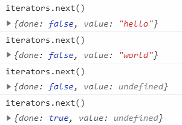
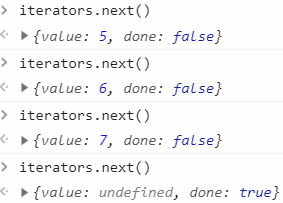
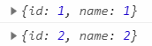
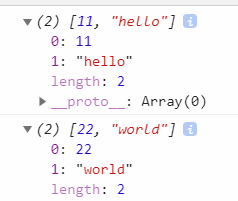
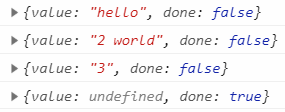
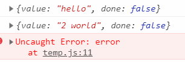
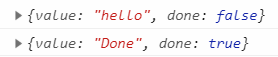
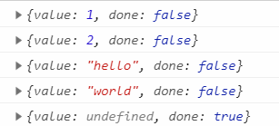

# 迭代器和生成器

为了解决循环变量（for 里面用来++的 i）

## Iterators

都拥有 next 方法

next()调用时返回一个对象，对象有两个属性：

- value 代表下一个值

- done 代表是否完成，是个布尔值。 true 时表示没有下一个 value 可以 return 了

### ES5 简单实现

```js
function Iterators(items) {
  var i = 0
  return {
    next: function() {
      var done = items.length < i
      var value = !done ? items[i++] : undefined
      return {
        done: done,
        value: value
      }
    }
  }
}
```



## Generators

返回迭代器的函数，也就是用来生成迭代器

- 函数名前面加`*`表示是一个生成器。可以作为对象的方法

- 可以使用`yield`关键字， yield 后面指定了 value 的值
  ::: warning
  yield 只能放在生成器中，生成器内如果嵌套了函数，也不能放在嵌套函数内部
  :::
- 不能用箭头函数创建生成器

```js
function* generators(items) {
  let length = items.length
  for (let i = 0; i < length; i++) {
    yield items[i]
  }
}
let iterators = generators([5, 6, 7])
```



```js
function *generators(items) {
  items.forEach(function(element) {
    yield element; //报错
  });
}
```

## 可迭代对象(Iterables)

Iterable 是一个拥有 Symbol.iterator 属性的对象

所有集合对象（数组、Set、Map）和字符串都是可迭代对象，拥有[默认的迭代器](#内置的迭代器-built-in-iterators)。WeakSet, WeakMap 不是

生成器默认会为 Symbol.iterator 属性赋值，因此它创建的所有迭代器都是可迭代对象

### for of

用于可迭代对象（不能循环普通的对象，需要通过和 Object.keys()搭配使用）。

值是 next()返回的 value; done 是 true 的时候结束

```js
let values = [
  {
    id: 1,
    name: 1
  },
  {
    id: 2,
    name: 2
  }
]
for (let value of values) {
  console.log(value)
}
```



### Symbol.iterator

`for...of`会先调 Symbol.iterator 方法，Symbol.iterator 返回一个迭代器，然后 next()被调用,
获取到的 value 值放到 for 的 key 中

```js
let values = ['1', 2, '3']
let iterators = values[Symbol.iterator]()
console.log(iterators.next())
```

#### 判断是否可以迭代

通过判断 Symbol.iterator 是不是一个方法来判断是否可迭代

```js
function isIterable(object) {
  return typeof object[Symbol.iterator] === 'function'
}
isIterable('12345') //true
isIterable([1, 2, 3]) //true
isIterable(new WeakMap()) //false
```

#### 自行创建可迭代对象

通过生成器增加 Symbol.iterator 方法

```js
let items = {
  value: [],
  *[Symbol.iterator]() {
    for (let item of this.value) {
      yield item
    }
  }
}
items.value.push(1)
items.value.push(2)
for (let value of items) {
  console.log(value)
}
```

## 内置的迭代器(Built-in Iterators)

### 集合的迭代器: keys, values, entries

- keys：输出 key

对于数组来说是索引，Set 来说就是 value，Map 来说是 key

- values 输出 value

- entries 输出键值对的集合

```js
let values = [11, 22, 33]
let keys = values.keys()
for (let key of keys) {
  console.log(key) //依次输出索引0, 1, 2
}
```

```js
let values = new Set([11, 22, 33])
let keys = values.keys()
for (let key of keys) {
  console.log(key) //依次11, 22, 33
}
```

```js
let values = new Map([[11, 'hello'], [22, 'world']])
let keys = values.entries()
for (let key of keys) {
  console.log(key)
}
```



#### 默认的迭代器

用`for..of`直接遍历某个集合时，不同集合有不同的迭代器

数组和 Set 是 values

Map 是 entries

```js
let arr = [11, 22, 33]
for (let key of arr) {
  //等价于key of arr.values()
  console.log(key)
}
```

### NodeList（DOM）的迭代器

NodeList 是一个类数组，迭代表现和数组一样

## 迭代器传参

可以传递参数：next(参数)

第一次调用参数无效

```js
function* createIteratror() {
  let first = yield 'hello'
  let second = yield first + ' world' //2赋值给了first
  let third = yield second //3赋值给了second
}
let iterators = createIteratror()
console.log(iterators.next('1'))
console.log(iterators.next('2'))
console.log(iterators.next('3'))
console.log(iterators.next('4'))
```



## 抛出错误 throw

```js
function* createIteratror() {
  let first = yield 'hello'
  let second = yield first + ' world' //2赋值给了first
  let third = yield second //报错，不会执行
}
let iterators = createIteratror()
console.log(iterators.next('1'))
console.log(iterators.next('2'))
console.log(iterators.throw(new Error('error')))
```



## 提前退出 return

```js
function* createIteratror() {
  let first = yield 'hello'
  return 'Done'
  let second = yield first + ' world' //已结束
}
let iterators = createIteratror()
console.log(iterators.next('1'))
console.log(iterators.next('2'))
```



## 委托

生成器做为函数，成为另一个生成器的一部分

```js
function* createStr() {
  yield 'hello'
  yield 'world'
}
function* createNum() {
  yield 1
  yield 2
}
function* createIteratror() {
  yield* createNum()
  yield* createStr()
}
let iterators = createIteratror()
```



## await/async

适合场景：回调之间存在依赖（回调地狱）。本质上就是 Generator 的一个语法糖

- 在一个函数前加一个 async，函数会返回一个 Promise
- await 只能在 async 函数中使用

- await 会阻塞代码

- 多个 await 依次执行

- await 后面跟的是个 Promise 对象，如果不是。await 会把它转成 Promise

```js
async function async1() {
  console.log('async1 start')
  await async2()
  console.log('async1 end')
  console.log('a1 end2')
}

//等价于
async function async1() {
  console.log('async1 start')
  Promise.resolve(async2()).then(() => {
    console.log('async1 end')
    console.log('a1 end2')
  })
}
```

- await 执行后的结果就是 resolve 的值

```js
async function myMethod() {
  let y = await 20
  console.log(y)
}
myMethod() //20
function promise(params) {
  return new Promise((resolve, reject) => {
    resolve(params)
  })
}
async function secondMethod() {
  let y = await promise('hello')
  console.log(y)
}
secondMethod() //"hello"
```

### 例子

```js
async function a1() {
  console.log('a1 start')
  await a2()
  console.log('a1 end')
}
async function a2() {
  console.log('a2')
}

console.log('script start')

setTimeout(() => {
  console.log('setTimeout')
}, 0)

Promise.resolve().then(() => {
  console.log('promise1')
})

a1()

let promise2 = new Promise(resolve => {
  resolve('promise2.then')
  console.log('promise2')
})

promise2.then(res => {
  console.log(res)
  Promise.resolve().then(() => {
    console.log('promise3')
  })
})
console.log('script end')
```

结果

```
script start
a1 start
a2
promise2
script end
promise1
a1 end
promise2.then
promise3
setTimeout
```

### 异步迭代器

让 await 可以和 for...of 循环一起使用，以串行的方式运行异步操作

```js
async function process(array) {
  for await (let i of array) {
    doSomething(i)
  }
}
```
