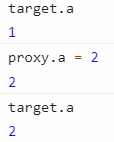

# 代理 proxy 与反射 Reflection 的 API

代理允许拦截 JS 的底层操作

通过调用 `new Proxy()`，可以创建一个代理，用于替代另一个对象（target），这个代理对目标对象进行了虚拟，因此该代理与该目标对象表面上可以被当作同一个对象来对待

## new Proxy(target, handler)

### target

```js
let target = {}
let proxy = new Proxy(target, {})
proxy.name = 'proxy'
console.log(proxy.name) // "proxy"
console.log(target.name) // "proxy"
target.name = 'target'
console.log(proxy.name) // "target"
console.log(target.name) // "target"
```

将所有操作直接转发给 target 对象。

proxy 自身其实并没有存储该属性，它只是简单将值转发给 target 对象

proxy.name 与 target.name 都指向 target.name

### handler 对象

使用代理的主要目的是可以定义捕获器（trap）。一般用来做一些拦截行为，比如鉴权  
即下方的陷阱（trap）函数

### 陷阱函数与 Reflect

Reflect 的存在是为了方便返回原有的实现，避免一样的逻辑需要自己手写一遍

每个函数都有对应的 Reflect，并且同名，函数名一致

比如 get 对应 Reflect.get

同样这类函数也存在一些限制：必须遵循“捕获器不变式”（trap invariant）

```ts
const target: {
  foo?: string
} = {}
Object.defineProperty(target, 'foo', {
  configurable: false,
  writable: false,
  value: 'bar',
})
const handler = {
  get() {
    return 'qux'
  },
}
const proxy = new Proxy(target, handler)
console.log(proxy.foo) // Uncaught TypeError: 'get' on proxy: property 'foo' is a read-only and non-configurable data property on the proxy target but the proxy did not return its actual value (expected 'bar' but got 'qux')
```

#### has

用到关键字 in 的时候会触发 has 函数，比如遍历对象的属性的时候，即使存在这个 key，也可以让他返回 false

has 接受的参数分别是

- target: 目标对象(target)

- key

下面访问目标对象是 true，访问代理是 false

```js
let target = {
  name: 'hello',
  age: 12,
}
let proxy = new Proxy(target, {
  has(target, key) {
    if (key == 'age') {
      return false
    }
    return Reflect.has(target, key)
  },
})
console.log('name' in target) // true
console.log('age' in target) // true

console.log('name' in proxy) // true
console.log('age' in proxy) // false
```

#### get

访问某个对象的 key 时，如果不存在，不会报错，而是返回 undefined

通过 get，可以设置成报错

get 函数接受的参数分别是

- target: 目标对象(target)

- key

- receiver: 代理对象(proxy)

下面访问 target，还是返回 undefined，访问 proxy 就会报错，但是可以添加属性

```ts
let target: {
  name: string
  age?: number
} = {
  name: 'hello',
}
let proxy = new Proxy(target, {
  get(target, key, receiver) {
    if (!(key in receiver)) {
      throw new Error('不存在该属性')
    }
    // return Reflect.get(target, key, receiver)
    return Reflect.get(target, key, receiver)
  },
})
console.log(target.name) // hello
console.log(proxy.name) // hello

console.log(target.age) // undefined
console.log(proxy.age) // Uncaught Error: 不存在该属性
```

```ts
proxy.age = 12
console.log(proxy.age) // 12，赋值后正常输出
```

#### set

例：假设创建一个对象，对象的每一个新增的 key 都只能是 Number 类型。

那么每新增一个 key 都必须经过校验，可以通过 set 来实现

set 接受的参数是：

- target: 目标对象(target)

- key

- value

- receiver: 代理对象(proxy)

```ts
let target: {
  name: string
  age?: number
  plan?: string
} = {
  name: 'hello',
}
let proxy = new Proxy(target, {
  set(target, key, value, receiver): boolean {
    //如果target本身有key，跳过，本题只是为了校验新增的key
    if (!target.hasOwnProperty(key)) {
      if (isNaN(value)) {
        console.log('不是数字')
        return true
      }
      // 添加属性
      return Reflect.set(target, key, value, receiver)
    }
    return false
  },
})
proxy.age = 12
console.log(proxy.age) // 12
console.log(target) // {name: 'hello', age: 12}
// 不报错，但不会赋值
proxy.plan = 'S' // 不是数字
console.log(target, proxy.plan) // {name: 'hello', age: 12} undefined
// 因为最后 return false 所以会报错
proxy.name = 'hello' // Uncaught TypeError: 'set' on proxy: trap returned falsish for property 'name'
```

#### 其余函数见原文

[understandinges6](https://github.com/nzakas/understandinges6/blob/master/manuscript/12-Proxies-and-Reflection.md)，
[翻译](https://sagittarius-rev.gitbooks.io/understanding-ecmascript-6-zh-ver/content/chapter_12.html)

## 基于 proxy 实现响应式

```js
let target = {
  a: 1,
}
function info(obj, key) {
  console.log(`对象的${key}是${obj[key]}`)
}
function change(obj, key, value) {
  obj[key] = value
}
let proxy = new Proxy(target, {
  get(target, key, receiver) {
    info(target, key)
    return Reflect.get(target, key, receiver)
  },
  set(target, key, value, receiver) {
    //通过改变proxy来改变target的值
    change(target, key, value)
    return Reflect.set(target, key, value, receiver)
  },
})
```



### 数组操作

如果 target 是一个数组，假设值是`[1,2,3]`。实际上 proxy 的值是  


```js
let target = [1, 2, 3]
function info(obj, key) {
  console.log(`对象的${key}是${obj[key]}`)
}
function change(obj, key, value) {
  console.log(`${key}的值会被改变成${value}`)
  obj[key] = value
}
let proxy = new Proxy(target, {
  get(target, key, receiver) {
    info(target, key)
    return Reflect.get(target, key, receiver)
  },
  set(target, key, value, receiver) {
    //通过改变proxy来改变target的值
    change(target, key, value)
    return Reflect.set(target, key, value, receiver)
  },
})
proxy.push(5)
```

`proxy.push(5)`会多次触发`get`和`set`


### 对象嵌套

嵌套不会触发`set`，但会触发`get`

```js
let target = {
  name: 'hello',
  location: {
    three: 'west',
  },
}
/* 省略proxy定义 */
proxy.location.three = 'east'
```


### 更好的响应式

解决两个问题：

1. 多次触发`set`后，反复触发一个事件:  
   可以用[防抖](./022_bom.md#函数防抖与节流)实现；  
   在 Vue 中，根据 key 是否是 target 的自有属性(`hasOwnProperty`)：
   - 不是自有属性，那么应该是新增的 key，走一次逻辑，结束
   - 是自有属性，判断旧值和新值是否一致：不一致，走逻辑，结束；一致，不需要执行，结束
2. 对象嵌套：递归的方式  
   在 Vue 中，用的是`get`会被触发的特性，对 Refelect.get 返回的对象进行 Proxy

```js
function createReactive(target) {
  let proxy = new Proxy(target, handlers)
  return proxy
}
const handlers = {
  get: getters,
  set: setters,
}
function getters(target, key, receiver) {
  const result = Reflect.get(target, key, receiver)
  if (typeof result === 'object') {
    //再次调用
    return createReactive(result)
  }
  return result
}
function setters(target, key, value, receiver) {
  const isOwn = target.hasOwnProperty(key)
  if (!isOwn) {
    //新增属性，执行逻辑
    console.log('not own')
  } else {
    //已有属性，判断新值和旧值是否相等
    const currentValue = target[key]
    if (value !== currentValue) {
      console.log('value changed')
    }
  }
  return Reflect.set(target, key, value, receiver)
}
let target = {
  name: 'hello',
  location: {
    three: 'west',
  },
  arr: [1, 2, 3],
}
let proxy = createReactive(target)
proxy.arr.push(6) // "not own"
proxy.location.three = 'east' // "value changed"
```
