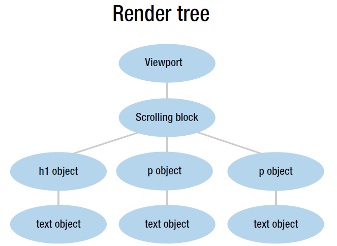

# 最佳实践

## 可维护性

### 可读性：加注释

### 命名

- 变量都是名词，比如 name,

- 函数名都是动词, 比如 getName。如果返回的是布尔，用 is 开头

### 数据类型

初始化就确定要数据类型，尽可能避免变量的数据类型改变

### 松散耦合

抽取方法

比如监听事件和根据事件内参数进行不同的处理函数，把事件监听和处理函数拆开
::: tip
避免传递 event 对象，只传递 event 内需要的值
:::

### 避免创建多个全局变量

把变量封装在对象内

比如

```js
var name = 'hello'
function sayName() {
  console.log(name) //用到了全局变量name
}
//修改为
var nameObj = {
  name: 'hello',
  sayName() {
    console.log(this.name)
  }
}
```

### 避免和 null 比较

如果需要的值是一个引用类型，用 instanceof；基本类型，用 typeof

### 使用常量

常量一般都大写

```js
const Constants = {
  INVALID_MESSAGE: '错误'
}
```

适用场景

- 重复出现

- 显示给用户的值，方便国际化

## 性能

尽可能使用局部变量

减少嵌套

少操作 DOM

合理的 for 循环

### 复杂度

#### O(1)

寻找常量是最快的，将常量放在数组里面访问也一样

用局部对象存全局，用常量存对象

### 最小化语句

单条语句多个操作快，避免多个语句，每个语句只有一个操作。

```js
var foo = 5
var bar = true
//改成
var foo = 5,
  bar = true
```

#### 迭代值（自增、自减）

```js
var name = foo[i]
i++
//改成
var name = foo[i++]
```

#### 用数组和对象字面量代替构造函数

### 部署

- 减少 HTTP 请求，将代码压缩合并

- 压缩代码
  ::: tip
  去掉属性名的引号，比如{"foo": "123"}改为{foo: "123"}，方便压缩工具压缩变量
  :::
- 使用 Gzip 编码，服务器端压缩文件

- 缓存

- CDN

### 浏览器加载过程

渲染由排版引擎（layout engine）执行

1.  解析文件并构建对象模型

- 浏览器加载网站时，接受到一个 HTML 文件，会先把 HTML 文件解析成一个树，也就是 DOM（document
  object model）；

- 当遇到指向 CSS 文件时（不论是 style 还是外部 link），会转成 CSSOM（CSS object
  model, CSS 对象模型）

每个 CSS 选择符都会匹配一个 DOM 节点


2.  渲染树(render tree)

构建另外一个树结构，每个节点表示渲染到屏幕上的信息。

类似 DOM，但是不包含隐藏元素，会保存伪类，还有其他表现性信息，比如滚动条。

也就是渲染树内每个节点都知道了自己的颜色、字体等等



3.  layout/reflow

计算每个对象的几何信息，确定每个对象显示在浏览器上的位置

元素的几何属性（比如宽、高）会触发 reloflow

4.  绘制(paiting)，合成(compositing), 呈现(drawing)

确定每个对象的位置和属性后，可以得到显示在屏幕的实际像素，这个过程是绘制。

如果最终某个部分不会影响页面的其他内容，浏览器会把绘制拆成不同的任务，每个任务负责不同的部分（layer）

有些复杂元素（比如三维变换），需要经过 GPU 进行硬件加速。有些用了滤镜，需要和其他层混合。也就是拆分和混合的过程为合成

最后可以进行呈现了

### 重绘（Repaint）和回流（Reflow）

重绘：当页面中元素样式的改变并不影响它在文档流中的位置时（例如：color、background-color、visibility 等），浏览器会将新样式赋予给元素并重新绘制它，这个过程称为重绘。

回流/重排发生的情况：页面布局或者集合属性改变

- 可见元素的删除或增加

- 元素位置改变

- 元素尺寸改变（包括 padding、margin、border，宽高等）

- 内容改变（比如文本改变，如偏）

- 获取布局信息（offsetTop, offsetLeft, offsetWidth,
  offsetHeight，还有 scroll 相关，client 相关，getComputeStyle）需要返回最新的布局信息，因为浏览器会触发 reflow

回流要比重绘消耗性能开支更大。

回流必将引起重绘，重绘不一定会引起回流

#### CSS

CSS 属性影响的过程可参考[csstriggers](https://csstriggers.com/)

也可以通过 Chrome 的 Performance

#### 优化

- :hover

避免使用大量的 hover 伪类

- 批量修改 DOM

让元素脱离文档流，进行操作，最后带回文档中  
脱离文档流 reflow 一次，待会文档中 reflow 一次  
::: tip
常用方式：

- 隐藏 → 修改 → 显示
- 推荐：使用文档片段（document fragment），在当前 DOM 之外创建一个子树，最后拷贝回文档
- 对原始元素拷贝到脱离文档的一个节点，修改后替换原始的元素  
   cloneNode(true)+replaceChild
  :::
- 事件委托，比如很多 li 绑定 click，委托给父元素 ul

- BOM

  对于布局信息（scroll, client, offset）可以事先赋值给局部变量。在布局确定，不会修改之后，再去访问

- 减少选择器的层级嵌套
