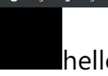
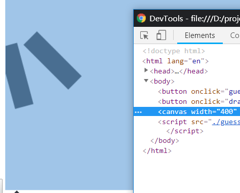

# 动画

## 函数 requestAnimationFrame(function)

## Canavs

标签的基本属性有`width`和`height`，以 px 为单位，width="400"  
JS 可以动态修改这两个属性  
canvas 是即时的，发生变化需要重新绘制。  
浏览器可以右键直接存为图片。  
2D 环境：CanvasRenderingContext2D

### 2D 相关概念

- 坐标：以画布左上角为（0，0），向右 x 轴正方形，向下 y 轴正方形
- 当前状态：所有操作都在当前状态完成。本质上是一个栈，可以应用到整个画布
- 主要状态有：  
  变换矩阵：缩放、旋转、变换、平移
- 裁剪区域：clip
- 属性：比如 strokeStyle 等等

### getContext

```js
//获取2D对象
const canvasTarget = doc.getElementById('canvas')
let ctx = canvasTarget.getContext('2d')
```

### getContext 对象的属性

- 颜色`fillStyle`/ `strokeStyle`
  设置颜色，一个是填充色（对应 fillRect），一个是边框色（对应 strokeRect）
  线段厚度 lineWidth
  默认是 1。
  比如 stroke 的边框厚度
- 透明度属性 globalAlpha  
  1 为不透明
- 文字属性 font
  设置字体大小和类型。两者都写，否则无效。光写"40px"没有用  
  `ctx.font = "40px sans-serif";`

### 绘制矩形

#### 带颜色 fillRect

`ctx.fillRect(x, y, width, height);`

矩形起始点的 x 轴和 y 轴

`fillStyle`设置颜色，`fillRect`绘制区域

`ctx.fillStyle = "#ffffaa";`

`ctx.fillRect(0, 0, 400, 300);`



#### 画笔 strokeRect

类似画笔一样，绘制矩阵的边，不会有颜色

#### 清除 clearRect

清除指定区域并且完全透明

### 绘制文字 fillText

`ctx.fillText(text, x, y [, maxWidth]);`

maxWidth：最大宽度。如果字符串内容超过最大宽，会进行字体缩小

`ctx.fillText("hello world", 100, 100);`

### 绘制图片 drawImage

`ctx.drawImage(image, dx, dy, dWidth, dHeight);`

dx, dy 坐标

dWidth, dHeight 表示指定图片宽高，不写就默认图片自身大小

创建图片需要 new 一个 image 对象，在 onload 内进行绘制，确保图片加载后可以读取到内容

```js
let img = new Image()
img.onload = () => {
  ctx.drawImage(img, 100, 100)
}
img.src = 'https://mdn.mozillademos.org/files/225/Canvas_drawimage.jpg'
```

配合图片和文字可以用 canvas 生成带水印的图片

### 旋转整个画布 rotate

canvas 本身不会变，变的只是内容

默认以（0, 0）为旋转中心点，顺时针旋转

反复调用就会叠加，不会清除之前的内容

```js
ctx.rotate((45 * Math.PI) / 180)
ctx.fillRect(70, 0, 100, 30)
ctx.rotate((30 * Math.PI) / 180)
ctx.fillRect(70, 0, 100, 30)
```



### 绘制渐变 createLinearGradient(x0,y0,x1,y1)

- x0/y0 渐变开始点的 x, y 坐标
- x1/y1 渐变结束点的 x, y 坐标

### addColorStop(stop, color)

addColorStop() 方法要和 createLinearGradient() 或 createRadialGradient() 一起  
规定 gradient 对象中的颜色和位置

```js
var c = document.getElementById('myCanvas')
var ctx = c.getContext('2d')

var grd = ctx.createLinearGradient(0, 0, 170, 0)
grd.addColorStop(0, 'black')
grd.addColorStop(1, 'white')

ctx.fillStyle = grd
ctx.fillRect(20, 20, 150, 100)
```

### 绘制圆 arc((x,y,r,sAngle,eAngle,counterclockwise)

用 stroke() 或 fill() 方法在画布上绘制实际的弧

```js
var c = document.getElementById('myCanvas')
var ctx = c.getContext('2d')
ctx.beginPath()
ctx.arc(100, 75, 50, 0, 2 * Math.PI)
ctx.stroke()
```

### setTransform

`ctx.transform(a, b, c, d, e, f);`

### toDataURL

canvas 对象生成的图像

```js
var canvas = document.getElementById('canvas')
var dataURL = canvas.toDataURL()
```
