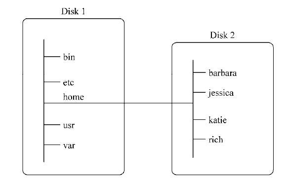

# 文件系统

Windows 通过物理驱动器决定文件路径名，比如 `D:\project\FE-notes`  
每个驱动器都会有自己的目录结构，以便访问存储其中的文件  
但 Linux 只包含一个根（root）目录，路径系统称之为虚拟目录，不会包括物理磁盘（`D:`）  
路径采用 `/` 而不是 `\`  
在 Linux PC 上安装的第一块硬盘称为`根驱动器`。根驱动器包含了虚拟目录的核心，所有的路径都是从这开始的  
Linux 会在根驱动器上创建一些特别的目录，称之为挂载点（mount point）。  
挂载点是虚拟目录用来分配额外存储的目录，效果是文件和目录出现在挂载点目录中，但实际上的存储位于另一个硬盘/驱动器  
比如 `/home/test` 目录位于根驱动器，但实际上 `test` 的内容存储在别的硬盘  


## 常见目录

大部分 Linux 发行版的常见的目录名都基于文件系统层级标准（filesystem hierarchy standard，FHS）

- `/bin` 二进制目录，存放许多用户级的 GNU 工具
- `/boot` 启动目录，存放启动文件
- `/dev` 设备目录，Linux 在这里创建设备节点
- `/etc` 系统配置文件目录
- `/home` 主目录，Linux 在这里创建用户目录
- `/lib` 库目录，存放系统和应用程序的库文件
- `/media` 媒体目录，可移动媒体设备的常用挂载点
- `/mnt` 挂载目录，另一个可移动媒体设备的常用挂载点
- `/opt`可选目录，常用于存放第三方软件包和数据文件
- `/proc` 进程目录，存放现有硬件及当前进程的相关信息
- `/root` root 用户的主目录
- `/sbin` 系统二进制目录，存放许多 GNU 管理员级工具
- `/run` 运行目录，存放系统运作时的运行时数据
- `/srv` 服务目录，存放本地服务的相关文件
- `/sys` 系统目录，存放系统硬件信息的相关文件
- `/tmp` 临时目录，可以在该目录中创建和删除临时工作文件
- `/usr` 用户二进制目录，大量用户级的 GNU 工具和数据文件都存储在这里
- `/var` 可变目录，用以存放经常变化的文件，比如日志文件

## 浏览目录

### cd

- `cd 目录`：如果不传目录，会进入到当前用户主目录（以 root 身份登录，位于 `/root`）
  目录路径以 `/` 开头表示绝对路径  
  以目录名开头表示相对路径  
  `.` 表示当前目录，`..` 表示当前目录的父目录

### pwd

- `pwd`：当前所在目录

### ls

- `ls`：显示当前目录下的文件和文件夹。不会显示隐藏文件
  输出根据字母排列，顺序是按列，而不是按行  
  比如在根目录`/` 输入 `ls`

```bash
# 只列举部分内容
[root@xxx /]# ls
bin   dev  gqserver  lib    lost+found  mnt  proc  run   srv  tmp  var
boot  etc  home      lib64  media       opt  root  sbin  sys  usr
```

- `ls -F`
  区分文件还是目录
  - 带 `/` 表示目录
  - 带 `*` 表示可执行文件

```bash
[root@xxx ~]# ls -F
bbr.sh*        gq-server-linux-amd64-1.2.2
bbr.sh.1       install_bbr.log
go.sh          node/
```

- `ls -a`：显示当前目录下的所有内容，包括隐藏文件  
  一般隐藏文件都是以`.` 开头
- `ls -R`：递归显示目录及子目录下的所有内容  
  比如当前目录下安装了Node.JS，那么`ls -R` 会显示 node 文件夹及里面的所有内容

```bash
# 只列举部分内容

./node/lib/node_modules/npm/node_modules/cyclist:
index.js  package.json  README.md

./node/lib/node_modules/npm/node_modules/dashdash:
CHANGES.md  etc  lib  LICENSE.txt  package.json  README.md

```

- 混合参数，比如 `-F` 和 `-a` 一起，可以是 `ls -F -a`，也可以是 `ls -Fa`
- `ls -l`：显示目录的相关信息，比如时间

```bash
# 只列举部分内容
[root@xxx ~]# ls -l
total 73740
-rwxr-xr-x 1 root root    13173 Jun  9  2019 bbr.sh
-rw-r--r-- 1 root root    13871 Jun 10  2019 go.sh
drwxr-xr-x 6 1001 1001     4096 Nov 19 16:38 node
```

涉及的信息有：

- 文件类型，比如目录是 `d`，文件是 `-`，字符串文件 `c`，块设备 `b`
- 文件的权限：只读/可写等等
- 硬连接数：`1`，`6`
- 用户属主的用户名
- 用户属组的用户名
- 文件大小，单位是字节
- 上次修改时间
- 文件名
- `ls -l --time=atime`：查看访问时间
- 过滤：只显示匹配的目录，比如只匹配 `node` 字符串，`ls node`  
  可以用正则：`*` 代表零个或多个，`?` 代表一个字符串

## 操作文件

### touch

- 创建文件：`touch filename`
- 修改文件的修改时间：`touch 已存在的文件`
- 修改文件的访问时间，不改变修改时间：`touch -a 已存在的文件`

### cp

复制文件: `cp 源文件 目的地`  
比如

```bash
[root@xxx ~]# cp bbr.sh /home/bbr.sh
[root@xxx ~]# cd /home
[root@xxx home]# ls
bbr.sh
```

- `cp -i 源文件 目的地的父目录`：如果目的地有已存在的文件，会先询问是否覆盖

```bash
[root@xxx ~]# cp -i bbr.sh /home
cp: overwrite '/home/bbr.sh'?
```

- `-R`：递归的复制目录内的所有内容

### tab 键

自动补全文件名

### ln

链接文件：目录指向文件真实位置的占位符，可以理解为是目录的别名，用 `node` 代替 `/root/node`  
链接有两种方式：

- 符号链接/软连接
- 硬链接

#### 符号链接

用一个实际存在的文件，指向另一个的文件，尽管两个文件的内容不同  
要建立符号链接，首先要保证真实的源文件存在，通过 `ln -s 源文件 不存在的文件名` 建立  
例`ln -s bbr.sh bbr_test.sh`  
创建完成之后新文件 `bbr_test.sh` 存在

#### 硬链接

不需要额外选项，`ln 源文件 不存在的文件名`

### mv

移动或者重命名文件（moving）：`mv 源文件 目的地`  
移动文件不影响修改时间

### rm

删除文件（removing）

- `-i`：删除文件前进行确认

## 操作目录

### mkdir

创建目录

- `-p`：递归创建不存在的目录下的子目录，`mkdir -p hello/world/target`

### rmdir

删除目录：默认情况下只删除空目录
需要先 `rm` 目录下的文件，才能删除该目录

- `-r`：`rmdir -r` 相当于 `rm` + `rmdir`

## 查看单个文件

### file

查看单个文件的信息，比如文件类型

```bash
[root@xxx ~]# touch hello.txt
[root@xxx ~]# file hello.txt
hello.txt: empty
[root@xxx ~]# file bbr.sh
bbr.sh: a /usr/bin/env bash script, ASCII text executable
```

### cat

查看文件内容

- `cat 文件名`：显示文件的内容
- `-n`：显示内容前加行号。空格也会有

```
1 hello
2
3 world
```

- `-b`：给有文字的部分加行号

```
1 hello

2 world
```

### more

`cat` 会显示所有内容，`more` 可以进行分页，一次显示一屏的内容  
输入后通过空格进行翻页，回车进行逐行阅读
最下面会有 `--More--(3%)` 表示当前进度

```bash
[root@xxx ~]# more bbr.sh

#!/usr/bin/env bash
#
# Auto install latest kernel for TCP BBR
#
# System Required:  CentOS 6+, Debian7+, Ubuntu12+
#

red='\033[0;31m'
green='\033[0;32m'
yellow='\033[0;33m'
plain='\033[0m'

--More--(3%)
```

### less

less is more：实际上是 `more` 的升级版，可以用方向键进行前后滚动

### tail

查看文件的最后几行，默认是 10 行

- `tail -n 行数 文件名`：可以指定显示的行数

### head

查看文件的开头几行，选项和 `tail` 一致
