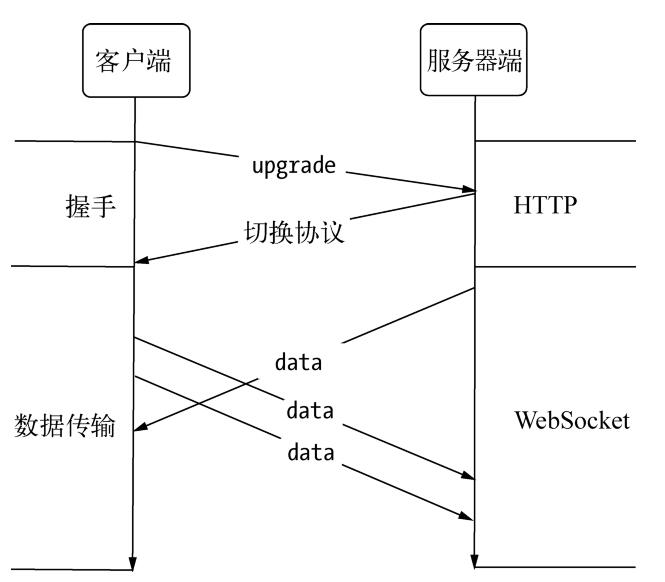

# websocket

只需要一次握手，没有同源策略的限制，即可以跨域

允许服务端主动向客户端推送数据

使用 ws 或 wss 的统一资源标志符，类似于 HTTPS，其中 wss 表示在 TLS 之上的 Websocket

ws 默认 80，wss 默认 443，和 HTTP 一样

Connection 必须设置 Upgrade，表示客户端希望连接升级。

Upgrade 字段必须设置 Websocket，表示希望升级到 Websocket 协议

## Comet

在 websocket 之前，客户端和服务端通信的高效方式是 Comet 技术  
实际上就是用长轮询（long-polling）或者 iframe  
当客户端向服务器发起请求，服务端只有请求超时或者数据正常返回时才结束连接（`res.end()`）  
客户端收到请求或者超时后重新发送请求。  
这个请求拖着长长的尾巴，所以被称之为 Comet（彗星）  
使用 websocket 只需要一个 TCP 连接即可完成双向通信

## 组成

websocket 协议主要分成两部分：握手和数据传输

### 握手

- 握手：通过 HTTP 完成
  Chrome 下的请求头可能包括以下信息

```
Connection: Upgrade
Sec-WebSocket-Extensions: permessage-deflate; client_max_window_bits
Sec-WebSocket-Key: xOXBXNWy8KSqbGpNWh8oxA==
Sec-WebSocket-Version: 13
Upgrade: websocket
```

和 HTTP 的区别在于

```
# 表示协议升级为 websocket
Connection: Upgrade
Upgrade: websocket
```

Sec-WebSocket-Key 是随机生成的 Base64 编码字符串
服务端接收之后，和 "258EAFA5-E914-47DA-95CA-C5AB0DC85B11" 相连，然后通过 sha1 安全散列算法计算出结果后，
再进行 Base64 编码，返回给客户端，详见[下方](#服务端)

### 数据传输

- 数据传输  
  

握手完成后，服务端的 onopen 事件被触发  
客户端调用 send() 发送数据，触发服务端的 onmessage  
同理服务端也可以 send()

## 创建

```js
var host = 'ws://' + href + ':6800'
socket = new WebSocket(host)
socket.onmessage = function () {}
```

## 服务端

响应代码 101 表示本次连接的 HTTP 协议即将被更改，更改后的协议就是 Upgrade: websocket

```js
const http = require('http')
const crypto = require('crypto')

const server = http.createServer(function (req, res) {
  res.writeHead(200, { 'Content-Type': 'text/plain' })
  res.end(' Hello World n')
})
server.listen(666)

// 收到 upgrade 请求后，告知客户端允许切换协议
server.on('upgrade', function (req, socket) {
  let key = req.headers['sec-websocket-key']
  const shasum = crypto.createHash('sha1')
  key = shasum
    .update(key + '258EAFA5-E914-47DA-95CA-C5AB0DC85B11')
    .digest('base64')
  var headers = [
    'HTTP/1.1 101 Switching Protocols',
    'Upgrade: websocket',
    'Connection: Upgrade',
    'Sec-WebSocket-Accept:' + key,
  ]
  socket.write(headers.concat('', '').join('\r\n'))
  socket.on('data', (data) => console.log(data.toString()))
})
```

## 事件

socket.onopen/ onmessage / onclose

## 方法

send/close
