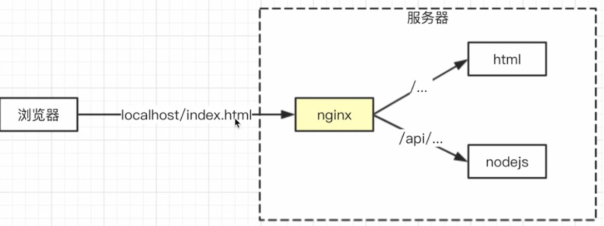

# nginx

- 一般用来放静态资源直接返回，负载均衡（让集群的负载量达到比较高的状态，主要在运维方面）

- 反向代理  
  nginx 把 http 请求转发到另一个或者一些服务器

对于浏览器来说，访问的就是同源服务器上的一个 url。而 nginx 通过检测 url 前缀，把 http 请求转发到后面真实的物理服务器。并通过 rewrite 命令把前缀再去掉。这样真实的服务器就可以正确处理请求，并且并不知道这个请求是来自代理服务器的

Brower =\> host =\> nginx =\> 目标地址

服务器数据 =\> nginx =\> Brower

参考

- [前端开发者必备的 Nginx 知识](https://juejin.im/post/5c85a64d6fb9a04a0e2e038c)
- [Nginx 与前端开发](https://juejin.im/post/5bacbd395188255c8d0fd4b2)
- [前端想要了解的 Nginx](https://juejin.im/post/5cae9de95188251ae2324ec3)
- [Nginx 极简教程](https://dunwu.github.io/nginx-tutorial/#/nginx-quickstart)
- [Nginx 开发从入门到精通](http://tengine.taobao.org/book/index.html)

扩展阅读：[Nginx 配置之完整篇](https://imququ.com/post/my-nginx-conf.html)  
在线自定义配置 nginx: [digitalocean/nginxconfig.io](https://github.com/digitalocean/nginxconfig.io)

## 组成

nginx 采用异步非阻塞的方式，以多进程的方式运行：分为一个 master 进程和多个 worker 进程

- master: 管理作用：比如接收外界信号（重启 nginx），向 worker 发送信号，监控 worker 状态，处理 worker 异常（重启 worker）
- worker: 实际的工作处理。
  - worker 之间是相互独立的，不需要加锁，一个 worker 终止也不会影响其他
  - 一个 http 请求只可能由一个 worker 处理
  - 进程数量(`worker_processes`)一般和 CPU 核数一致：worker 进程数越多，资源消耗就越大，让 worker 数=CPU 数，可以做到最大的并发又不消耗过于资源

## 反向代理

localhost 端口是 8080，访问 nginx，如果访问的是接口 api，代理到 nodejs（比如端口是 3000）

对客户端不可见

相对的正向代理，客户端能控制的代理，比如本机安装 VPN 访问公司内网



### 优点

1. 安全与权限：客户端无法得知真正的后台服务器，请求必须通过 nginx；那么 nginx 可以对没有权限的请求进行过滤
2. 负载均衡：nginx 内部模块提供了多种负载均衡算法，可以将接收到的客户端请求“均匀地”分配到这个集群中所有的服务器上

## CentOS 下的安装

[参考](https://www.cnblogs.com/hafiz/p/6891458.html?utm_source=itdadao&utm_medium=referral)  
事先准备

- 切换到 root

```bash
su root
```

- `yum`安装依赖

```bash
# 编译
yum install gcc-c++
# 正则
yum install -y pcre pcre-devel
# gzip
yum install -y zlib zlib-devel
# https
yum install -y openssl openssl-devel
```

下载包

```bash
wget https://nginx.org/download/nginx-1.16.1.tar.gz
```

查看 nginx 在哪: `where is nginx`  
解压

```bash
tar -zxvf nginx-1.16.1.tar.gz
```

进入压缩包以后，配置+编译

```bash
# 创建配置涉及的文件夹(`mkdir`)： /var/temp、/var/temp/nginx、/var/run/nginx/
mkdir /var/temp
# 配置
./configure \
--prefix=/usr/local/nginx \
--pid-path=/var/run/nginx/nginx.pid \
--lock-path=/var/lock/nginx.lock \
--error-log-path=/var/log/nginx/error.log \
--http-log-path=/var/log/nginx/access.log \
--with-http_gzip_static_module \
--http-client-body-temp-path=/var/temp/nginx/client \
--http-proxy-temp-path=/var/temp/nginx/proxy \
--http-fastcgi-temp-path=/var/temp/nginx/fastcgi \
--http-uwsgi-temp-path=/var/temp/nginx/uwsgi \
--http-scgi-temp-path=/var/temp/nginx/scgi \
--with-http_ssl_module

# 编译
make && make install
# 重新编译
make
# 进入nginx文件夹后启动
cd /usr/local/nginx/sbin && ./nginx

# 启动时指定配置文件
./nginx -c /usr/local/nginx/conf/nginx.conf
# 编辑config文件
vim /usr/local/nginx/conf/nginx.conf
```

### vim

常用命令
快捷键`Insert`开始输入  
`esc`退出输入  
`:wq`保存并退出  
`ln -s 绝对路径 快捷方式的绝对路径`: 创建链接

## 常用命令

- 启动
  进入目录后启动:  
  linux: `./nginx`  
  windows: `start nginx`
- nginx -s signal: 向 master 发出信号
  - 退出：`nginx -s quit`
  - 重新加载配置文件: `nginx -s reload`
- nginx -t: 测试
- nginx -c <文件名> 设置配置文件的路径，默认是`conf/nginx.conf`
  例：

```
nginx.exe -t -c conf/nginx.conf
```

## 默认的配置文件

```nginx
# 设置工作进程worker的数量
# 为1，线程打开2个，有一个是主线程master
worker_processes  1;
# 处理连接
events {
    # 设置连接数
    worker_connections  1024;
}

http {
    # 文件拓展名查找集合
    include       mime.types;
    # 当查找不到对应类型的时候默认值
    default_type  application/octet-stream;

    # 日志格式，定义别名为 main
    #log_format  main  '$remote_addr - $remote_user [$time_local] "$request" '
    #                  '$status $body_bytes_sent "$http_referer" '
    #                  '"$http_user_agent" "$http_x_forwarded_for"';

    # 指定日志输入目录
    #access_log  logs/access.log  main;

    # 调用 sendfile 系统传输文件
    sendfile        on;
    #tcp_nopush     on;

    # 客户端与服务器连接超时时间，超时自动断开。以秒为单位
    #keepalive_timeout  0;
    keepalive_timeout  65;

    # 开启gizip 压缩
    #gzip  on;

    # 虚拟主机
    server {
        # 端口
        listen       80;
        # 匹配请求中的host值
        server_name  localhost;

        #charset koi8-r;

        #access_log  logs/host.access.log  main;

        # 路由
        location / {
                root   html;
                # 默认查找
                index  index.html index.htm;
            }
    }

    # 引入其他的配置文件
    include servers/*;
}
```

## 内置变量

| 变量名            | 解释                           |
| ----------------- | ------------------------------ |
| \$request_method  | 请求类型                       |
| \$content_length  | 请求头中的 Content-length 字段 |
| \$http_user_agent | 客户端 agent                   |
| \$http_cookie     | cookie                         |
| \$server_protocol | 请求使用的协议，如 HTTP/1.0    |
| \$server_addr     | 服务器地址                     |
| \$server_name     | 服务器名称                     |
| \$server_port     | 服务器的端口号                 |

## 代理

- worker_processes 启动实例的个数

- server

```nginx
listen 端口号
location 代理
```

```nginx
#如果访问的url地址是/api/下的内容，代理端口到localhost:3000
#proxy_set_header: 将客户端的请求头转发给服务端
location /api/ {
    proxy_pass   http://localhost:3000;
    proxy_set_header Host $host;
}
```

如果用 proxy_pass，一定是完整的域名（包括协议）。比如打开 localhost，实际访问的是百度

```nginx
#如果访问的url地址是根/的内容，代理端口到baidu
location / {
    root   html;
    index  index.html index.htm;
    proxy_pass https://www.baidu.com;
}
```

### 跨域

客户端的 fe.server.com 访问 nginx 的 fe.server.com，不会跨域。  
而 nginx 将请求代理回 dev.server.com

```nginx
server {
    listen       80;
    server_name  fe.server.com;
    location / {
        proxy_pass dev.server.com;
    }
}
```

### demo

```nginx
#运行用户
#user somebody;

#启动进程,通常设置成和cpu的数量相等
worker_processes  1;

#全局错误日志: error_log /path/to/log level, 级别越高记录的信息越少
#level可以是debug, info, notice, warn, error, crit, alert, emerg, 错误级别等于或高于level才会写入错误
error_log  logs/error.log;
error_log  logs/error.log  notice;

#PID文件，记录当前启动的nginx的进程ID
pid        logs/nginx.pid;

#工作模式及连接数上限
events {
    worker_connections 1024;    #单个后台worker process进程的最大并发链接数
}

#设定http服务器，利用它的反向代理功能提供负载均衡支持
http {
    #设定mime类型(邮件支持类型),类型由mime.types文件定义
    include       mime.types;
    default_type  application/octet-stream;

    #设定日志
    log_format  main  '[$remote_addr] - [$remote_user] [$time_local] "$request" '
                      '$status $body_bytes_sent "$http_referer" '
                      '"$http_user_agent" "$http_x_forwarded_for"';

    #access_log    D:/Tools/nginx-1.10.1/logs/access.log main;
    #rewrite_log     on;

    #sendfile 指令指定 nginx 是否调用 sendfile 函数（zero copy 方式）来输出文件，对于普通应用，
    #必须设为 on,如果用来进行下载等应用磁盘IO重负载应用，可设置为 off，以平衡磁盘与网络I/O处理速度，降低系统的uptime.
    sendfile        on;
    #tcp_nopush     on;

    #连接超时时间
    keepalive_timeout  120;
    tcp_nodelay        on;

    #gzip压缩开关
    #gzip  on;

    #设定实际的服务器列表
    upstream zp_server1{
        server 127.0.0.1:8089;
    }

    #HTTP服务器
    server {
        #监听80端口，80端口是知名端口号，用于HTTP协议
        listen       80;

        #定义使用www.xx.com访问
        server_name  www.helloworld.com;

        #首页
        index index.html

        #指向webapp的目录
        root D:\01_Workspace\Project\github\zp\SpringNotes\spring-security\spring-shiro\src\main\webapp;

        #编码格式
        charset utf-8;

        #代理配置参数
        proxy_connect_timeout 180;
        proxy_send_timeout 180;
        proxy_read_timeout 180;
        proxy_set_header Host $host;
        proxy_set_header X-Forwarder-For $remote_addr;

        #反向代理的路径（和upstream绑定），location 后面设置映射的路径
        location / {
            proxy_pass http://zp_server1;
        }

        #静态文件，nginx自己处理
        location ~ ^/(images|javascript|js|css|flash|media|static)/ {
            root D:\01_Workspace\Project\github\zp\SpringNotes\spring-security\spring-shiro\src\main\webapp\views;
            #过期30天，静态文件不怎么更新，过期可以设大一点，如果频繁更新，则可以设置得小一点。
            expires 30d;
        }

        #设定查看Nginx状态的地址
        location /NginxStatus {
            stub_status           on;
            access_log            on;
            auth_basic            "NginxStatus";
            auth_basic_user_file  conf/htpasswd;
        }

        #禁止访问 .htxxx 文件
        location ~ /\.ht {
            deny all;
        }

        #错误处理页面（可选择性配置）
        #error_page   404              /404.html;
        #error_page   500 502 503 504  /50x.html;
        #location = /50x.html {
        #    root   html;
        #}
    }
}
```

## 安全相关

### server_tokens

以 nginx/1.16.1 为例  
在 Responese Headers 里面可以看到一个`server`字段

```http
Accept-Ranges: bytes
Connection: keep-alive
Content-Length: 612
Content-Type: text/html
Date: Mon, 25 Nov 2019 09:36:15 GMT
ETag: "5d52b25f-264"
Last-Modified: Tue, 13 Aug 2019 12:51:43 GMT
Server: nginx/1.16.1
```

通过设置`server_tokens`为 off，可以不显示 nginx 的具体版本

```nginx
http {
    server_tokens   off;
    include       mime.types;
}
```

### 权限

deny 和 allow 是内置的 ngx_http_access_module 模块的语法

```nginx
#禁止192.168.1.100
#允许192.168.1.10-200 ip段内的访问
#允许10.110.50.16这个单独ip
#剩下未匹配到的全部禁止访问
location / {
    deny  192.168.1.100;
    allow 192.168.1.10/200;
    allow 10.110.50.16;
    deny  all;
}
```

### 过滤

```nginx
#根据请求类型过滤
if ( $request_method !~ ^(GET|POST|HEAD)$ ) {
    return 403;
}
```

`~* \.(js|css|png|jpg|gif)$`: 匹配相关文件类型

```nginx
#根据文件类型过滤，比如设置不缓存
#add_header: 给请求的响应加上一个头信息
location ~* \.(js|css|png|jpg|gif)$ {
    add_header Cache-Control no-store;
}
```

### 匹配规则

- `=` 表示精确匹配。只有请求的 url 路径与后面的字符串完全相等时，才会命中（优先级最高）。

```nginx
location = / {
    [ configuration A ]
}
```

- `^~` 表示如果该符号后面的字符是最佳匹配，采用该规则，不再进行后续的查找。

```nginx
location ^~ /images/ {
    [ configuration D ]
}
```

- `~` 表示该规则是使用正则定义的，区分大小写。
- `~*` 表示该规则是使用正则定义的，不区分大小写。

```nginx
location ~* \.(gif|jpg|jpeg)$ {
    [ configuration E ]
}
```

## 适配 PC 和移动

```nginx
#内置变量$http_user_agent为移动端时，根目录由html文件夹改为html/distPhone
location / {
    root   html;
    index  index.html index.htm;
    if ($http_user_agent ~* '(Android|webOS|iPhone|iPod|BlackBerry)') {
        root html/distPhone;
    }
}
```

## gzip

```nginx
http {
    server {
        #开启或者关闭gzip模块
        gzip                    on;
        #启用 GZip 所需的HTTP 最低版本，默认值为HTTP/1.1
        gzip_http_version       1.1;
        #压缩级别，级别越高压缩率越大，当然压缩时间也就越长（传输快但比较消耗cpu）, 值为1-9
        gzip_comp_level         5;
        #页面最小字节数，Content-Length小于该值的请求将不会被压缩
        gzip_min_length         1000;
        #要压缩的文件类型(MIME)
        gzip_types text/csv text/xml text/css text/plain text/javascript application/javascript application/x-javascript application/json application/xml;
    }
}
```

## 负载均衡

1. Upstream 指定后端服务器地址列表
2. 在 server 中拦截响应请求，并将请求转发到 Upstream 中配置的服务器列表。

```nginx
http {
    #网关集群
    upstream gateway_server {
        server 10.250.190.168:8010 weight=1;
        #server 192.168.30.135:8010 weight=1;
    }
    server {
        location /v1 {
            proxy_pass   http://gateway_server/v1;
        }
    }
}

```

## 静态资源

匹配以 png|gif|jpg|jpeg 为结尾的请求，并将请求转发到本地路径，root 中指定的路径即 nginx 本地路径。同时也可以进行一些缓存的设置

```nginx
location ~* \.(png|gif|jpg|jpeg)$ {
    root    /root/static/;
    expires     10h;# 设置过期时间为10小时
}
```

## OpenResty

## njs
