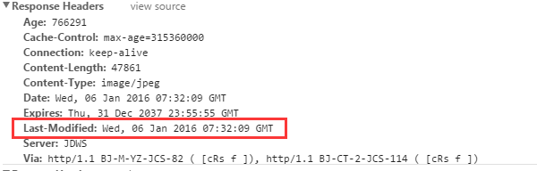

# 浏览器缓存

参考：

- [深入理解浏览器的缓存机制](https://github.com/ljianshu/Blog/issues/23)
- [前端静态资源缓存最优解以及 max-age 的陷阱](https://segmentfault.com/a/1190000014134828)
- [前端必须要懂的浏览器缓存机制](https://github.com/zuopf769/notebook/blob/master/fe/%E5%89%8D%E7%AB%AF%E5%BF%85%E9%A1%BB%E8%A6%81%E6%87%82%E7%9A%84%E6%B5%8F%E8%A7%88%E5%99%A8%E7%BC%93%E5%AD%98%E6%9C%BA%E5%88%B6/README.md)

## 缓存读取优先级

1.  Service Worker

2.  Memory Cache（内存中的缓存）

- 一旦关闭 Tab 页面，内存中的缓存也就被释放了。由浏览器自己决定放什么文件在 Memory Cache

3.  Disk Cache（存储在硬盘中的缓存）

4.  Push Cache

- HTTP/2 才存在

5.  网络请求

## 传统的浏览器缓存


## 缓存过程

- 每次发起请求，都会先在浏览器缓存中查找该请求的结果以及缓存标识
- 浏览器每次拿到返回的请求结果都会将该结果和缓存标识存入浏览器缓存中
  

## 缓存策略

分为[强缓存](#强缓存)和[协商缓存](#协商缓存)

- 强缓存判断是否缓存的依据是时间，不关心服务器端文件是否已经更新，这可能会导致加载文件不是最新的内容
- 获知服务器端内容是否更新用到协商缓存策略
  都是通过设置 HTTP Header 实现

## 强缓存

不会向服务器发送请求，直接从缓存中读取资源  
在 chrome 控制台的 Network 选项中可以看到该请求返回`200`的状态码，并且 Size 显示`from disk cache`或`from memory cache`  
强缓存可以通过设置两种 HTTP Header 实现：`Expires` 和 `Cache-Control`  
Cache-Control 优先级高

## Expires

绝对时间，GMT 格式

```http
Expires: Wed, 22 Oct 2018 08:41:00 GMT
```

1.  第一次请求时，服务器返回 Expires 在 Header 中，浏览器缓存这个 header 信息

2.  当下次再次请求这个资源时，浏览器以请求的时间与这个 Expires 中的时间比对。如果小于这个时间，说明未过期，直接从本地缓存中获取，请求返回 200（from
    cache）
    ::: warning
    因为是绝对时间，可能浏览器和服务器存在时差
    :::

## Cache-Control

（优先级高，HTTP/1.1 以上）：相对时间。  
比如当`Cache-Control:max-age=300`时，则代表在这个请求正确返回时间（浏览器也会记录下来）的 5 分钟内再次加载资源，就会命中强缓存。

1.  第一次请求时，服务器在 response header 中添加头 Cache-Control 的设置

浏览器接收到这个资源后，连同这个 header 和本次请求的时间缓存在浏览器端

2.  下一次再请求这个资源时，浏览器根据上一次请求的时间，这次请求的时间的时间差，去 Cache-control 中设置的时间差比较，如果小于 Cache-Control 中设置的时间差，那么说明未过期，直接从本地缓存中取，请求返回 200（from cache）

### no-cache 和 no-store

```http
Cache-Control: no-cache
```

- no-cache 并不意味着不缓存。它的意思是在使用缓存资源之前，它必须经过服务器的检查
- no-store 才是告诉浏览器不要缓存它，即不使用强制缓存，也不使用协商缓存

```js
var http = require("http")
var fs = require("fs")
http
  .createServer(function (req, res) {
    if (req.url === "/cache.png") {
      fs.readFile("./cache.png", function (err, file) {
        res.setHeader("Cache-Control", "max-age=" + 5) //缓存五秒
        res.setHeader("Content-Type", "images/png")
        res.writeHead("200", "Not Modified")
        res.end(file)
      })
    }
  })
  .listen(8888)
```

### max-age 和 s-maxage

s-maxage 仅在代理服务器中生效，客户端中只考虑 max-age

### public 和 private

两者是针对服务器（CDN）才生效

- public: 既可以被浏览器缓存，也可以被代理服务器缓存
- private: 该资源只能被浏览器缓存。private 为默认值  
  服务器 Response 返回

```http
Cache-control: public
```

## 协商缓存

协商缓存就是强制缓存失效后，浏览器携带缓存标识向服务器发起请求，由服务器根据缓存标识决定是否使用缓存的过程

- 协商缓存生效，返回 304 和 Not Modified
- 协商缓存失效，返回 200 和请求结果

协商缓存可以通过设置两种 HTTP Header 实现：`Last-Modified` 和 `ETag`  
优先级上，服务器校验优先考虑 Etag

## Last-Modified 和 If-Modified-Since

配合 Cache-Control 使用



1.  浏览器在第一次访问资源时，服务器返回资源的同时，在 response header 中添加
    Last-Modified 的 header，值是这个资源在服务器上的最后修改时间，浏览器接收后缓存文件和 header

2.  浏览器下一次请求这个资源，浏览器检测到有
    Last-Modified 这个 header，于是添加 `If-Modified-Since` 这个 header，值是 Last-Modified 中的值

3.  服务器再次收到这个资源请求，根据 If-Modified-Since
    中的值与服务器中这个资源的最后修改时间对比

    - 如果没有变化，返回 304 和空的响应体

    - 如果 If-Modified-Since 的时间小于服务器中这个资源的最后修改时间，说明文件有更新，于是返回新的资源文件和 200

### 缺点：

- GMT 格式最多到秒，如果 1 秒内被修改多次的话，不能及时更新；

- 服务器只对比最后修改时间，会出现一种情况：只是文件重新生成（比如删除后重新生成），内容其实并没有变化

## ETag 和 If-None-Match

解决 Last-Modified 的问题，配合 Cache-Control 使用

由服务器返回，内容为资源的唯一标识，生成规则由服务器决定

1.  客户端请求一个页面（A）。

2.  服务器返回页面 A，并在给 A 加上一个 ETag，值是这个资源的唯一标识，由服务器端生成。

3.  客户端展现该页面，并将页面连同 ETag 一起缓存。

4.  客户再次请求页面 A，并将上一次返回的 Etag 值放到 request header 里的`If-None-Match`里。

5.  服务器需要比较客户端传来的 If-None-Match 跟自己服务器上该资源的 ETag 是否一致
6.  发现 ETag 匹配不上，那么直接以常规 GET 200 回包形式将新的资源（当然也包括了新的 ETag）发给客户端；
    如果 ETag 是一致的，则直接返回 304 知会客户端直接使用本地缓存即可

```js
var http = require("http")
var fs = require("fs")
http
  .createServer(function (req, res) {
    if (req.url === "/cache.png") {
      fs.readFile("./cache.png", function (err, file) {
        if (!req.headers["if-none-match"]) {
          res.setHeader("Cache-Control", "max-age=" + 5)
          res.setHeader("Content-Type", "images/png")
          res.setHeader("Etag", "ffff")
          res.writeHead("200", "Not Modified")
          res.end(file)
        } else {
          if (req.headers["if-none-match"] === "ffff") {
            res.writeHead("304", "Not Modified")
            res.end()
          } else {
            res.setHeader("Cache-Control", "max-age=" + 5)
            res.setHeader("Content-Type", "images/png")
            res.setHeader("Etag", "ffff")
            res.writeHead("200", "Not Modified")
            res.end(file)
          }
        }
      })
    }
  })
  .listen(8888)
```

ETag 可以是唯一标识资源的任何东西，如持久化存储中的某个资源关联的版本、一个或者多个文件属性，实体头信息和校验值、(CheckSum)，也可以计算实体信息的散列值

## 304 与 200

服务器正确接收到了一个带条件(Conditional Validation)的 GET，如果这个条件是真的就会返回 304、否则就会返回 200  
带条件的 GET：本地有相关资源的缓存，并且在缓存的时候响应头里面有 `ETag` 或者 `Last-Modified` 的情况，这个时候去请求服务器的时候就会是带有条件的 GET 请求

## 用户行为与缓存

- 用户在地址栏回车、页面链接跳转、新开窗口、前进后退时，缓存是有效的

- 用户在点击浏览器刷新或按 F5 时，TAB 并没有关闭，因此 memory cache /disk cache 都有效  
  Last-Modified/Etag 是有效的，但 Expires、Cache-Control 重置失效

- 用户在强制刷新按 Ctr+F5 时，缓存全部失效

## 使用场景

- 频繁变动的资源，设置 `Cache-Control: no-cache`
  使浏览器每次都请求服务器，然后配合 ETag 或者 Last-Modified
  来验证资源是否有效
- 不常变化的资源，设置`Cache-Control: max-age=31536000  
  这样浏览器之后请求相同的 URL 会命中强制缓存。
  而为了解决更新的问题，就需要在文件名(或者路径)中添加 hash， 版本号等动态字符，之后更改动态字符，从而达到更改引用 URL 的目的，让之前的强制缓存失效 (其实并未立即失效，只是不再使用了而已)
