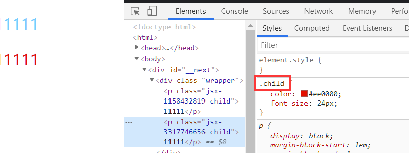
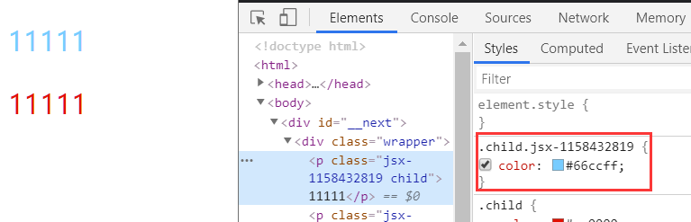

# CSS

## &lt;style&gt;标签

在 jsx 内直接使用`<style>`标签
`global`表示全局属性

```js
function HomePage() {
  return (
    <div className="wrapper">
      <p className="child">
        11111
        <style jsx>{`
          .child {
            color: #66ccff;
          }
        `}</style>
      </p>
      <p className="child">
        11111
        <style global jsx>{`
          .child {
            color: #ee0000;
            font-size: 24px;
          }
        `}</style>
      </p>
    </div>
  )
}
```





## 内联样式

和`React`一致

```js
<p className="child" style={{ border: "1px solid #ccc" }}>
  11111
</p>
```

## 使用 Sass

::: tip  
Next.js 自 9.3 版本起已经内置了 Sass ，不需要额外安装
:::  
以下是 9.2 版本内容

参考官网[next-sass](https://github.com/zeit/next-plugins/tree/master/packages/next-sass)

1. 安装依赖

```bash
yarn add @zeit/next-sass node-sass
```

2. 配置
   在根目录的`next.config.js`配置

```js
// next.config.js
const withCSS = require("@zeit/next-css")
const withSass = require("@zeit/next-sass")

module.exports = withSass(
  withCSS({
    /* config options here */
  })
)
```

::: tip  
Next.js 自 9.2 版本起已经内置了`@zeit/next-css` ，不需要额外安装
但所有 CSS 只能在入口`pages/_app.js`内引入
Sass 和原本一致，可以在任意页面  
:::
