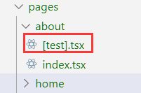
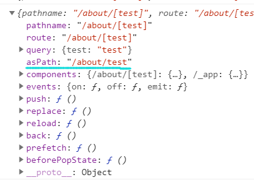

# 路由

## index

next 根据文件名自动生成路由，例如`about.js`对应的路由就是`/about`  
同样遵循 ES6 module 的路径规则，新建文件夹`about`，next 会去找`about`文件夹下的`index.js/index.ts/index.tsx`

## 嵌套路由

pages/dashboard/settings/username.js 对应路由/dashboard/settings/username

## 动态路由

比如建立的文件时  

/pages/about/[test].js  
访问/about/1, /about/2, /about/xx 任意路径都会到[test].js

## next/link 模块

### Link

内部必须是单个元素包裹，不可以直接字符串

```js
import React from "react"
import Link from "next/link"
function HomePage() {
  return (
    <div className="wrapper">
      <Link href="/about">
        <a>About</a>
      </Link>
    </div>
  )
}
```

### href 和 as

href 指向具体页面，as 表示显示在 url 内的路径。浏览器显示为`localhost:3000/about/test`

```js
<Link href="/about/1" as="/about/test">
  <a>About</a>
</Link>
```

## next/router 模块

[next/router](https://nextjs.org/docs/api-reference/next/router)

### useRouter

获取 router 对象。属于 React Hook，不能在 class 组件内使用  
比如从上面的"/about/1"跳过来的路由，显示如下

```js
import React from "react"
import { useRouter } from "next/router"
function DynaticPage() {
  const router = useRouter()
  console.log(router)
  return <div>hello</div>
}
```



### withRouter

将路由参数传给组件

```js
import React from "react"
import { withRouter } from "next/router"
function HomePage({ router }) {
  console.log(router) //router对象和useRouter()一样
  return (
    <div className="wrapper">
      <a>About</a>
    </div>
  )
}
export default withRouter(HomePage)
```

### Router

对应 Vue 的`this.$router`，即编程式路由

#### push/replace

有 push, replace

```js
import Router from "next/router"
function HomePage() {
  const jumpAbout = () => {
    //跳到/about?id=1
    Router.push({
      pathname: "/about",
      query: {
        id: 1,
      },
    })
  }
  return (
    <div className="wrapper" onClick={jumpAbout}>
      click me
    </div>
  )
}
const jumpAbout = () => {
  //跳到/about，但浏览器地址栏显示是"/alias"
  Router.push("/about", "/alias")
}
```

#### beforePopState

返回 false：前进后退不会渲染组件  
一定要确保浏览器的组件挂载后才能调用  
即在浏览器端执行，需要组件加载完 componentDidMount/useEffect 执行  
但是刷新或者调用 Router.push 仍然会渲染，只影响浏览器的前进后退键

```js
import Router from "next/router"
function HomePage() {
  useEffect(() => {
    // 路由拦截，会影响浏览器前进后退的渲染结果
    Router.beforePopState(({ url, as, options }: any) => {
      return false
    })
  })
  return <div className="wrapper">click me</div>
}
```

#### 事件

同样需要组件加载完，在 componentDidMount/useEffect 执行。解绑在 componentWillUnmount  
绑定用 on, 解绑用 off  
比如绑定`routeChangeStart`(路由开始变化时触发)

```js
import Router from "next/router"
function handleRouteChange(params) {
  console.log(params)
}
Router.events.on("routeChangeStart", handleRouteChange)
```

### Shallow

改变 URL 但是不执行`getInitialProps`  
比如停留在当前页面，但是在 url 里面加了?id=xxx  
`router.push('/home?id=111', undefined, { shallow: true })`  
设置 shallow 为 true 后，可以保留之前的 state

```js
import React, { useEffect } from "react"
import { NextPage } from "next"
import { useRouter } from "next/router"

interface Props {
  stars?: string;
}
const HomePage: NextPage<Props> = ({ stars }) => {
  const router = useRouter()
  const jumpAbout = () => {
    router.push("/home?id=111", undefined, { shallow: true })
  }
  return (
    <div className="wrapper" onClick={jumpAbout}>
      
    </div>
  )
}
HomePage.getInitialProps = async (ctx) => {
  console.log("111")
  return { stars: "hello" }
}
export default HomePage
```
