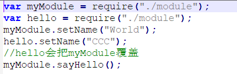
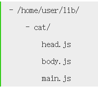
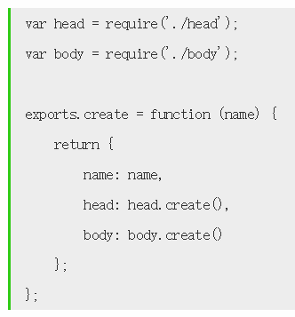
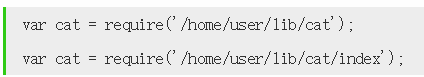
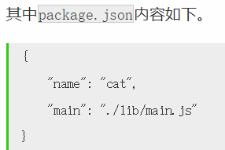
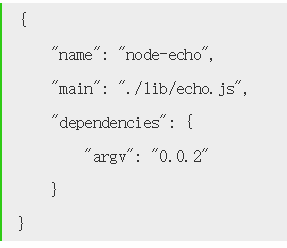

# 模块

编写稍大一点的程序时一般都会将代码模块化。在 NodeJS 中，一般将代码合理拆分到不同的 JS 文件中，每一个文件就是一个模块，而文件路径就是模块名。

在编写每个模块时，都有**require**、**exports**、**module**三个预先定义好的变量可供使用。

## require

require 操作是同步的，所以通常都放在开头，避免阻塞

require 函数用于在当前模块中加载和使用别的模块，传入一个模块名，返回一个模块导出对象。模块名可使用相对路径（以./开头），或者是绝对路径（以/或 C:之类的盘符开头）。

- 模块名中的.js 扩展名可以省略。

- require 可加载 .js、.json 和 .node 后缀的文件;

### 模块路径解析规则

require 函数支持斜杠（`/`）或盘符（`C:`）开头的绝对路径，也支持`./`开头的相对路径。

一旦某个模块文件的存放位置需要变更，使用该模块的其它模块的代码也需要跟着调整，变得牵一发动全身。因此，require 函数支持第三种形式的路径，写法类似于 foo/bar，并依次按照以下规则解析路径，直到找到模块位置。

- 以.和/开头的，根据路径定位到文件。如果写了扩展名，那么就用扩展名的文件。

- 如果没写扩展名，比如./path/xx 那么按照`xx.js→xx.json→xx.node`

- 如果还没有找到，那么将它当做一个目录，找./path/xx
  package.json 文件中 main 指定的入口文件

- 如果没有 package.json 或者 main 指定的文件不存在，那么找./path/xx /index.js

- 如果上面都没找到，那么 require 报错

- 内置模块：如果传递给 require 函数的是 NodeJS 内置模块名称，不做路径解析，直接返回内部模块的导出对象，例如 require('fs')。

- node_modules 目录：某个模块的绝对路径是/home/user/hello.js，在该模块中使用 require('foo/bar')方式加载模块时，则 NodeJS 依次尝试使用以下路径


- NODE_PATH 环境变量：NODE_PATH 环境变量中包含一到多个目录路径，路径之间在 Linux 下使用:分隔，在 Windows 下使用;分隔。

  - 例如定义了以下 NODE_PATH 环境变量：

  - 当使用 require('foo/bar')的方式加载模块时，则 NodeJS 依次尝试以下路径。


## exports 和 module.exports

require() 返回的是 module.exports 而不是 exports

- module.exports 初始值为一个空对象 {}

- exports 是指向的 module.exports 的引用

- exports.hello=hello 时，在 require 之后，需要 xxx.hello 来调用。

- 设置 module.exports = hello，可以直接使用

内部声明了一个名为 exports 变量：var exports = module.exports;

但最后暴露出去的是 module.exports 对象；所以可以通过 exports.XXX 来修改 module.exports.XXX，但是不能通过 exports
= {}修改

## 主模块

在 Node 环境里面启用的模块就是主模块。即 cmd 中 node main.js，则 main.js 就是主模块

## 模块初始化

一个模块中的 JS 代码仅在模块第一次被使用时执行一次。

会在内存中缓存起来

即使在主模块定义两个变量 A，B，他们都去 require 同一个 js，那么 A 和 B 指向同一个 object。

也就是如果对 A 操作后再去操作 B，B 会在 A 的结果上继续，而不是重新开始。

例如：

下例 myModule 输出的是 hello 的结果



## 包(package)

把由多个子模块组成的大模块称做包，并把所有子模块放在同一个目录里。

在组成一个包的所有子模块中，需要有一个入口模块，入口模块的导出对象被作为包的导出对象。

比如



其中 cat 目录定义了一个包，其中包含了 3 个子模块。main.js 作为入口模块，其内容如下：



在其它模块里使用包的时候，需要加载包的入口模块。接着上例，使用 require('/home/user/lib/cat/main')

此时用 index.js 做为入口模块可以简写

### index.js



两者等价。

### package.json

#### 自定义入口模块。

包名和路径。

比如 require('/home/user/lib/cat')，NodeJS 会根据包目录下的 package.json 找到入口模块所在位置



#### 安装多个第三方的包：

```json
dependencies: {
  packageName: "version"
}
```



dependencies

## 语义版本号 X.Y.Z

主版本号.次版本号.修订号

\^X.Y.Z：升级次版本号和修订号，表示选择 X.Y.Z 到 X+1.0.0 之间最新的版本

\~X.Y.Z：只升级修订号，表示选择 X.Y.Z 到 X.Y+1.0 之间最新的版本

\*：升级到最新版本

比如


4.14.0\<=x\<5.0.0

\~4.14.0 表示 4.14.0\<=x\<4.15.0

## npm

- `npm init`：初始化项目
- `npm init –y`: 一路 yes，用默认的 package.json

- `npm install/npm i`：安装

\--save：安装依赖的同时，自动把这些依赖写入 package.json。命令执行完成之后，查看
package.json，会发现多了一个 dependencies 字段

\--g 全局安装

### 报错解决

#### unable to look up github


### npx

在当前文件夹的 node_modules 寻找模块

```shell
#全局安装下的webpack
webpack –v
```

```shell
#运行当前目录的webpack
npx webpack –v
```
