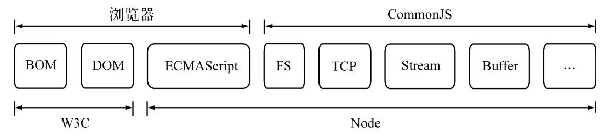

# 模块



## CommonJS 规范

当时 ECMAScript 规范由于时间早，涵盖的范围比较小。存在一些缺陷：

- 没有模块系统
- 标准库较少：对于文件系统，I/O 流等常见需求没有标准的 API
- 没有标准接口：比如 Web 服务器或者数据库之类的标准统一接口
- 缺乏包管理系统
  CommonJS 的提出，主要是为了弥补当时 JavaScript 没有标准的缺陷，期望让 JavaScript 具备开发大型应用的能力  
  规范涵盖了模块、二进制、Buffer、字符集编码、I/O流、进程环境、文件系统、套接字、单元测试、Web服务器网关接口、包管理等。

CommonJS 对于模块的定义主要分为三部分：

- 模块引用（require）：用 `require()` 引入外部模块到当前上下文中
- 模块定义（exports）：  
  上下文提供了`exports` 对象用于导出当前模块的变量或方法，并且是唯一的导出出口  
  还有一个`module` 对象，代表模块本身，exports 是 module 的属性

```js
// method.js
exports.add = () => {
  // do sth.
}
```

```js
// index.js
const method = require('./method')
// method.add()
```

- 模块标识（module）：传递给 `require` 的参数，比如路径、字符串

## NodeJS 的模块实现

NodeJS 对 CommonJS 的模块规范进行了一定的取舍。  
引入模块经历 3 个步骤：

1. 路径分析
2. 文件定位
3. 编译执行

在 NodeJS 中，模块分为两类

- 核心模块：NodeJS 本身提供的模块。  
  核心模块部分在NodeJS进程启动时就被直接加载进内存，会略过文件定位和编辑执行两个步骤，加载速度是最快的
- 文件模块：运行时动态加载，需要进行完整的 3 个步骤，比核心模块慢

## 优先从缓存加载

类似浏览器缓存静态资源，NodeJS 也会进行缓存，缓存的是编译和执行之后的对象  
不论是核心模块还是文件模块，require() 对相同模块的二次加载都优先从缓存中拿

```js
// method.js
let myName = 'hello'
exports.changeName = (name) => {
  myName = name
}

exports.getName = () => {
  console.log(myName)
}
```

```js
// index.js
const method = require('./method')
const sameMethod = require('./method')
method.getName() // "hello"
sameMethod.changeName('world')
method.getName() // "world"
```

### 路径分析和文件定位

模块标识符主要分为以下几类

- 核心模块，如 fs、http、path 等。
  如果自定义的模块和核心模块重名，是不会被加载的，因为核心模块加速速度总是弊文件模块快
- "." 或者 ".." 开头的相对路径
- "/" 或盘符（`C:`）开始的绝对路径
- 非路径形式的文件模块：比如一个包（package）

### 模块路径

生成规则，有点像作用域链

- 当前文件目录的 node_modules
- 父级的 node_modules
- 父级的父级的 node_modules
- 往上递归，一直到根目录下的 node_modules

```js
// index.js
console.log(module.paths)
```

windows 下可能是这样

```
[
  'D:\\project\\typescript\\src\\node_modules',
  'D:\\project\\typescript\\node_modules',
  'D:\\project\\node_modules',
  'D:\\node_modules'
]
```

### 文件定位

缓存加载的策略使得二次引入时不需要引入模块的 3 个步骤，但在文件的定位过程中需要注意一些细节：

1. 扩展名：require() 支持不包含文件扩展名，NodeJS 会根据 `xx.js → xx.json → xx.node` 依次查找  
   查找的过程中会调用`fs` 模块同步阻塞地判断文件是否存在

2. 目录分析和包：如果没有查找到文件，而是一个目录，NodeJS 会把目录当做一个包来处理
   - 先在当前目录下找 package.json（CommonJS 包规范定义的包描述文件），通过 JSON.parse() 解析对象，取出 `main` 属性指定的文件名进行文件定位
   - 如果 `main` 指定的文件名错误，或者没有 package.json，将 `index` 作为默认文件名，依次查找 `index.js`，`index.json`，`index.node`
   - 如果都没能定位任何文件，那么往上找 `module.paths` 的路径数组，直至遍历完毕

```js
// D:\project\typescript\src\index.js
const method = require('method2.js')
```

会往上找 'D:\\project\\typescript\\node_modules\\method2.js'，'D:\\project\\node_modules\\method2.js'，'D:\\node_modules\\method2.js'

- 依然没找到，抛出查找失败

## 文件模块编译

定位到具体文件后，NodeJS 会新建一个模块对象，然后根据路径载入编译  
不同的文件扩展名，载入方式不同

- `*.js`：fs 模块同步读取文件后编译执行
- `*.node`：C/C++ 编写的扩展文件，通过 dlopen() 方法加载最后编译生成的文件
- `*.json`：fs 模块同步读取后再用 JSON.parse() 解析返回后的结果
- 其他：当做 `*.js` 处理

### JavaScript 模块的编译

在编译的过程中，NodeJS 对 JavaScript 进行了一些包装（），大致结构如下  
这样可以进行作用域隔离，避免全局变量污染

```js
;(function (exports, require, module, __filename, __dirname) {
  // 源代码内容
  // 比如 console.log(module.paths)
})
```

而 exports、[\_\_dirname](./008_path.md) 这些全局变量的由来也是因为包装而不需要定义就能使用

### exports 和 module.exports

require() 返回的是 module.exports 而不是 exports

- module.exports 初始值为一个空对象 {}
- exports 是指向的 module.exports 的引用
  - exports.hello=hello 时，在 require 之后，需要 xxx.hello 来调用。
  - 设置 module.exports = hello，可以直接使用

内部声明了一个名为 exports 变量：var exports = module.exports;  
但最后暴露出去的是 module.exports 对象；所以可以通过 exports.XXX 来修改 module.exports.XXX，但是不能通过 exports
= {}修改

### C/C++模块的编译

调用 process.dlopen() 方法进行加载和执行，dlopen() 在 Windows 和 _nix 平台下有不同的实现，通过 libuv 兼容层进行封装  
`_.node` 实际上并不需要编译，它是编写 C/C++ 模块之后编译生成的。  
执行的过程中，模块的 exports 对象和 .node 模块产生联系，然后返回给调用者

### JSON 文件的编译

读取 JSON 文件，直接引入即可，不需要显示地调用 fs 模块

## 核心模块编译

核心模块在编译成可执行文件的过程中被编译进了二进制文件。  
核心模块实际上分为两部分

- JavaScript 编写：放在 lib 文件夹下
- C/C++ 编写：放在 src 文件夹下

### JavaScript 核心模块的编译

NodeJS 用 V8 附带的 js2c.py 工具把内置的 JavaScript 代码转换成 C++ 里的数组，生成 node_natives.h 头文件  
在这个过程中，JavaScript 以字符串的形式存储在 NodeJS 命名空间中。  
启动 NodeJS 进程时，JavaSciprt 代码直接加载进内存。

lib 目录下的的模块文件也没有定义 require、module、exports 这些变量。在引入 JavaScript 核心模块的过程中，也经历了和文件模块一样的包装过程

### C/C++ 核心模块的编译

核心模块中，有些是完全用 C/C++ 编写，有些是 C/C++ 编写核心，其他部分由 JavaScript 包装以满足性能要求。  
因为脚本语言的开发速度由于静态语言，虽然性能会弱于静态语言  
纯 C/C++ 编写的称为内建模块：比如 buffer、crypto

### gyp

Generate Your Projects：跨平台地生成文件。比如 \*nix 下生成的是 Makefile 等文件，Windows 下是 vcxproj 等  
再在各自的平台用各自的编译器进行编译  
开发者专门为 Node 提供了一个专有的扩展构建工具——node-gyp
