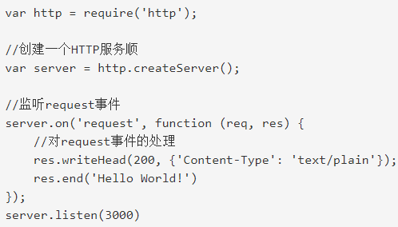
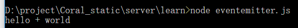

# Event loop

和浏览器相比，多了一个`nextTick`  
官网[说明](https://github.com/nodejs/nodejs.org/blob/master/locale/zh-cn/docs/guides/event-loop-timers-and-nexttick.md)
::: warning
以下所有示例和解释的 node 版本是 10.x(v10.16.3)，其余 node 版本表现可能不同, 11.x 以上表现结果与浏览器一致
:::

```js
console.log('1')
setTimeout(function () {
  console.log('2')
  new Promise(function (resolve) {
    console.log('4')
    resolve()
  }).then(function () {
    console.log('5')
  })
})
new Promise(function (resolve) {
  console.log('7')
  resolve()
}).then(function () {
  console.log('8')
})

setTimeout(function () {
  console.log('9')
  new Promise(function (resolve) {
    console.log('11')
    resolve()
  }).then(function () {
    console.log('12')
  })
})
/*
NodeJS结果  1 7 8 2 4 9 11 5 12
浏览器结果  1 7 8 2 4 5 9 11 12
*/
```

## 执行顺序

Node v10.x 下：  
如果执行 task 的时候发现了 microtask，不会像浏览器一样执行了，而是将为微任务放到微任务队列中，等待整个 job queue 执行完毕，下一个阶段开始的时候先执行完微任务队列中的任务  
Node 中  
microtask：then 、nextTick 、messageChannel、mutationObersve(微任务中 nextTick 会比 then 先执行)
task：setTimeout 、setInterval 、setImmediate 、io 文件操作、Promise

```js
new Promise(function (resolve, reject) {
  console.log('start')
  resolve()
})
  .then(() => {
    console.log('promise1')
  })
  .then(() => {
    console.log('promise2')
  })
process.nextTick(() => {
  console.log('nextTick')
})
Promise.resolve()
  .then(() => {
    console.log('promise3')
  })
  .then(() => {
    console.log('promise4')
  })
process.nextTick(() => {
  console.log('nextTick2')
})
setTimeout(() => {
  console.log('setTimeout')
  new Promise(function (resolve, reject) {
    console.log('setTimeout Promise')
    resolve()
  })
    .then(() => {
      console.log('promise5')
    })
    .then(() => {
      console.log('promise6')
    })
})
setTimeout(() => {
  console.log('setTimeout2')
  new Promise(function (resolve, reject) {
    console.log('setTimeout2 Promise')
    resolve()
  })
    .then(() => {
      console.log('promise7')
    })
    .then(() => {
      console.log('promise8')
    })
})
process.nextTick(() => {
  console.log('nextTick3')
})
console.log('end')
/*
NodeJS顺序
start
end
nextTick
nextTick2
nextTick3
promise1
promise3
promise2
promise4
setTimeout
setTimeout Promise
setTimeout2
setTimeout2 Promise
setTimeout nextTick
promise5
promise7
promise6
promise8
*/
```

## 异步编程

如果 err 就直接 return，这样比较优雅

## 回调

一般用来表示一次性响应的逻辑

## 事件监听器

本质上也是回调



server.on 就是一个监听器，每次有 request 事件发出的时候，就会触发

## 自定义事件发射器（Event Emitter）

用`EventEmitter`创建自己的实例

on 监听，emit 触发，removeListener 删除监听

```js
const EventEmitter = require('events').EventEmitter
const myEvent = new EventEmitter()
myEvent.on('join', (msg, msg2) => {
  console.log(`${msg} + ${msg2}`)
})
myEvent.emit('join', 'hello', 'world')
//myEvent.removeListener ("join");
```



removeAllListeners 删除所有对应的监听器，用法同 removeListener  
如果绑定多个，按照绑定的顺序执行，和`addEventListener`表现一致

### once

只绑定一次，调用之后立即解绑

```js
const events = require('events')
const instance = new events()
instance.once('play', (data) => {
  console.log(data)
})
instance.on('play', (data) => {
  console.log('second: ' + data)
})
instance.emit('play', 'hello')
instance.emit('play', 'hello')

/* 
hello 
second: hello
second: hello
*/
```
