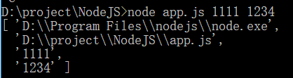

# process

进程相关，和操作系统有关的一个接口。  
提供有关当前 Node.js 进程的信息并对其进行控制  
是一个全局变量，不需要 require，就可以直接使用  
同时也是[EventEmitter](./002_event_loop.md)的实例，可以监听事件

## argv

process.argv：数组。第一个是 node 进程，第二个是 JS 路径，第三个之后是各种参数。

比如运行任意一个 JS



## version

获取 NodeJS 版本

```js
process.version //v12.16.1
```

## pid

获取当前进程的 pid

```js
process.pid //17004
```

## process.env

一个对象，可以进行赋值，比如常见的`NODE_ENV`其实是个自定义的对象，只不过大家都公认这个 NODE_ENV 是 NodeJS 的环境，已经成为了开发规范  
最常见的值是`"development"`和`"production"`  
也可能有 dev, prod 等等，取决于项目  
设置值通常用 cross-env 库

## cwd

获取当前的工作目录

```js
process.cwd() //D:\project\express-ts
```

## exit

退出进程  
可以传入一个可选的参数`code`，表示退出成功时的状态码，默认为 0

```js
process.on('exit', code => {
  console.log(code) //666
})
process.exit(666)
```

## 流

process 中流操作是**同步**的，和其他[stream](./006_stream.md)不同  
`process.stdin`: cmd 内输入
`process.stdout`: 输出。`console.log`就是通过`stdout`实现的
`process.stderr`: 错误。`console.error`就是通过`stderr`实现的

```js
process.stdin.setEncoding('utf8')

process.stdin.on('readable', () => {
  let chunk
  // 使用循环确保我们读取所有的可用数据。
  while ((chunk = process.stdin.read()) !== null) {
    if (chunk === '\n') {
      process.stdin.emit('end')
      return
    }
    process.stdout.write(`收到数据: ${chunk}`)
  }
})

process.stdin.on('end', () => {
  process.stdout.write('结束监听')
})
```
