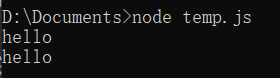

# Stream

处理大文件  
readFile 和 writeFile 读写大文件时性能较差

改用流来进行分片，流通过管道(pipe)传输

比如 request 是 POST 形式的时候，on 监听"data"方法，解决网络流量

以下的 API(比如 on, write)只要是 Stream 对象都可以使用。

等价于

`req.pipe(res);`

## cmd 下显示输入的内容

本质上是 linux 的概念，NodeJS 用自己的 API 进行了实现

std 就是 stand

标准的输入输出

`process.stdin.pipe(process.stdout);`

比如输入"hello"按 Enter，控制台输出"hello"



## fs 模块操作 stream

### fs.createReadStream(fileName, options)

### fs.createWriteStream(path, options)

gmarket.txt 的内容被替换为 temp.css

```js
const fs = require('fs')
const readFile = fs.createReadStream('./temp.css')
const writeTarget = fs.createWriteStream('./gmarket.txt')
readFile.pipe(writeTarget)
readFile.on('end', () => {
  console.log('read finished')
})
```

#### write(chunk, callback)

除了用 pipe 连接写入流，对象本身也可以调方法写入自定义的内容

写入完成后触发回调

```js
const fs = require('fs')
const writeFile = fs.createWriteStream('./temp.css')
writeFile.write('hello', () => {
  console.log('complete')
})
```

## http 与 fs 结合使用

比如 http 的 request 发送的 GET 请求，需要读取某个文件

```js
const fs = require('fs')
const http = require('http')
http
  .createServer((req, res) => {
    if (req.method == 'GET') {
      const readFile = fs.createReadStream('./temp.css')
      readFile.pipe(res)
    }
  })
  .listen(8888)
```

## on 监听

Stream 对象可以通过监听"data"来展开每个流读取的内容, "end"表示读取完毕

用法和 request 的 on 一样

```js
readFile.on('data', chunk => {
  console.log(chunk.toString())
})
```

## readline

基于 stream。用来读取一行行的 stream

### createInterface

```js
const fs = require('fs')
const readline = require('readline')
const rl = readline.createInterface({
  input: fs.createReadStream('./temp.css')
})
rl.on('line', line => {
  console.log(`接收到：${line}`)
})
```

### on 监听事件

#### line

收到行尾输入（\\n、 \\r 或 \\r\\n）时就会触发`line`事件

#### close 事件

所有行读取结束触发
