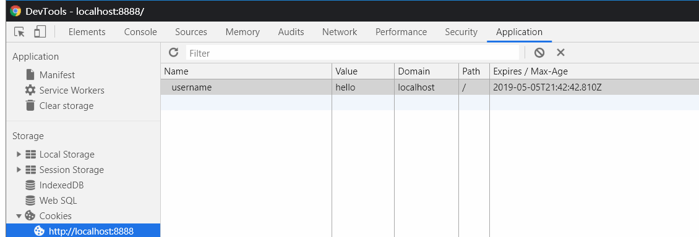
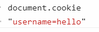

# http

```js
const http = require('http')
```

## createServer()

```js
http
  .createServer((req, res) => {
    console.log(req.method) //请求的方式，比如GET, POST
    res.end('hello, world')
  })
  .listen(8888)
```

## request

对应上面的`req`

### method 属性

req.method  
请求方式

#### GET

#### POST

如果`req.method`是 post，通过调用[on 方法](#on方法)监听数据

### url 属性

浏览器上的完整地址，可以用[querystring](./009_query_string.md)模块解析

### headers 属性

请求头，比如

```js
req.headers['content-type']
```

### on 方法

采用 Stream 的方式

```js
http.createServer((req, res) => {
  if (req.method === 'POST') {
    let postData = ''
    req.on('data', chunk => {
      postData += chunk.toString()
    })
    req.on('end', () => {
      res.end('post数据接收完毕')
    })
  }
})
```

### pipe 方法

```js
req.pipe(res)
```

将 req 的内容写到 res 中，等价于 req.on+req.end。

但 pipe 使用了流(stream)的方式，读取大文件更加高效

## response

### setHeader 方法

设置返回的响应头(Response Headers)，比如 content-type

只能设置单个状态
`res.setHeader(key, value);`

```js
http.createServer((req, res) => {
  res.setHeader('Content-Type', 'application/json')
  res.end(`{
    hello: "world"
  }`)
})
```

#### Set-Cookie

服务器设置 cookie 的 key 是"Set-Cookie"

设置后 JS 内可以通过 document.cookie 查看，也可以看浏览器 Application 的 Cookies



1. path

做登录功能要设置 path

例如在访问/foo/bar 时 Set-Cookie 的值只传了"key=value"，那么默认 path 是/foo/bar。这样在访问/foo/bar2 的时候 cookie 就会失效

实际上需求是要访问整个项目的时候都设置 cookie

res.setHeader("Set-Cookie", \`username=hello; path=/\`)



2. httpOnly

只允许后台修改 cookie

```js
res.setHeader('Set-Cookie', `username=hello; httpOnly`)
```

设置后 document.cookie 为空，也无法修改


3.expires

过期时间，格式是 GMT 的字符串

```js
var date = new Date()
date.toGMTString()
res.setHeader('Set-Cookie', `username=hello; expires=${date}`)
```

### writeHead

多个返回的响应头(Response Headers)

```js
res.writeHead(statusCode, {
  key: value,
  key2: value2
})
res.writeHead(200, {
  'Content-Type': 'text/plain'
})
res.end(`hello, world`)
```

### end 方法

## http.get

获取第三方接口，比如慕课网。

返回的结果用`on`监听 data 数据改变

用`end`监听数据全部请求完成


