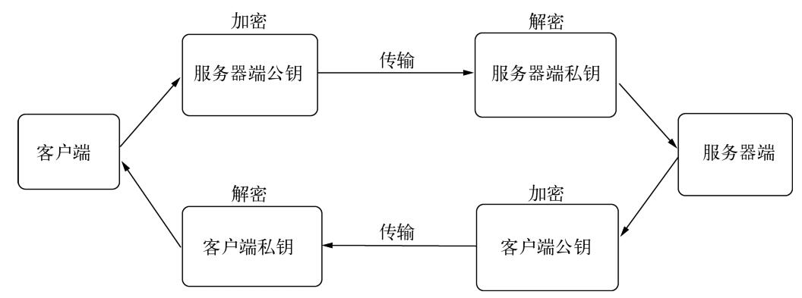

# 网络编程

Node 提供了一些模块用来处理网络请求

- [Net](https://nodejs.org/docs/latest/api/net.html)：处理 TCP
- [dgram](https://nodejs.org/docs/latest/api/dgram.html)（UDP/Datagram）：处理 UDP
- [HTTP](https://nodejs.org/docs/latest/api/http.html)
- [HTTPS](https://nodejs.org/docs/latest/api/https.html)
- [HTTP/2](https://nodejs.org/docs/latest/api/http2.html)

## TCP

关于 TCP 的介绍，见[网络](../tcp/01_tcp.md)  
可以用 Node 建立一个服务器

```js
const net = require("net");

const server = net.createServer((socket) => {
  socket.write("hello");

  socket.on("end", () => console.log("end"));
});

server.on("connection", () => console.log("connect"));

server.listen(666, () => console.log("server open"));
```

windows 下打开 cmd，输入

```bash
telnet 127.0.0.1 666
```

在 cmd 内可以看到写入的 "hello" 字符串  
如果提示没有 telnet 这个命令，可以在控制面板打开  
控制面板 → 程序和功能 → 打开或关闭 Windows 功能，勾上 telnet 客户端

Node 也可以自己建立客户端

```js
// server 端
const net = require("net");

const server = net.createServer((socket) => {
  socket.write("hello");

  // data 是 Buffer 对象
  socket.on("data", (data) => console.log(data.toString())); // "hey"
});
server.listen(666, () => console.log("server open"));
```

```js
// client 端
const net = require("net");

const client = net.connect(
  {
    port: 666,
  },
  () => {
    console.log("connect");
    client.write("hey");
  }
);

client.on("data", (data) => console.log(data.toString())); // "hello"

client.on("end", () => console.log("end"));
```

### 事件

对于服务端，具有以下事件

- listen
- connection：连接到该服务端时触发
- close / error

服务端可以和多个客户端连接，每个连接都是一个 Stream 对象，可以使用 `pipe` 等  
这些对象常用的事件：

- data：当一端调用 `write` 发送数据时，另一端会触发 `data`。  
  但不一定每次 write 都触发，出于性能考虑，可能会合并多个 write 数据，只触发一次 data
- end：任意一端终止
- connect：用于客户端，连接到服务端时触发
- drain：调用`write`时触发
- error / close
- timeout：连接一定时间后不再活跃

## UDP

```js
// 服务端
const dgram = require("dgram");
const socket = dgram.createSocket("udp4");

socket.on("message", (msg, remoteInfo) => {
  console.log(`${msg} from ${remoteInfo.port}`); // port: 发送者端口
  // hello from 62094
});

socket.on("listening", () => console.log("listening"));

socket.bind(666); // 绑定 666 端口
```

```js
// 客户端
const dgram = require("dgram");
const socket = dgram.createSocket("udp4");

// 向 666 端口发送信息
socket.send("hello", 666, () => {
  console.log("send");
  socket.close();
});
```

## HTTP

继承自 net 模块  
HTTP 模块实际上只做两件事情：处理 HTTP 请求（ServerRequest 对象）和发送 HTTP 响应（ServerResponse 对象）

## websocket

对 Websocket 的介绍见[websocket](../network/09_websocket.md)  
Node 没有内置的 Websocket，可以用社区 `ws` 模块

## 安全

数据在服务端和客户端之间传递，如果是明文当然不安全，需要进行加密。  
但对于应用层协议而言（HTTP，FTP），需要信息透明方便处理，不需要关心网络传输中的安全问题。  
为此诞生了 SSL，在传输层提供网络加密。  
最初的 SSL 应用在 Web 上，服务端和浏览器都支持，随后被标准化，称为 TLS（Transport Layer Security，安全传输层协议）  
NodeJS 在安全方面提供了三个模块，分别是 crypto，tls，https。

- crypto：主要用于加密解密，SHA1、MD5 等加密算法都在其中有所体现
- tls：提供了类似 net 模块的功能，区别在于它建立在 TLS/SSL 加密的 TCP 连接上
- https：和 http 模块的接口完全一样，区别在于建立在安全连接上

### 秘钥

TSL/SSL 是一个公钥/私钥的结构，非对称。公钥加密，私钥解密  
他们是配对的，只有对应的私钥才能解密对应的公钥  
  
风险：中间人攻击，进行劫持，对服务端扮演客户端的角色，对客户端扮演服务端的角色

```
客户端 ← 中间人 ← 服务端
```

解决方案：对公钥进行认证，确保是目标服务端发出的  
认证手段：TSL/SSL 加入了数字证书来进行认证。  
数字证书包含了服务器的名称、主机名、服务器的公钥、签发颁发机构的名称、来自颁发机构的签名等等  
建立连接前，会验证颁发机构的签名确认收到的公钥是来自目标服务器

### 数字证书

引入第三方 CA（Certificate Authority），为站点颁发证书。证书内包含通过 CA 自己的公钥和私钥实现的签名  
过程：  
为了得到签名证书，服务端需要通过自己的私钥生成 CSR（Certificate Signing Request，证书签名请求）文件。  
CA 通过这个文件颁发属于该服务端的签名证书，只要通过 CA 机构就能验证该证书是否合法  
通过 CA 发证书过程比较繁琐，一般小企业通过自签名证书来构建安全网络。  
自签名证书就是自己扮演 CA 机构，给自己的服务端颁发证书
