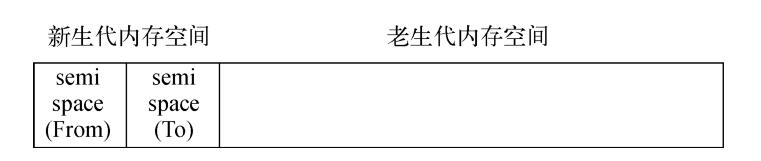
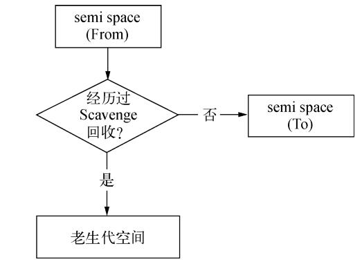

# V8 中的垃圾回收

随着 NodeJS 在服务端的发展，基于 NodeJS 本身无阻塞、事件驱动建立的服务，具有内存消耗低的特点  
适合处理海量的网络请求  
在海量请求的前提下，需要考虑一些客户端不太可能造成影响的问题。  
内存控制正是在海量请求和长时间运行的前提下要探讨的，如何高效地使用内存，首先要知道 V8 的相关的内存管理

## V8 的内存限制

在 V8 中，所有的对象都是通过堆来进行分配的。
在 NodeJS 命令行中，输入 `process.memoryUsage()` 可以看到当前的内存信息

```bash
> process.memoryUsage()
{
  rss: 19816448,        # rss: resident set size（常驻内存）
  heapTotal: 5177344,   # 已申请到的堆内存
  heapUsed: 2653608,    # 当前使用量
  external: 1417563
}
>
```

```
                堆
——————————————————————————————————
|   已使用对象 |                  |
——————————————————————————————————
```

V8 会限制堆的大小，表层原因是因为 V8 最初就是为浏览器设计的，不太可能遇到大内存的场景。  
深层原因是因为垃圾回收机制：以 1.5GB 的垃圾回收堆内存为例，做一次小的垃圾回收需要 50 毫秒以上，做一次非增量式的垃圾回收，至少需要 1 秒以上。  
以上时间指的是引起 JavaScript 线程暂停执行的时间，在这段时间中，应用的性能和响应能力都会直线下降。  
在浏览器也是无法接受的，所以不如直接限制堆内存

## 垃圾回收算法

### 分代

V8 的垃圾回收策略主要基于分代式垃圾回收机制。  
按对象的存活时间将内存的的垃圾回收进行不同的分代  
V8 中主要分为新生代和老生代两代。

- 新生代的对象是存活时间较短的对象
- 老生代是时间较长或者常驻的对象

```
—————————————————————————————————
|新生代的 |  老生代的内存空间     |
|内存空间 |                      |
—————————————————————————————————
```

### Scavenge 算法

在分代的基础上，新生代的对象主要通过 Scavenge 算法进行垃圾回收。  
Scavenge 算法的实现主要采用 Cheney 算法  
Cheney 算法是一种采用复制的方式实现的垃圾回收算法：  
将堆内存一分为二，每一部分空间成为 `semispace`，在这两个空间中，只有一个空间会被使用，另一个处于闲置状态

- 处于使用状态的 semispace 称为 From 空间
- 闲置状态称为 To 空间

当分配对象时，先在 From 空间进行分配。  
开始进行垃圾回收时，会检查 From 空间的存活对象，这些存活对象会被复制到 To 空间，而非存活对象则被释放。  
完成复制后，原本的 From 空间就成了 To 空间

Scavenge 是典型的用空间换时间的算法，无法大规模地应用到所有垃圾回收中。因为新生代的生命周期较短，比较适合  


当一个对象进行多次复制后依然存活，会被认为是生命周期较长的对象。会被移动到老生代的内存空间，采用新的算法进行管理。  
从新生到移动到老生代的过程称之为晋升

在单纯的 Scavenge 过程中，From 空间的存活对象会被复制到 To 空间，然后两个空间进行角色交换。  
在分代式垃圾回收的前提下，From 的存活对象复制到 To 之前需要进行检查。满足一定条件时要将存活周期长的对象移动到老生代  
条件一般分为两部分：

- 对象是否经历过 Scavenge 回收：通过内存地址来判断
  
- To 空间的内存占用超过限制：把对一个对象从 From 复制到 To 空间时，如果 To 空间占比超过 25%，直接把该对象晋升到老生代

### Mark-Sweep & Mark-Compact

Scavenge 算法不适合老生代内的对象处理。因为老生代的生命周期比较长
Mark-Sweep：标记-清除  
在标记阶段遍历所有对象，并标记活着的对象。然后在清除阶段只清除没有标记的对象

Mark-Sweep 在进行一次标记清除之后，内存会变成不连续的状态。  
因为遍历的时候没有修改对象的位置，活着的和未标记的可能是相邻的  
这样会对后续的内存分配造成影响。如果需要一个比较大的内存，但是被清除的对象留下的内存都比较小，就不能完成这次分配  
所有有了 Mark-Compact：标记-整理。  
在标记-清除的基础上，会在遍历的时候把活着的对象往一端移动，清除的时候直接清理掉剩余内存。

### 对比

| 回收算法     | Mark-Sweep   | Mark-Compact | Scavenge           |
| ------------ | ------------ | ------------ | ------------------ |
| 速度         | 中等         | 最慢         | 最快               |
| 空间开销     | 少（有碎片） | 少（无碎片） | 双倍空间（无碎片） |
| 是否移动对象 | 否           | 是           | 是                 |

在取舍上，V8 主要用 Mark-Sweep，从新生代晋升到老生代的对象分配内存不足的情况下，使用 Mark-Compact

## Node 中的内存

Node 的内存分为通过 V8 分配的部分和 Node 自行分配的部分。  
内存限制以及垃圾回收只影响 V8 分配的堆内存。
因为 V8 本身是为浏览器设计的，JavaScript 大部分情况下处理字符串就满足了。  
但 Node 需要处理网络流和文件 I/O 流，所以很多对象是由 Node 自行分配的，比如 Buffer
