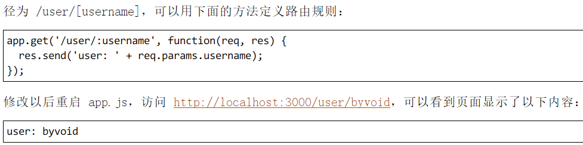
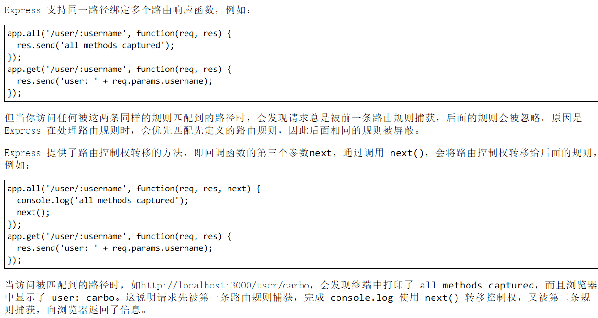
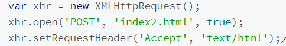

# express

```js
const express = require('express')
const app = express()
app.use((req, res, next) => {
  console.log(`use: ${req.url}`) //use: 不论是什么方法都会进
  next()
})
app.get('/api', (req, res, next) => {
  console.log(`get: ${req.url}`) //get请求的时候会进
  next()
})
app.get('/api/foo', (req, res, next) => {
  console.log(`get: ${req.url}`) //get请求的时候会进
  next()
})
app.listen('3000', () => {
  console.log(`app is running in port 3000`)
})
```

- 访问http://localhost:3000/api
  会进 use /api，因为 use 写了 next()，所以会进 get /api
- 访问http://localhost:3000/api/foo
  同理会进 use /api 和 get /api/foo


:name: 通过 req.params.name 取到实际的值



## next()



## res.send

## res.format

根据 ajax 的请求消息头返回对应的内容

页面 ajax



express 内响应


## express.static

读取静态文件

## NODE_ENV

告知 Node 程序运行在哪个环境中，其默认是开发环境

## use(middleware)

app.use 加载用于处理 http 請求的 middleware（中间件），当一个请求来的时候，会依次被这些 middlewares 处理  
当业务逻辑复杂的时候，为了明确和便于维护，需要把处理的事情分一下，分配成几个部分来做，而每个部分就是一个中间件  
本质上中间件就是个函数

```js
function middleware(req, res, next) {
  // 做该干的事
  // 做完后调用下一个函数
  next()
}
```

- 使用 app.use(fn)后，传进来的 fn 就会被扔到一个函数数组
- 执行完毕后调用 next()方法执行函数数组里的下一个函数，如果没有调用 next()的话，就不会调用下一个函数

## Express 应用生成器

```
npm install express-generator –g

express myapp

express –-view=ejs

supervisor ./bin/www
```
