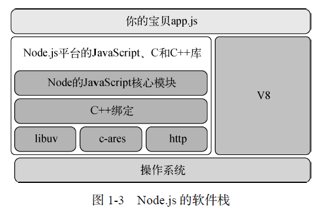
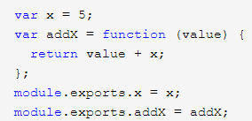
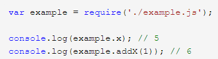

# 概要

本节大部分是[七天学会 NodeJS](http://nqdeng.github.io/7-days-nodejs/), [《Node.js 实战（第 2 版）》](http://www.ituring.com.cn/book/1993)的笔记;  
包含了少量的后台知识

## windows 安装(个人兴趣)

npx 启动路径不能带空格，Program Files 要全部替换掉，暂时改成 project\\node

查看全局安装路径：

`npm config ls`

修改全局安装路径，还要修改环境变量

```bash
npm config set prefix "D:\\project\\node\\node_global"
npm config set cache "D:\\project\\node\\node_cache"
```

新建名字为 NODE_PATH

设置值为`D:\\project\\node \\node_global\\node_modules`

在 path 内修改`AppData\\Roaming\\npm`

为`D:\\project\\node\\node_global`

如果遇到 permission not permitted，修改 temp 文件路径

`npm config set tmp`

## CentOS 下安装

```bash
#下载xz
wget https://nodejs.org/dist/v12.13.1/node-v12.13.1-linux-x64.tar.xz
#解压
xz -d node-v12.13.1-linux-x64.tar.xz
tar -xvf  node-v12.13.1-linux-x64.tar
#进入解压目录
cd node-v10.9.0-linux-x64/
#执行node命令 查看版本
./bin/node -v
#建立软连接，方便全局使用
#在这之前用`pwd`查看node文件夹的完整目录
pwd
#拿到完整目录后ln建立软连接。假设完整路径是/root/node/bin/node
ln -s /root/node/bin/node /usr/local/bin/node
#建立npm软连接。目录同node
ln -s /root/node/bin/npm /usr/local/bin/npm
#检查是否关联。如果软连接成功，node -v会输出对应的nodejs版本。同样npm -v也是
node -v
```

重命名
`mv oldname newname`

### 删除软连接

`ln`命令如果在上述步骤关联失败或者重新关联的时候提示方式已存在：`failed to create symbolic link '/usr/local/bin/node': File exists`  
可以通过删除文件重新建立来解决

```bash
#删除关联的文件夹
rm -rf /usr/local/bin
#新建关联的文件夹
mkdir /usr/local/bin
#建立软连接
ln -s /root/node/bin/node /usr/local/bin/node
```

## 用处

JS 是脚本语言，脚本语言都需要一个解析器才能运行。对于写在 HTML 页面里的 JS，浏览器充当了解析器的角色。而对于需要独立运行的 JS，NodeJS 就是一个解析器。



## CommonJS

NodeJS 是 CommonJS 规范的一个实现

`require`引入，`module.exports`导出

- 每个文件就是一个模块，有自己的作用域。在一个文件里面定义的变量、函数、类，都是私有的，对其他文件不可见

- CommonJS 规范规定，每个模块内部，module 变量代表当前模块。这个变量是一个对象，它的 exports 属性（即 module.exports）是对外的接口。加载某个模块，其实是加载该模块的 module.exports 属性




