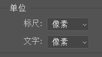
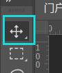

# PS

记录一些常用的操作
参考[前端工程师必备的 PS 技能——切图篇](https://www.imooc.com/learn/506)

## 快捷键

以下基于 windows 默认

- 新建：ctrl+N
- 移动工具：V
- 标尺：ctrl+R

## 初始化设置

设置完毕以后可以保存到工作区

窗口——工作区

### 移动工具

方便选中 PSD 的任意文件：移动工具时，默认设置成自动选择-图层。

自动选择不要勾选。

需要选中的情况下，按 ctrl+鼠标左键（MAC 是 command）

### 编辑

编辑——首选项

首选项——暂存盘：改 D 盘

首选项——单位与标尺：改像素

### 视图

视图设置显示标尺和智能参考线

视图——标尺

视图——显示——智能参考线

### 窗口

显示字符和信息：窗口——字符，窗口——信息

关闭库。

关掉一些多余的东西，拖拽。可以调整成下面的内容

### 信息

信息点击面板，在面板选项里面改成颜色改 RGB，尺寸改像素

## 操作

### 移动

移动状态下 ctrl+左键图层，可以选中多个

选中多个的前提下，状态栏会出现对齐方式，比如居左、居右

ctrl+鼠标左键图层，会变成选中状态，并且信息会显示宽高

### 选框

一旦选区之后，所有的操作都在选框的区域内

单行/单列都只有一个像素

多个选区：

默认选区只有一个，多个需要状态栏设置

剩下两个是减区和多个区域取交集

### 图片去色

从彩色变黑白：
图像 → 调整 → 去色
