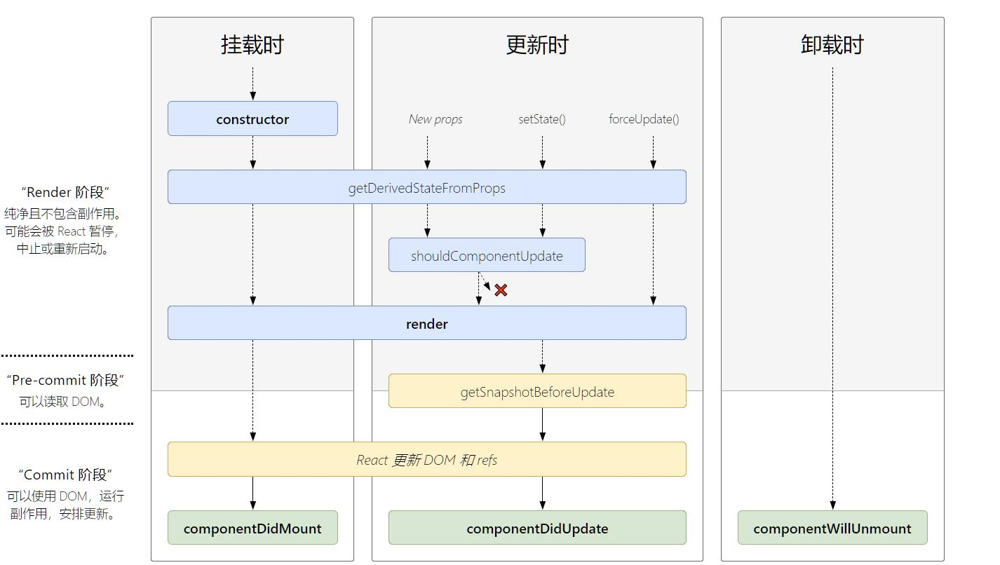

# 组件

官网[Components and Props](https://reactjs.org/docs/components-and-props.html)  
分为函数组件和类组件。  
组件名必须首字母大写。React 会把小写字母认为是原生的 HTML 标签

```js
function Welcome(props) {
  return <h1>Hello, {props.name}</h1>
}
//或者
class Welcome extends React.Component {
  render() {
    return <h1>Hello, {this.props.name}</h1>
  }
}
```

## props

父组件以属性的形式给子组件传值/函数，子组件通过 `props` 接收/调用

比如一个 TodoList。用类组件需要注意 `this` 的指向

```js
//父组件中
import React, { Component } from "react"
import TodoItem from "./TodoItem"

class TodoList extends Component {
  constructor(props) {
    super(props)
    // 当组件的 state 或者 props 发生改变的时候，render 函数就会重新执行
    this.state = {
      list: [],
    }
    // this 的绑定都放在 constructor 处理，性能较好
    this.handleItemDelete = this.handleItemDelete.bind(this)
  }

  render() {
    return <ul>{this.getTodoItem()}</ul>
  }

  getTodoItem() {
    return this.state.list.map((item, index) => {
      return (
        <TodoItem
          key={index}
          content={item}
          index={index}
          deleteItem={this.handleItemDelete}
        />
      )
    })
  }

  handleItemDelete(index) {
    this.setState((prevState) => {
      const list = [...prevState.list]
      list.splice(index, 1)
      return { list }
    })
  }
}

export default TodoList
```

```js
//子组件中
import React, { Component } from "react"

class TodoItem extends Component {
  constructor(props) {
    super(props)
    this.handleClick = this.handleClick.bind(this)
  }

  render() {
    return <div onClick={this.handleClick}>{this.props.content}</div>
  }

  handleClick() {
    const { deleteItem, index } = this.props
    //this.props.deleteIem = this.handleItemDelete
    //此时的this执行的是父组件，所以传递的时候用bind把this转为父组件的this
    deleteItem(index)
  }
}
```

### 默认为 true

只传 prop，但是不赋值，prop 的值默认是`true`。建议写完整  
下面两者等价

```js
<MyTextBox autocomplete />

<MyTextBox autocomplete={true} />
```

### 展开运算符

注意不要传递多余的 prop

```js
function App1() {
  return <Greeting firstName="Ben" lastName="Hector" />
}
//等价于
function App2() {
  const props = { firstName: "Ben", lastName: "Hector" }
  return <Greeting {...props} />
}

//进一步
const Button = (props) => {
  const { kind, ...other } = props
  const className = kind === "primary" ? "PrimaryButton" : "SecondaryButton"
  return <button className={className} {...other} />
}
```

## StrictMode

开发环境生效

- 额外 render 一次（不包括事件内的内容）
- React 18：额外执行 Effect 一次（setup+cleanup cycle in development）
- 会提示过时的 API

```jsx
<StrictMode>
  <App />
</StrictMode>
```

```tsx
let count = 0
function Demo() {
  const [value, setValue] = useState<number | undefined>(() => {
    count += 1
    return 1
  })

  useEffect(() => {
    console.log("[] mount")
    return () => {
      console.log("[] unmount")
    }
  }, [])

  useEffect(() => {
    console.log("value mount")
    return () => {
      console.log("value unmount")
    }
  }, [value])

  return <>{count}</>
}
export default Demo
```

```bash
[] mount
value mount
[] unmount
value unmount
[] mount
value mount
```

count 值是 2

## 类组件

官网[React.Component](https://reactjs.org/docs/react-component.html)  
定义类组件必须要调用`render()`方法

### defaultProps

添加默认的 props。props 未赋值，但又不能为 null 的情况，会拿默认值

```js
class CustomButton extends React.Component {
  // ...
}

CustomButton.defaultProps = {
  color: "blue",
}
```

```js
render() {
  return <CustomButton /> ; // props.color 将设置为 'blue';如果给了color={null}，那么color的值是null
}
```

### 事件绑定

官网[handling-events](https://reactjs.org/docs/handling-events.html)  
主要是对`this`进行处理，调用方法一般都是`this.myMethod`，对于方法调用有三种方式可以实现

```js
class EventsSample extends React.Component {
  constructor(props) {
    super(props)
    //第一种：手动bind
    this.handleClick = this.handleClick.bind(this)
  }
  handleClick = (e) => {
    //第一种
    console.log(e)
  }
  secondClick = (e) => {
    //第二种，属于实验性质，直接在class内写
    console.log(e)
  }
  thirdClick = (e) => {
    //第三种
    console.log(e)
  }
  render() {
    return (
      <>
        <button onClick={this.handleClick}>第一种，手动bind</button>
        <button onClick={this.secondClick}>第二种，直接在class内写</button>
        <button onClick={(e) => this.thirdClick(e)}>
          第三种，使用箭头函数
        </button>
      </>
    )
  }
}
```

在 React 17 之前，React 是把事件委托在 document 上的，React 17 及以后委托在挂载的容器上。React 合成事件采用的是事件冒泡机制，当在某具体元素上触发事件时，等冒泡到顶部被挂载事件的那个元素时，才会真正地执行事件。  
而原生事件，当某具体元素触发事件时，会立刻执行该事件。因此若要比较事件触发的先后时机时，原生事件会先执行，React 合成事件会后执行。

## 生命周期

类组件里面才存在  
[生命周期图示](http://projects.wojtekmaj.pl/react-lifecycle-methods-diagram/)  
完整图示：


::: warning
注意以下方法即将弃用，要避免使用
:::

- componentWillMount  
  即将被挂载，但没有挂载（通常只会执行一次）
- componentWillUpdate  
  组件更新之前，在`shouldComponentUpdate`之后，如果 shouldComponentUpdate 是 false，就不会执行。
- componentWillReceiveProps
  顶层父组件中不存在。  
  也就是某个子组件中存在，并且组件从父组件接收参数。  
  父组件的 render**重新**被执行时，componentWillReceiveProps 就会执行  
  也就是父组件第一次 render 的时候，子组件刚被创建不会执行。  
  再次 render，子组件已存在时，就会执行

### constructor

非必须。  
不需要初始化 state 或者绑定方法的话，也不需要使用`constructor`  
作用：

- 用`this.state`初始化该组件的 state 值
- 绑定方法：比如修改作用域，constructor 只会执行一次，作用域绑定也只需要一次。有利于提高性能  
  如果在`render`内绑定，render 会频繁调用，没有必要反复绑定  
  注意事项
- `this.state`只能在 constructor 内操作，其他方法都需要通过[setState](./03_state.md#setState)
- 避免使用带有副作用的函数，比如 setTimeout, ajax 等，这些操作应该在[componentDidMount](#componentDidMount)内
- 不要在 state 内直接赋值父元素继承的 props

```js
constructor(props) {
 super(props);
 // 不要把props放在state
 // 即使更新 prop 中的 color，也不会影响 state
 this.state = { color: props.color };
}
```

### getDerivedStateFromProps

基本不用  
render 调用之前调用，返回一个对象来更新`state`  
通常用[shouldComponentUpdate](#shouldComponentUpdate), [memoize](https://reactjs.org/blog/2018/06/07/you-probably-dont-need-derived-state.html#what-about-memoization) 等方案代替  
参考[React v16.3 版本新生命周期函数浅析及升级方案](https://juejin.im/post/5ae6cd96f265da0b9c106931)  
getDerivedStateFromProps 禁止了组件去访问 this.props

```js
// after
static getDerivedStateFromProps(nextProps, prevState) {
  if (nextProps.isLogin !== prevState.isLogin) {
    return {
      isLogin: nextProps.isLogin,
    };
  }
  return null;
}

componentDidUpdate(prevProps, prevState) {
  if (!prevState.isLogin && this.props.isLogin) {
    this.handleClose();
  }
}

```

### render

必须存在。  
其他周期会有默认继承自`React.Component`的操作，render 是没有的  
当该组件的 props 或者 state 被改变的时候，render 就会执行  
或者父组件的 render 函数被执行，也会被执行。  
这样会引起不必要的渲染（比如父组件 render 之后，但是与子组件无关。子组件不需要更新）  
此时可以用[shouldComponentUpdate](#shouldComponentUpdate)进行判断  
render 是一个纯函数：state 不改变的情况下 return 的结果始终是一致的。并且不会和浏览器有交互，比如 ajax，应该在[componentDidMount](#componentDidMount)内  
render 可以返回以下类型

- React 元素
- 数组
- Portals
- 字符串/ null / 布尔值

### componentDidMount

已经被挂载（通常只会执行一次）
此时组件已经被插到了 DOM 内  
服务端渲染不会被调用

### shouldComponentUpdate

尽可能用 PureComponent 来代替，不建议在 shouldComponentUpdate 中进行深层比较或使用 `JSON.stringify`
组件更新之前执行。目的是为了性能优化。  
返回 true/false  
false 时后面的函数(componentWillUpdate，render，componentDidUpdate)都不会执行。  
会收到两个回调参数。  
nextProps（改变后的 props），nextState（改变后的 state）

```js
shouldComponentUpdate(nextProps, nextState) {
  if(nextProps.content === this.props.content) {
    return false;
  }
  return true;
}
```

调用 forceUpdate 或者第一次 render 不会进

### getSnapshotBeforeUpdate

不常用  
一定要和 componentDidUpdate 一起使用  
可以获取到一些 DOM 信息，比如处理滚动条  
收到两个回调 prevProps 和 prevState
必须要 return，不想要返回值的时候返回一个`null`，返回值会传给[componentDidUpdate](#componentDidUpdate)
在 getSnapshotBeforeUpdate 中读取到的 DOM 元素状态是可以保证与 componentDidUpdate 中一致的

### componentDidUpdate

更新结束后执行。首次渲染不会执行  
如果执行了 getSnapshotBeforeUpdate，会作为第三个参数[getSnapshotBeforeUpdate](#getSnapshotBeforeUpdate) 传给 componentDidUpdate  
`componentDidUpdate(prevProps, prevState, snapshot)`

### componentWillUnmount

组件即将被去除时。
比如子组件从父组件里面被删除  
如果在`componentDidMount`内添加了订阅（比如绑定 click 事件），记得在 componentWillUnmount 取消订阅（解绑）

服务端渲染不会被调用

## 返回空组件

满足条件时渲染组件，不满足时不渲染，组件返回的应该是个`null`，即`return null`

## 错误边界

只有类组件才能作为错误边界  
官网[Error Boundaries](https://react.dev/reference/react/Component#catching-rendering-errors-with-an-error-boundary)  
本质上是一个**Class 组件**，用于捕获**子组件**报错的情况下的异常处理  
当 Class 组件具有`static getDerivedStateFromError()`或者`componentDidCatch()`的声明周期时，这个组件成为了一个错误边界  
用`getDerivedStateFromError`渲染出错情况下的展示  
`componentDidCatch`获取错误信息

```js
class ErrorBoundary extends React.Component {
  constructor(props) {
    super(props)
    this.state = { hasError: false }
  }

  static getDerivedStateFromError(error) {
    //修改state
    return { hasError: true }
  }

  componentDidCatch(error, errorInfo) {
    console.log(error, errorInfo)
  }

  render() {
    if (this.state.hasError) {
      //错误情况下的展示
      return <h1>Something went wrong.</h1>
    }

    return this.props.children
  }
}
```

::: warning
错误边界不能捕获以下错误：

- 事件
- 异步代码
- SSR
- 错误边界本身的报错  
  :::

## React.PureComponent

不推荐。建议用函数组件  
官网[React.PureComponent](https://react.dev/reference/react/PureComponentt)  
通常可以用`PureComponent`代替 shouldComponentUpdate。  
PureComponent 会进行浅比较。用法和 React.Component 一致

## Suspense

Suspense 只在特定场景使用，Effect 或者事件里边异步拉取数据不能生效

- Data fetching with Suspense-enabled frameworks like Relay and Next.js
- 使用 React.lazy（React.lazy 不支持 ssr）

```js
const HelloWorld = React.lazy(() => import("./HelloWorld"))
```

```jsx
<Suspense fallback={<div>Loading...</div>}>
  <HelloWorld />
</Suspense>
```

- 如果有多个子组件，总是一起出现
- 如果 Suspense 嵌套 Suspense，谁没加载就 fallback 谁
  - 比如父组件从来没加载，首次加载展示父组件；之后所有组件重新 render，已经加载过的就不会再出 fallback
  - 如果子组件按特定逻辑 render，比如 flag? A: B，那么 A/B 会在第一次 render 的时候出 fallback，之后也不会再出

```tsx
function App() {
  const [render, setRender] = useState<boolean>(false)

  return (
    <>
      <button onClick={() => setRender((prev) => !prev)}>render</button>
      <Suspense fallback={<div>Loading...</div>}>
        <AnotherText />
        <Suspense fallback={<div>child...</div>}>
          {render ? <Test /> : null}
        </Suspense>
      </Suspense>
    </>
  )
}
```

首次，出现 'Loading...'  
点击 button，出现 'child...'  
之后反复点击 button，不会再出现 fallback
