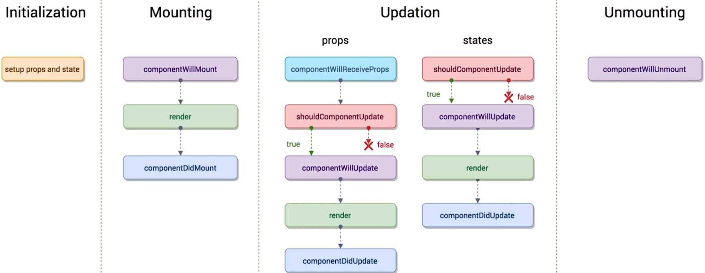

# 组件

官网[Components and Props](https://reactjs.org/docs/components-and-props.html)  
分为函数组件和类组件。  
组件名必须首字母大写。React 会把小写字母认为是原生的 HTML 标签

```js
function Welcome(props) {
  return <h1>Hello, {props.name}</h1>
}
//或者
class Welcome extends React.Component {
  render() {
    return <h1>Hello, {this.props.name}</h1>
  }
}
```

## props

父组件以属性的形式给子组件传值/函数，子组件通过`props`接收/调用

比如一个 TodoList。用类组件需要注意`this`的指向

```js
//父组件中
import React, { Component } from 'react'
import TodoItem from './TodoItem'

class TodoList extends Component {
  constructor(props) {
    super(props)
    // 当组件的state或者props发生改变的时候，render函数就会重新执行
    this.state = {
      list: []
    }
    //this的绑定都放在constructor处理，性能较好
    this.handleItemDelete = this.handleItemDelete.bind(this)
  }

  render() {
    return <ul>{this.getTodoItem()}</ul>
  }

  getTodoItem() {
    return this.state.list.map((item, index) => {
      return (
        <TodoItem
          key={index}
          content={item}
          index={index}
          deleteItem={this.handleItemDelete}
        />
      )
    })
  }

  handleItemDelete(index) {
    this.setState(prevState => {
      const list = [...prevState.list]
      list.splice(index, 1)
      return { list }
    })
  }
}

export default TodoList
```

```js
//子组件中
import React, { Component } from 'react'

class TodoItem extends Component {
  constructor(props) {
    super(props)
    this.handleClick = this.handleClick.bind(this)
  }

  render() {
    return <div onClick={this.handleClick}>{this.props.content}</div>
  }

  handleClick() {
    const { deleteItem, index } = this.props
    //this.props.deleteIem = this.handleItemDelete
    //此时的this执行的是父组件，所以传递的时候用bind把this转为父组件的this
    deleteItem(index)
  }
}
```

## 第三方 PropTypes

[Typechecking With PropTypes](https://reactjs.org/docs/typechecking-with-proptypes.html)  
类型校验工具，API 见官网[facebook/prop-types](https://github.com/facebook/prop-types)

```js
import React, { Component } from 'react'
import PropTypes from 'prop-types'

class TodoItem extends Component {
  render() {
    // 省略
  }
}
//报警告，不影响代码后续运行
TodoItem.propTypes = {
  content: PropTypes.string.isRequired, //数据类型是`string`且必输
  deleteItem: PropTypes.func,
  index: PropTypes.number
}
//默认值，对应vue的`default`
TodoItem.defaultProps = {
  content: 'hello' // 父组件没有传值时默认值是`hello`
}
```

## 类组件

官网[React.Component](https://reactjs.org/docs/react-component.html)  
定义类组件必须要调用`render()`方法

## 生命周期

类组件里面才存在  
[生命周期图示](http://projects.wojtekmaj.pl/react-lifecycle-methods-diagram/)  
完整图示：


旧版 React 图示  

::: warning
注意以下方法即将弃用，要避免使用
:::

- componentWillMount  
  即将被挂载，但没有挂载（通常只会执行一次）
- componentWillUpdate  
  组件更新之前，在`shouldComponentUpdate`之后，如果 shouldComponentUpdate 是 false，就不会执行。
- componentWillReceiveProps
  顶层父组件中不存在。  
  也就是某个子组件中存在，并且组件从父组件接收参数。  
  父组件的 render**重新**被执行时，componentWillReceiveProps 就会执行  
  也就是父组件第一次 render 的时候，子组件刚被创建不会执行。  
  再次 render，子组件已存在时，就会执行

### constructor

非必须。  
不需要初始化 state 或者绑定方法的话，也不需要使用`constructor`  
作用：

- 用`this.state`初始化该组件的 state 值
- 绑定方法：比如修改作用域，constructor 只会执行一次，作用域绑定也只需要一次。有利于提高性能  
  如果在`render`内绑定，render 会频繁调用，没有必要反复绑定  
  注意事项
- `this.state`只能在 constructor 内操作，其他方法都需要通过[setState](./03_state.md#setState)
- 避免使用带有副作用的函数，比如 setTimeout, ajax 等，这些操作应该在[componentDidMount](#componentDidMount)内
- 不要在 state 内直接赋值父元素继承的 props

```js
constructor(props) {
 super(props);
 // 不要把props放在state
 // 即使更新 prop 中的 color，也不会影响 state
 this.state = { color: props.color };
}
```

### getDerivedStateFromProps

基本不用  
render 调用之前调用，返回一个对象来更新`state`  
通常用[shouldComponentUpdate](#shouldComponentUpdate), [memoize](https://reactjs.org/blog/2018/06/07/you-probably-dont-need-derived-state.html#what-about-memoization) 等方案代替  
参考[React v16.3 版本新生命周期函数浅析及升级方案](https://juejin.im/post/5ae6cd96f265da0b9c106931)  
getDerivedStateFromProps 禁止了组件去访问 this.props

```js
// after
static getDerivedStateFromProps(nextProps, prevState) {
  if (nextProps.isLogin !== prevState.isLogin) {
    return {
      isLogin: nextProps.isLogin,
    };
  }
  return null;
}

componentDidUpdate(prevProps, prevState) {
  if (!prevState.isLogin && this.props.isLogin) {
    this.handleClose();
  }
}

```

### render

必须存在。  
其他周期会有默认继承自`React.Component`的操作，render 是没有的  
当该组件的 props 或者 state 被改变的时候，render 就会执行  
或者父组件的 render 函数被执行，也会被执行。  
这样会引起不必要的渲染（比如父组件 render 之后，但是与子组件无关。子组件不需要更新）  
此时可以用[shouldComponentUpdate](#shouldComponentUpdate)进行判断  
render 是一个纯函数：state 不改变的情况下 return 的结果始终是一致的。并且不会和浏览器有交互，比如 ajax，应该在[componentDidMount](#componentDidMount)内

### componentDidMount

已经被挂载（通常只会执行一次）
此时组件已经被插到了 DOM 内  
服务端渲染不会被调用

### shouldComponentUpdate

组件更新之前执行。目的是为了性能优化  
返回 true/false  
false 时后面的函数(componentWillUpdate，render，componentDidUpdate)都不会执行。  
会收到两个回调参数。  
nextProps（改变后的 props），nextState（改变后的 state）

```js
shouldComponentUpdate(nextProps, nextState) {
  if(nextProps.content === this.props.content) {
    return false;
  }
  return true;
}
```

调用 forceUpdate 或者第一次 render 不会进

### getSnapshotBeforeUpdate

不常用  
一定要和 componentDidUpdate 一起使用  
可以获取到一些 DOM 信息，比如处理滚动条  
收到两个回调 prevProps 和 prevState
必须要 return，不想要返回值的时候返回一个`null`，返回值会传给[componentDidUpdate](#componentDidUpdate)
在 getSnapshotBeforeUpdate 中读取到的 DOM 元素状态是可以保证与 componentDidUpdate 中一致的

### componentDidUpdate

更新结束后执行。首次渲染不会执行  
如果执行了 getSnapshotBeforeUpdate，第三个参数值[getSnapshotBeforeUpdate](#getSnapshotBeforeUpdate)的返回值  
`componentDidUpdate(prevProps, prevState, snapshot)`

### componentWillUnmount

组件即将被去除时。
比如子组件从父组件里面被删除  
如果在`componentDidMount`内添加了订阅（比如绑定 click 事件），记得在 componentWillUnmount 取消订阅（解绑）

服务端渲染不会被调用
