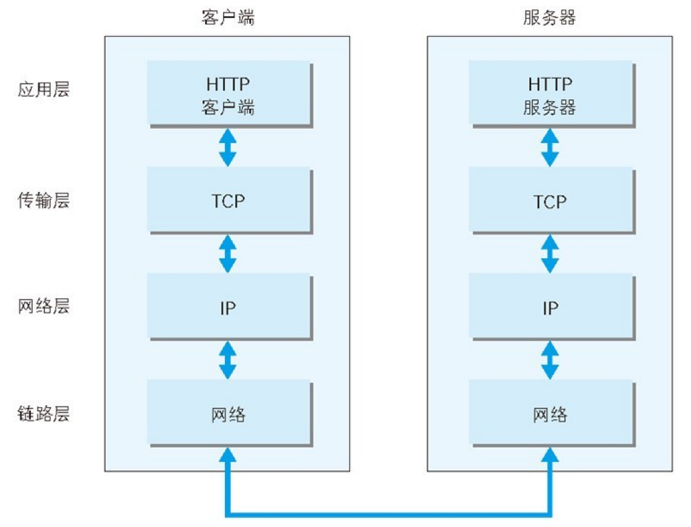
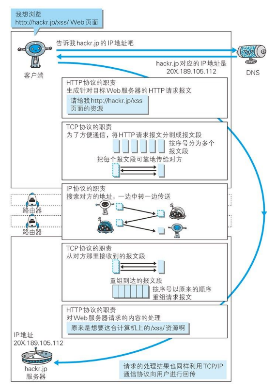
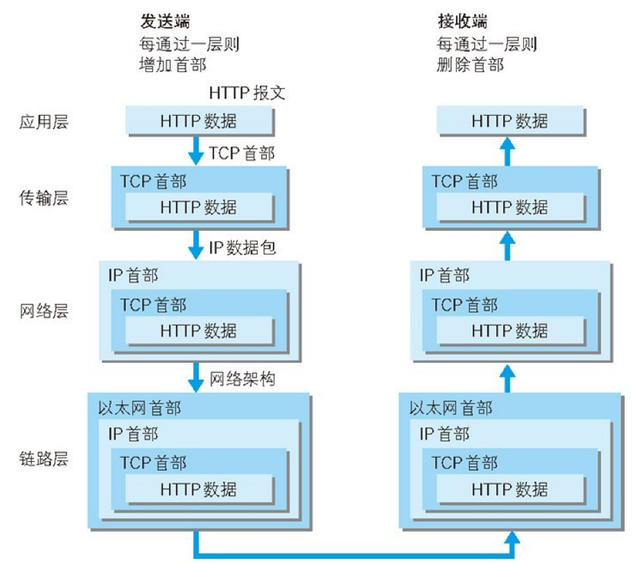
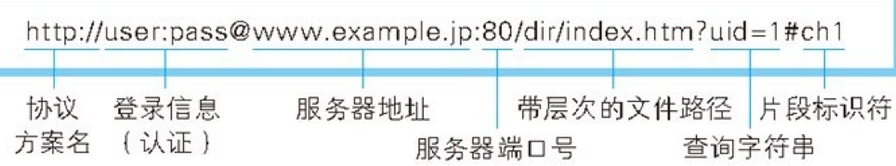

# TCP/IP

TCP/IP 协议族：TCP/IP Protocols

HTTP 属于它内部的一个子集

比如还有 DNS，FTP

和 HTTP 密切相关的几个协议：[DNS](./02_application_layer.md)，[TCP](./03_transport_layer.md)，[IP](./04_network_layer.md)

## 分层

为了方便管理，避免改一个内容，要替换整体。

分为 4 层：应用层、传输层、网络层和数据链层

### 概览

## 大致过程

客户端通过 DNS 解析获取到 IP 地址，经过 HTTP 协议，生成请求报文，报文经过 TCP 协议加工被分割成报文段，每个报文段（并行）三次握手传输，经过 IP 协议中转找到服务端。

服务端经过 TCP 协议合并报文段，经过 HTTP 协议处理回传。

回传流程又以客户端的形式开始。

发送 HTTP

为了传输方便，在传输层进行分割，在各个 HTTP 请求的报文中打上标记和端口号

在网络层增加 MAC 地址

## URI

Uniform Resource Identifier：统一资源标识符

Uniform：协议方案（常见的：HTTP、ftp、file、telnet、mailto）

比如

mailto: John.Doe\@example. com

telnet://192.0.2.16:80/

url 是 URI 的一个子集

域名是 url 的一部分

### 格式

绝对 URI 格式

简单点：

\<协议\>://\<域名或 IP\>:\<端口\>/\<路径\>

通常端口会省略，用默认端口

- 服务器地址可以是域名，也可以是 IPv4（192.168.40.96）或者 IPv6（方括号表示：[0:
  0: 0: 0: 0: 0: 0: 1]）
