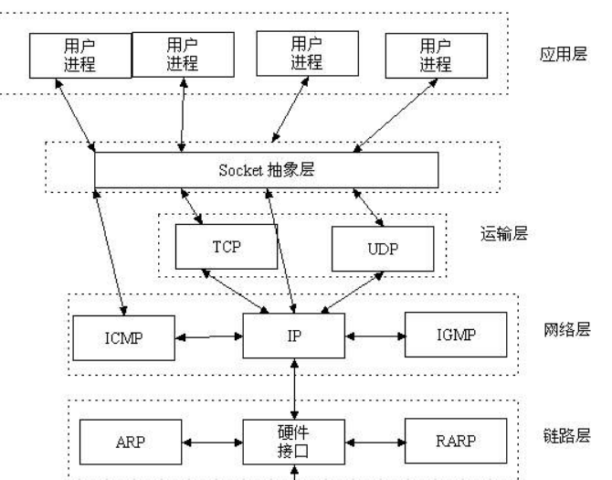

# 应用层

FTP、DNS、HTTP 处于该层

为各种应用程序提供了使用的协议。将应用程序的数据传送给传输层，以便进行信息交换

## HTTP

## DNS

Domain Name System：域名和 IP 地址之间的解析

域名 →IP 和 IP→ 域名

基于 [UDP](./03_transport_layer.md) 做的查询
扩展阅读:[详解 DNS 与 CoreDNS 的实现原理](https://draveness.me/dns-coredns)

## socket

socket 是在应用层和传输层之间的一个抽象层，它把 TCP/IP 层复杂的操作抽象为几个简单的接口供应用层调用，实现进程在网络中通信。

