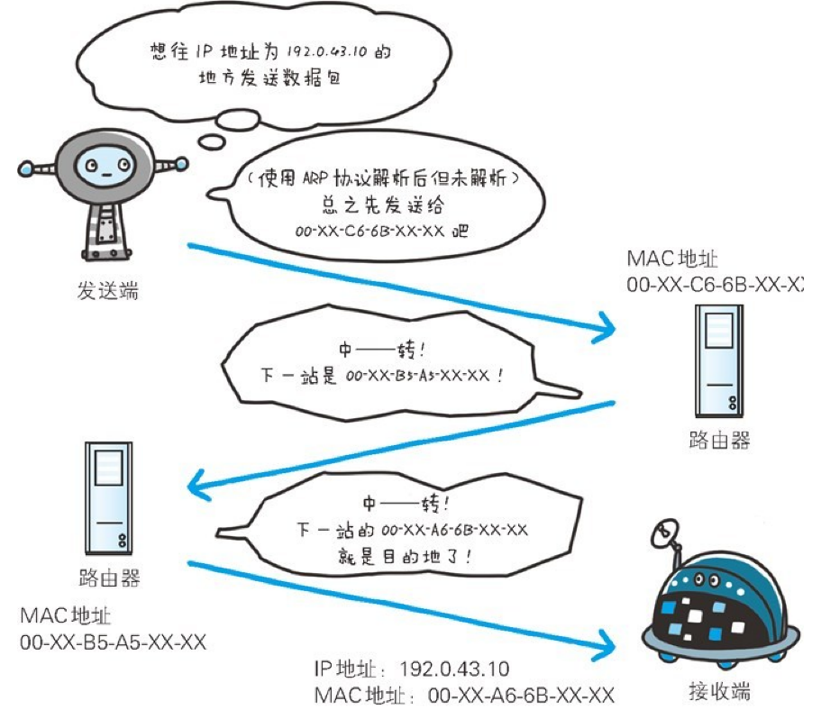

# 网络层

选择传输路线。规定以怎样的路线（传输路线）到达对方的计算机

## IP 协议

位于网络层

作用：把各种数据包发给对方

发送需要满足不同的条件，最重要的两个条件：IP 地址和 MAC 地址

### IP 地址和 MAC 地址

IP 地址指明节点被分配到的地址，MAC 地址指网卡的地址

一般 IP 地址是会变的，MAC 基本不会

IP 间的通信依赖 MAC。

### ARP 协议(Address Resolution Protocol)

用来解析地址的协议。

主要作用：将目标 IP 地址转换成目标 MAC 地址的

IP 间的通信依赖 MAC 地址。网络间通信通常都不在一个局域网（LAN）内，需要经过多个计算机或者设备（比如路由器）

在中转的过程中，会利用下一站的 MAC 地址来搜索下一个中转目标，这其中就用了 ARP 协议

