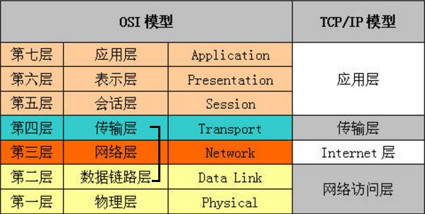

# 概要

本节大部分是[图解 HTTP](https://www.ituring.com.cn/book/1229)的笔记;

## OSI 七层和 TCP/IP 四层

参考[知乎](https://www.zhihu.com/question/55990047)  
OSI(Open Systems Interconnect):是计算机网络模型，称之为"开放系统互联**参考**模型"  
由于计算机网络太复杂了，这个模型将计算机网络分成 7 个层次来简化复杂的任务，每个层次负责不同的功能。

TCP/IP 借鉴了 OSI 的这些概念建立 TCP/IP 模型。  
由于 OSI 过于庞大复杂，TCP/IP 成为了主流  

