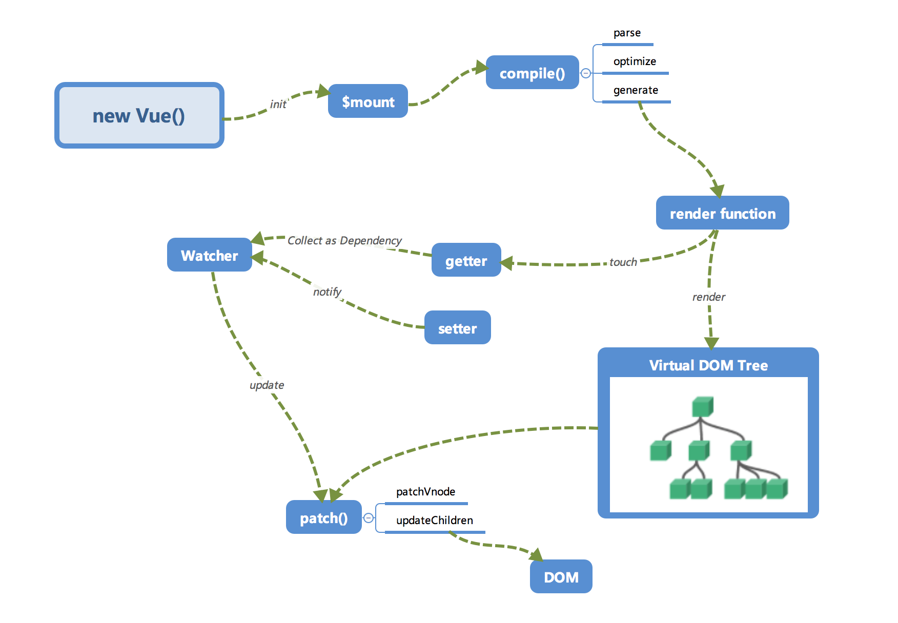

# Vue 实例

所有的 Vue 组件都是 Vue 实例

## 生命周期

如果在生命周期钩子使用箭头函数，要注意`this`的指向

- beforeCreate: 初始化生命周期、事件，还不能用 methods 和 data
- created:  
  数据绑定（还没有 el 对象）  
  初始化 props  
  此时会监测 el 有没有，如果没有。停止生命周期，直到\$mount 方法被执行
- beforeMount: complie 结束之后，生成真实 DOM
- mounted  
  `mounted` 不会承诺所有的子组件也都一起被挂载。如果希望等到整个视图都渲染完毕，可以用 `vm.$nextTick` 替换掉 mounted

```js
mounted: function () {
  this.$nextTick(function () {
    // Code that will run only after the
    // entire view has been rendered
  })
}
```

- beforeUpdate: data 数据改变前，重新渲染虚拟 DOM
- updated: data 数据改变后
- beforeDestroy: 调用`$destroy`方法前  
  路由从 A 跳转到 B 的时候，会先进行 B 的 beforeCreate

```
B beforeCreate
B create
A beforeDestroy
A destroyed
B mounted
```

- destroyed: 调用`$destroy`方法后


### 完整的周期

```js
var LIFECYCLE_HOOKS = [
  "beforeCreate",
  "created",
  "beforeMount",
  "mounted",
  "beforeUpdate",
  "updated",
  "beforeDestroy",
  "destroyed",
  "activated", //keep-alive
  "deactivated", //keep-alive
  "errorCaptured", //异常处理
  // v2.6+
  "serverPrefetch", //SSR
];
```

### 父子间的生命周期

Vue.js 的组件渲染顺序是由内而外的  
子节点 mounted 之后才会有 parent 的 mounted

```
parent: beforeCreate
parent: created
parent: beforeMount
child1: beforeCreate
child1: created
child1: beforeMount
child1: mounted
parent: mounted
```

## 运行机制

详细内容见[响应式](./20_responsive.md)

