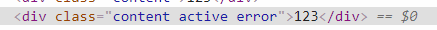
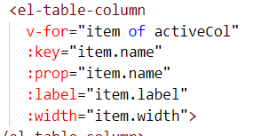
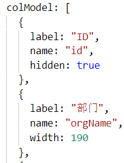
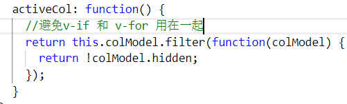

# 模板语法

模板编译成虚拟 DOM 渲染函数

## 文本插值（双括号）

### v-once 指令

一次性地插值，当数据改变时，插值处的内容不会更新

```html
<span v-once>这个将不会改变: {{ msg }}</span>
```

### 过滤器 filters

可以用在双花括号插值和 v-bind 表达式

```html
<div id="app">
  <div>{{ message | capitalize }}</div>
</div>
```

```js
let app = new Vue({
  el: "#app",
  data() {
    return {
      message: "hello",
    }
  },
  filters: {
    capitalize: function (value) {
      if (!value) return ""
      value = value.toString()
      return value.toUpperCase()
    },
  },
})
```

#### 全局注册 Vue.filter

::: tip
凡是全局都要在 new Vue 实例之前
:::

```js
Vue.filter("capitalize", function (value) {
  if (!value) return ""
  value = value.toString()
  return value.toUpperCase()
})
let app = new Vue({
  el: "#app",
  data() {
    return {
      message: "hello",
    }
  },
})
```

#### 传参

filters 内第一个值始终是`|`前面的变量，第二个值开始是函数传入的参数

```html
<div>{{ message | capitalize("second") }}</div>
```

```js
filters: {
  capitalize(value, param) {
    if(!value) {
      return "";
    }
    return value + param //hellosecond
  }
}
```

#### 过滤器连用

以上一个返回值为传入值

addWorld 的 value 是 capitalize return 的值

```html
<div>{{ message | capitalize | addWorld }}</div>
```

```js
filters: {
  capitalize(value) {
    if(!value) {
      return "";
    }
    return value.toUpperCase()
  },
  addWorld(value) {
    if(!value) {
      return "";
    }
    return value + " world"  //HELLO world
  }
}
```

## 原始 HTML

### v-html 指令

## &lt;template&gt;

不可见的包裹元素

## v-bind

### 绑定 class

可以是对象，也可以是数组，可以和原生 class 并存

- 对象

```html
<div class="content" :class="{'active': isActive}"></div>
```

- 数组：

```html
<div class="content" :class="[activeClass]">123</div>
```

```js
data: {
  activeClass: "active"
}
```

- 数组嵌套对象

```html
<div class="content" :class="[activeClass, {error: isError}]">123</div>
```

```js
data: {
  activeClass: 'active',
  isError: true
}
```



#### 结合 computed

```html
<div id="app">
  <div class="content" :class="classObject">123</div>
</div>
```

```js
let app = new Vue({
  el: "#app",
  data: {
    isActive: true,
    error: false,
  },
  computed: {
    classObject() {
      return {
        active: this.isActive && !this.error,
      }
    },
  },
})
```

### 过滤器 filters

```html
<div :id="rawId | formatId"></div>
```

## 动态参数

2.6.0 新增，可以用在 v-bind，v-on，v-slot

用方括号括起来的 JavaScript 表达式作为一个指令的参数

```html
<a v-bind:[attributename]="url"> ... </a>
```

在 data 中指定 attributename 的值

- 值应该是个字符串。如果返回 null，会移除绑定的指令。其他不是字符串类型的会报警告

- 变量名(attributename)不可以是驼峰式，因为 HTML 标签只能全部小写。

## v-on

### \$event

原生的 event 对象

```html
<a @click="handleClick('hi', $event)">123</a>
```

### 修饰符

- .stop

- .prevent

- .capture: 对应 [addEventListener](../javascript/060_events.md) 的 capture 是 true

- .self: 只有点击的元素自身才会触发。子元素冒泡到该元素不会触发

- .once: 只触发一次。对应 addEventListener 的 once 是 true

- .passive: 对应 addEventListener 的 passive 是 true

- .native: 和自定义事件重名时用原生

可以串联

```html
<a @click.stop.prevent="handleClick">123</a>
```

### 按键修饰符

监听键盘事件的时候

比如 enter。完整支持对应[KeyboardEvent](https://developer.mozilla.org/en-US/docs/Web/API/KeyboardEvent/key/Key_Values)
并把驼峰式转为短横线

Enter: \@keyup.enter

PageDown: \@keyup.page-down

#### 别名

常用的比如 Backspace, Enter, Esc

.enter

.tab

.delete (捕获"删除"和"退格"键)

.esc

.space

.up

.down

.left

.right

以下是组合情况才会触发（单纯按下一个 ctrl 不会）：

.ctrl

.alt

.shift

.meta: Mac 对应 command, Windows 对应 Win(⊞)

比如 Ctrl + Click: \@click.ctrl="doSomething"

## v-if

v-else 元素必须紧跟在带 v-if 或者 v-else-if 的元素的后面

### key 指定不被复用的元素

```html
<template v-if="loginType === 'username'">
  <label>Username</label>
  <input placeholder="Enter your username" />
</template>
<template v-else>
  <label>Email</label>
  <input placeholder="Enter your email address" />
</template>
```

input 会被复用

即使 v-else 改成 v-if="其他条件"也一样，不会清空 value 值，只是替换了 placeholder

通过指定`key`属性，不让元素被复用

```html
<template v-if="loginType === 'username'">
  <label>Username</label>
  <input placeholder="Enter your username" key="username-input" />
</template>
<template v-else>
  <label>Email</label>
  <input placeholder="Enter your email address" key="email-input" />
</template>
```

## v-show

不支持 `<template>` 元素

## v-for

遍历数组/对象。对象使用 Object.keys()

v-for 具有比 v-if 更高的优先级。不推荐同时使用 v-if 和 v-for

必须要`key`属性

### 小技巧

用计算属性返回 v-for 要用的内容。

比如表格的列过滤掉要隐藏的





## v-model

双向数据绑定

会忽略所有表单元素的 value、checked、selected 特性的初始值而总是将 data 内的值作为数据来源

### 本质

语法糖：bind 属性+on 监听事件

text 和 textarea：value 属性+ input 事件；

checkbox 和 radio：checked 属性+ change 事件；

select：value 作为 prop + change 事件

#### 对于 select

```html
<select v-model="selected">
  <option disabled value="">请选择</option>
  <option>A</option>
</select>
```

如果 v-model 的初始值不匹配，`<select>` 将被渲染为"未选中"状态。

在 iOS 中无法选择第一个选项。因为 iOS 不会触发 change 事件。

因此提供一个值为空的禁用选项

### 修饰符

#### .lazy

input 是触发 input 事件（值改变）

只要加上.lazy 会变成 change 事件（值改变并失焦）

#### .trim

自动调 trim()方法，去掉首尾空格

## v-slot:slotName

原本的`<slot>`和具名插槽已经在 2.6.0+版本被废弃，用 v-slot 取代

不写 slotName 时默认是 default

- 只能添加到 `<template>` 或自定义组件上

- v-slot 和 v-slot:slotName 不可以互相嵌套。比如下面是拆成两个 template 包裹的

```html
<div id="app">
  <text-document>
    <!-- v-slot加在template上，否则报错 -->
    <template v-slot>
      <h1>hello</h1>
    </template>
    <!-- 加在template上，指定插槽 -->
    <template v-slot:footer>
      <h1>world</h1>
    </template>
  </text-document>
</div>
<script>
  const MyComponent = {
    inheritAttrs: true,
    props: ["test"],
    template: `<div><slot></slot>66666<slot name="footer"></slot></div>`,
  }
  const app = new Vue({
    el: "#app",
    components: {
      "text-document": MyComponent,
    },
  })
</script>
```

### 作用域

父组件是无法访问子组件内部的数据的。

- 即父级模板里的所有内容都是在父级作用域中编译的；子模板里的所有内容都是在子作用域中编译的。

可以理解成函数的作用域，父函数无权访问嵌套子函数内部的变量

- 可以通过模板上`<slot>`元素绑定，在父组件中用 v-slot:slotName="某个变量"来访问

- 可以用 ES6 的解构, v-slot="{ childData }", 变量重命名 v-slot="{ childData: anotherParam }"

```html
<div id="app">
  <text-document>
    <!-- v-slot=自定义的变量名 -->
    <template v-slot="mySlot">
      <h1>{{ mySlot.childData }}</h1>
    </template>
  </text-document>
</div>
<script>
  const MyComponent = {
    inheritAttrs: true,
    props: ["test"],
    //slot绑定属性，值是data内的属性
    template: `<div><slot :child-data="innerData"></slot>{{innerData}}</div>`,
    data() {
      return {
        innerData: "123",
      }
    },
  }
  const app = new Vue({
    el: "#app",
    components: {
      "text-document": MyComponent,
    },
  })
</script>
```

### 简写(井号)

::: tip
&lt;slot&gt;有 name 属性才可以
:::

```html
<div id="app">
  <text-document>
    <!-- #name -->
    <template #header>
      <h1>hello</h1>
    </template>
  </text-document>
</div>
<script>
  const MyComponent = {
    inheritAttrs: true,
    props: ["test"],
    template: `<div><slot name="header"></slot>{{innerData}}</div>`,
    data() {
      return {
        innerData: "123",
      }
    },
  }
  const app = new Vue({
    el: "#app",
    components: {
      "text-document": MyComponent,
    },
  })
</script>
```

## 自定义指令

适用场景：对 DOM 直接操作。比如初始化的时候自动聚焦

### 全局指令 Vue.directive

```html
<div id="app">
  <input type="text" v-focus />
</div>
<script>
  // 注册一个全局自定义指令 `v-focus`
  Vue.directive("focus", {
    // 当被绑定的元素插入到 DOM 中时……
    inserted: function (el) {
      // 聚焦元素
      el.focus()
    },
  })
  const app = new Vue({
    el: "#app",
  })
</script>
```

### 局部指令 directives 属性

```js
const app = new Vue({
  el: "#app",
  directives: {
    focus: {
      // 指令的定义
      inserted: function (el) {
        el.focus()
      },
    },
  },
})
```

### 钩子函数

比如上面的 inserted，表示元素插入父节点时调用(仅保证父节点存在，但不一定已被插入文档中)

另外还有

- bind：只调用一次，指令第一次绑定到元素时调用

- update：所在组件的 VNode 更新时调用，但是可能发生在其子 VNode 更新之前

- componentUpdated：指令所在组件的 VNode 及其子 VNode 全部更新后调用。

- unbind：只调用一次，指令与元素解绑时调用

#### 参数

完整见官网[custom-directive](https://cn.vuejs.org/v2/guide/custom-directive.html)

el：指令所绑定的元素

binding：一个对象。包含指令的名字（比如 v-focus 的 name 是"focus"）、参数等

vnode：Vue 编译生成的虚拟节点

oldVnode：上一个虚拟节点，仅在 update 和 componentUpdated 钩子中可用
