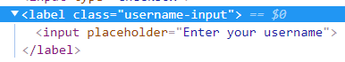

# 组件

也是 Vue 实例，new Vue 可以用的参数都可以用。除了 el 属性

## 组件名

- 组件名要是字母全小写且必须包含一个连字符。

避免和 HTML 本身的已有标签冲突

- 也可以用首字母大写命名

```js
Vue.component("MyComponentName", options)
```

### name

允许组件模板递归地调用自身。

比如 BaseHeader.vue 里面原本只写普通的 div，如果加上 name:
"base-header"之后，在 BaseHeader.vue 使用\<base-header\>，不需要 import，就会自行递归

注意栈溢出

## 注册方式

### 全局注册 Vue.component

- 必须要先注册，再 new 实例，否则组件会报没有被注册的错

- 任何根元素下的组件都可以复用

- my-component-name 自动成为组件的 name

```js
Vue.component("my-component-name", options)
```

```html
<my-component-name></my-component-name>
```

### 局部注册 components 属性

```html
<div id="app">
  <my-component></my-component>
</div>
```

```js
const MyComponent = {
  data() {
    return {
      inputValue: "hello",
    }
  },
  template: `<input v-model="inputValue">`,
}
const app = new Vue({
  el: "#app",
  components: {
    MyComponent,
  },
})
```

## 单个根元素

组件必须有一个根元素。所有内容都包裹在单个标签中

### el

只有根实例才有的属性

### \$mount

```js
new Vue({}).$mount("#app")
```

## data

组件的 data 必须是个函数

因为组件可以被复用，要保持相互独立

### data 响应式的原理

Vue 只会遍历 data 内的值，利用 Object.defineProperty 把这些属性全部转为
getter/setter

#### 追踪变化

- 每个组件实例都对应一个 watcher 实例

1.  组件 render 的过程中通过 getter，让 watcher 在组件渲染的过程中把“接触”过的数据属性记录为依赖。

2.  当依赖触发 setter 的时候，会通知(notify)watcher

3.  watcher 触发组件重新渲染

为了更好的性能，同一个 watcher 触发多次，只有最后一个会被放到事件队列里面。

内部是异步实现的，异步队列尝试使用原生的 Promise，MutationObserver 和
setImmediate，浏览器不支持的话就用 setTimeout

在下一个的事件循环“tick”中，Vue 刷新队列并执行实际 (已去重的) 工作

### \$nextTick

```js
this.$nextTick(function () {
  //do sth
})
```

在下次 DOM 更新循环结束之后执行延迟回调

#### 使用 Promise

nextTick 返回的是个 Promise 对象，所以可以用 then

也可以用 async/await

```js
await this.$nextTick()
```

#### 全局使用：Vue.nextTick

### Object.freeze

如果不想让 data 内的某个对象进行响应式依赖的话。

比如列表的数据，只是展示用，并不需要内部追踪

this.item = Object.freeze(Object.assign({}, this.item))

## template

## 父子间通信

### props

子组件接收。单向数据流。

最好明确传入属性的类型，更好地是指定 default 和校验

同下，HTML 大小写不敏感

属性如果是变量，不能用短横线，所以还是用驼峰式，但在 HTML 上的组件时改为短横线。比如

```js
props: ["myTitle"]
```

```html
<my-component my-title="hello"></my-component>
```

#### 传入一个对象的所有属性

```js
post: {
  id: 1,
  title: 'My Journey with Vue'
}
```

```html
<my-component v-bind="post"></my-component>
<!-- 等价于 -->
<my-component :id="post.id" :title="post.title"></my-component>
```

#### 类型校验

在实例创建之前进行验证，实例的属性 (如 data、computed 等) 在 default 或
validator 函数中不可用

type 对应的值见官网[Prop](https://cn.vuejs.org/v2/guide/components-props.html)，还可以是构造函数，用 instanceof 来进行检查

```js
// 多个可能的类型
propB: [String, Number],
// 必填的字符串
propC: {
  type: String,
  required: true
},
// 带有默认值的对象
propE: {
  type: Object,
  // 对象或数组默认值必须从一个工厂函数获取
  default: function () {
    return {
      message: 'hello'
    }
  }
},
// 自定义验证函数
propF: {
  validator: function (value) {
    // 这个值必须匹配下列字符串中的一个
    return ['success', 'warning', 'danger'].indexOf(value) !== -1
  }
},
//值是否是通过 new Person 创建的
propG: Person
```

#### 非 prop 特性

子组件本身的属性，不存在 props 里面

会加到子组件的最外层 DOM 上

比如子组件是

```html
<div>
  <input />
</div>
```

那么属性是存在 div 上面

##### inheritAttrs

设置是否继承。为 false 时不继承




如果不写，默认是 true，那么根元素（label）会继承


### on + \$emit

子组件 emit, 父组件用 on 监听自定义事件

HTML 是大小写不敏感的，但 JS 是

如果自定义事件名用 myEvent 这类驼峰式命名，在 HTML 也只会被转成 myevent。

但 Vue 是不会自动转换的，那么 myEvent 就永远不会触发

所以最好都用 my-event 这样的短横线自定义事件名。

#### 程序化的事件侦听器

官网[components-edge-cases](https://cn.vuejs.org/v2/guide/components-edge-cases.html)

在一个组件 mounted 的时候初始化了另一个插件（比如 mint-ui 的 popup）

当销毁这个组件的时候也要销毁 popup，否则再次进入的时候弹出框有问题

通常做法是在组件 beforeDestroy 的时候手动调弹出框的 destroy

另一种做法就是用程序化的事件侦听器

- 通过 \$on(eventName, eventHandler) 绑定事件

- 通过 \$once(eventName, eventHandler) 只监听一次

- 通过 \$off(eventName, eventHandler) 解绑事件

```js
this.$once("hook:beforeDestroy", () => {
  popup组件.$destroy()
})
```

### 父组件调用子组件的方法

`this.$refs.子组件.方法名`

### v-model

本质上子组件修改值，还是要 emit 到父组件修改 props 传入的值

只不过监听的 input 变成了 v-model

props 接收"value"，组件内监听 input 事件和绑定 value 属性

改变 input 的值，searchText 也会随之改变

```html
<div id="app">
  <custom-input v-model="searchText"></custom-input>
</div>
<script>
  Vue.component("custom-input", {
    props: ["value"],
    template: `
      <input
        :value="value"
        @input="handleChange"
      >
    `,
    methods: {
      handleChange(event) {
        this.$emit("input", event.target.value)
      },
    },
  })
  let app = new Vue({
    el: "#app",
    data: {
      searchText: "hello",
    },
  })
</script>
```

#### model 属性

自定义组件的 v-model 是监听 value 属性和 input 事件。

如果用 checkbox 等其他内容，也不会像原生的 v-model 一样随之改变成 checked 和 change

用 model 属性可以指定绑定的 value 和监听的事件

props 接收"checked"，组件内监听 change 事件和绑定 checked 属性

```js
Vue.component("base-checkbox", {
  model: {
    prop: "checked",
    event: "change",
  },
  props: {
    checked: Boolean,
  },
  template: `
    <input
      type="checkbox"
      :checked="checked"
      @change="$emit('change', $event.target.checked)"
    >
  `,
})
```

### .sync 修饰符

子组件修改父组件的值，以`update:myPropName`的模式触发事件取而代之

`this.$emit('update:title', newTitle)`

父组件监听那个事件并根据需要更新属性

```html
<text-document
  v-bind:title="doc.title"
  v-on:update:title="doc.title = $event"
></text-document>
```

.sync 修饰符就是上述监听的一个语法糖

```html
<text-document v-bind:title.sync="doc.title"></text-document>
```

对象同时设置多个 prop 的时候，也可以传入一个对象的所有属性

```html
<text-document v-bind.sync="doc"></text-document>
```

doc 对象的每个 key 都会各自监听

### $attrs 和 $listeners

- \$listeners 属性是个对象，包含了作用在这个组件上的所有监听器

配合 v-on="\$listeners" 将所有的事件监听器指向这个组件的子组件

子组件可以触发父组件的事件

```html
<div id="app">
  <text-document @click="handleClick"></text-document>
</div>
<script>
  //点击span会触发text-document的click
  const MyComponent = {
    template: `<div><span v-on='$listeners'>hello</span></div>`,
  }
  const app = new Vue({
    el: "#app",
    components: {
      "text-document": MyComponent,
    },
    methods: {
      handleClick() {
        console.log("handleClick")
      },
    },
  })
</script>
```

- \$attrs 表示父组件用 on 传给子组件自定义属性，但是没有被子组件 props 接收的部分

原生属性（比如`class`）不包括


```html
<div id="app">
  <text-document
    test="test"
    notInherit="notIn"
    inNotInherit="inNot"
    class="wrapper"
  >
  </text-document>
</div>
```

```js
const MyComponent = {
  inheritAttrs: true,
  props: ["test"],
  template: `<div><span>{{$attrs}}</span></div>`,
}
const app = new Vue({
  el: "#app",
  components: {
    "text-document": MyComponent,
  },
  data() {
    return {
      test: "hello",
      notIn: "world",
      inNot: "foo",
    }
  },
})
```

### provide/inject

provide：提供给后代组件的数据/方法。

inject ：后代组件里，用
inject 接收指定的想要添加在这个实例上的属性（这个属性是非响应式的）

类似更大范围的 props

```html
<template>
  <div id="app">
    <router-view v-if="isRouterAlive" />
  </div>
</template>
<script>
  export default {
    name: "App",
    provide() {
      return {
        reload: this.reload,
      }
    },
    data() {
      return {
        isRouterAlive: true,
      }
    },
    methods: {
      reload() {
        this.isRouterAlive = false
        this.$nextTick(function () {
          this.isRouterAlive = true
        })
      },
    },
  }
</script>
```

在登录.vue 中

```js
inject: ["reload"],
```

登录成功的时候调用

```js
this.reload()
```

## 其他通信

### 兄弟间

通过父组件

### EventBus

全局 Vue 实例变量 EventBus

```js
// 全局变量
let EventBus = new Vue()
//用全部变量的on和emit进行事件管理
EventBus.$emit("received", "from child")
EventBus.$on("received", (val) => {
  //sth.
})
```

### broadcast / dispatch

### Vuex

## 动态组件&lt;component&gt;

```html
<div id="app">
  <button @click="change">切换页面</button>
  <component :is="currentView"></component>
</div>
<script>
  var home = {
    template: "<div>我是主页</div>",
  }
  var post = {
    template: "<div>我是提交页</div>",
  }
  const app = new Vue({
    el: "#app",
    components: {
      home,
      post,
    },
    data: {
      index: 0,
      arr: ["home", "post"],
    },
    computed: {
      currentView() {
        return this.arr[this.index]
      },
    },
    methods: {
      change() {
        this.index = ++this.index % 2
      },
    },
  })
</script>
```

### keep-alive

主要用于保留组件状态或避免重新渲染

activated 和 deactivated 会被对应执行

```html
<keep-alive>
  <component :is="组件名或者name属性"> </component>
</keep-alive>
```

在 Vue 中是一个全局抽象(`abstract`)组件，通过自定义 render 函数并且利用了插槽来实现数据缓存和更新

```js
export default {
  name: "keep-alive",
  abstract: true,
  //...
}
```

抽象组件**不渲染**真实 DOM，且不会出现在父子关系的路径上（`initLifecycle`会忽略抽象组件）

#### include and exclude

include 的组件被缓存，exclude 的组件不会被缓存（一直触发 created 钩子）

可以是组件名（多个用逗号分开），数组，正则

```html
<keep-alive include="home, post">
  <component :is="currentView"></component>
</keep-alive>
```

#### max

最多缓存的组件个数，超过后会被最旧的缓存销毁

## 异步组件

```js
//全局注册异步
Vue.component("async-example", function (resolve, reject) {
  setTimeout(function () {
    // 向 `resolve` 回调传递组件定义
    resolve({
      template: "<div>I am async!</div>",
    })
  }, 1000)
})
//局部注册
const app = new Vue({
  el: "#app",
  components: {
    // 需要加载的组件是一个 `Promise` 对象
    "my-component": () => import("./my-async-component"),
  },
})
```

### 处理加载中的状态

```js
const AsyncComponent = () => ({
  // 需要加载的组件是一个 `Promise` 对象
  component: import("./MyComponent.vue"),
  // 异步组件加载时使用的组件
  loading: LoadingComponent,
  // 加载失败时使用的组件
  error: ErrorComponent,
  // 展示加载时组件的延时时间。默认值是 200 (毫秒)
  delay: 200,
  // 如果提供了超时时间且组件加载也超时了，
  // 则使用加载失败时使用的组件。默认值是：`Infinity`
  timeout: 3000,
})
```

## functional

设置 functional 是 true 之后，没有了 data 属性，也没有 this

## 一些常用的内部属性

### \$root

根实例

### \$parent

父组件

### ref

通过`this.$refs`访问
