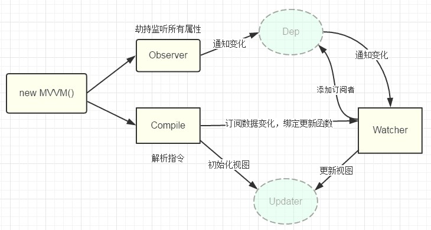

# 响应式

参考: [剖析 Vue.js 内部运行机制](https://juejin.im/book/5a36661851882538e2259c0f)  
更多内容:  
[answershuto/learnVue](https://github.com/answershuto/learnVue)  
[Vue.js 技术揭秘](https://ustbhuangyi.github.io/vue-analysis/)  
[「从源码中学习」面试官都不知道的 Vue 题目答案](https://juejin.im/post/5c959f74f265da610c068fa8)  
响应式概览


## 概述

大致可以理解成由 3 个模块组成，observer 完成对数据的劫持，compile 完成对模板片段的渲染，watcher 作为桥梁连接二者，订阅数据变化及更新视图

- 实现一个数据监听器`Observer`，能够对数据对象的所有属性进行监听，如有变动可拿到最新值并通知订阅者。  
  Observer就是在init的时候通过`Object.defineProperty` 进行了绑定，使得当被设置的对象被读取的时候会执行 getter 函数，而在当被赋值的时候会执行 setter 函数  
  如果set里面新值和旧值不一样，那么通知所有订阅者`Watcher`
- 当 render function 被渲染的时候，因为会读取所需对象的值，所以会触发 getter 函数进行「依赖收集」  
  「依赖收集」的目的是将观察者Watcher对象存放到当前闭包中的订阅者Dep的subs中

- 在修改对象的值的时候，会触发对应的 setter， setter 通知之前「依赖收集」得到的 Dep 中的每一个 Watcher，告诉它们自己的值改变了，需要重新渲染视图。
  这时候这些 Watcher 就会开始调用 update 来更新视图，当然这中间还有一个 patch 的过程以及使用队列来异步更新

## new Vue

Vue 本质上只是个构造函数，`new Vue`的时候通过调用`_init`开始初始化

```js
//src\core\instance\index.js
function Vue(options) {
  if (process.env.NODE_ENV !== 'production' && !(this instanceof Vue)) {
    warn('Vue is a constructor and should be called with the `new` keyword')
  }
  this._init(options)
}
```

`_init`: 实际上是直接写在`prototype`上的, 它会初始化生命周期、事件、 props、 methods、 data、 computed 与 watch 等

```js
//部分代码，省略静态类型检查
//src\core\instance\init.js
Vue.prototype._init = function (options) {
  //...
  initLifecycle(vm) //建立父子组件关系，在当前实例上添加一些属性和生命周期标识。如：$children、$refs、_isMounted
  initEvents(vm) //事件，比如$on
  initRender(vm) //初始化$slots, $attrs, $listeners
  callHook(vm, 'beforeCreate') //调用钩子
  initInjections(vm) //初始化inject
  initState(vm) //数据绑定，包括props、methods、data、computed 和 watch
  initProvide(vm)
  callHook(vm, 'created')
  //...
  if (vm.$options.el) {
    vm.$mount(vm.$options.el)
  }
}
```

## Object.defineProperty

可以说是`_init`最重要的部分，通过 `Object.defineProperty` 设置 setter 与 getter 函数，用来实现「响应式」以及「依赖收集」

### 响应式

响应式整体思路:

- 遍历`data`对象
- 为每个属性`key`设置 setter 与 getter 函数

```js
function MyVue(options) {
  this.data = options.data
  this.observe()
}
MyVue.prototype.observe = function () {
  const data = this.data
  for (let key in data) {
    if (data.hasOwnProperty(key)) {
      handle(data, key, data[key])
    }
  }
  function handle(obj, key, value) {
    Object.defineProperty(obj, key, {
      configurable: true,
      enumerable: true,
      get() {
        return value
      },
      set(newValue) {
        if (newValue === value) {
          return
        }
        callback(key, newValue)
      },
    })
  }
}
function callback(key, value) {
  console.log(`属性${key}改变了，新值是${value}`)
}
const app = new MyVue({
  data: {
    hello: 'world',
  },
})
app.data.hello = 'test' //属性hello改变了，新值是test
```

另一个例子：输入框和变量双向绑定

```html
<input type="text" id="test" />
<span id="display"></span>
<script>
  const doc = document,
    inputEl = doc.getElementById('test'),
    spanEl = doc.getElementById('display')
  var obj = {}
  Object.defineProperty(obj, 'hello', {
    set(newValue) {
      inputEl.value = newValue
      spanEl.innerHTML = newValue
    },
    get() {
      return inputEl.value
    },
  })
  inputEl.addEventListener('change', (e) => {
    obj.hello = e.target.value
  })
</script>
```

## 依赖收集

依赖收集的作用:

1. 避免不必要的更新  
   假设Vue实例的`template`里面没有涉及到变量"hello"，那么当变量 hello 改变的时候，就没必要进 hello 的`set`
2. 更新所有需要更新的对象  
   假设有一个全局变量globalObj，有多个Vue实例的`template`都用到 globalObj，那么当 globalObj 的值改变的时候，所有实例都应该更新

### 实现

核心思路就是手动触发一次属性的 getter 来实现发布订阅的添加

需要三块内容：

- Observer: 在 Object.defineProperty 的`get`内进行依赖收集

```js
get: function reactiveGetter () {
  /* 将Dep.target（即当前的Watcher对象存入dep的subs中） */
  dep.addSub(Dep.target);
  return val;
},
set: function reactiveSetter (newVal) {
    if (newVal === val) return;
    /* 在set的时候触发dep的notify来通知所有的Watcher对象更新视图 */
    dep.notify();
}
```

- Dependency: 存储 watcher 实例
- Wathcer: 更新逻辑

Vue 中响应式对象中的**每一个属性**都对应一个 dep  
每一个 dep 对应多个 Watcher（可能有多个视图依赖这个属性，即每个 Vue 实例会 new 一个 Watcher）

```js
//data每一个属性有各自的dep
function Dep() {
  this.subs = []
}
Dep.prototype.add = function (target) {
  this.subs.push(target)
}
Dep.prototype.notify = function () {
  const data = this.subs,
    length = data.length
  for (let i = 0; i < length; i++) {
    data[i].update()
  }
}

function Watcher() {
  Dep.target = this
}
Watcher.prototype.update = function () {
  console.log('更新逻辑')
}
function MyVue(options) {
  this.data = options.data
  this.observe()
  new Watcher() //一个Vue实例只有一个Watcher实例
}
MyVue.prototype.observe = function () {
  const data = this.data
  const dep = new Dep()
  for (let key in data) {
    if (data.hasOwnProperty(key)) {
      handle(data, key, data[key])
    }
  }
  function handle(obj, key, value) {
    Object.defineProperty(obj, key, {
      configurable: true,
      enumerable: true,
      get() {
        //依赖收集
        //这里省略了去重逻辑：如果一个属性触发多次get，其实应该在Watcher内进行去重的
        dep.add(Dep.target)
        return value
      },
      set(newValue) {
        if (newValue === value) {
          return
        }
        //更新逻辑
        dep.notify()
      },
    })
  }
}
const app = new MyVue({
  data: {
    hello: 'world',
  },
})
```

### Vue 中的 dep.js

```js
//src\core\observer\dep.js
//忽略静态类型检查
export default class Dep {
  static target
  id
  subs

  constructor() {
    this.id = uid++
    this.subs = []
  }

  addSub(sub) {
    this.subs.push(sub)
  }

  removeSub(sub) {
    remove(this.subs, sub)
  }

  depend() {
    if (Dep.target) {
      Dep.target.addDep(this)
    }
  }

  notify() {
    // stabilize the subscriber list first
    const subs = this.subs.slice()
    //...
    for (let i = 0, l = subs.length; i < l; i++) {
      subs[i].update()
    }
  }
}
```

### Vue 中的 wacher.js

Watcher 是有一个 id 属性的，每个 Watcher 的 id 都不一样，用这个 id 就可以去重，在被 push 进去之前会先看看是否已经有相同 id 的 Watcher 存在  
就可以避免：  
同一个属性多次触发 get 方法，每次都会 push 一个 Watcher 对象，后边 notify 的时候，就触发很多次 update

```js
//src\core\observer\watcher.js
//部分代码
export default class Watcher {
  //内部变量
  //...
  constructor(vm, expOrFn, cb, options, isRenderWatcher) {
    this.vm = vm
    if (isRenderWatcher) {
      vm._watcher = this
    }
    vm._watchers.push(this)
    //...
    this.cb = cb
    this.id = ++uid // 唯一值
    //...
  }

  /**
   * Evaluate the getter, and re-collect dependencies.
   */
  get() {
    //将自身watcher观察者实例设置给Dep.target，用以依赖收集。
    pushTarget(this)
    let value
    const vm = this.vm
    try {
      value = this.getter.call(vm, vm)
    } catch (e) {
      if (this.user) {
        handleError(e, vm, `getter for watcher "${this.expression}"`)
      } else {
        throw e
      }
    } finally {
      // "touch" every property so they are all tracked as
      // dependencies for deep watching
      if (this.deep) {
        traverse(value) //内部会去递归每一个对象, 触发它们的getter，使得对象或数组的每一个成员都被依赖收集
      }
      popTarget()
      this.cleanupDeps() //清除之前的依赖
    }
    return value
  }

  /**
   * Add a dependency to this directive.
   */
  addDep(dep: Dep) {
    const id = dep.id
    if (!this.newDepIds.has(id)) {
      //去重
      this.newDepIds.add(id)
      this.newDeps.push(dep)
      if (!this.depIds.has(id)) {
        dep.addSub(this)
      }
    }
  }

  /**
   * Clean up for dependency collection.
   */
  cleanupDeps() {
    let i = this.deps.length
    while (i--) {
      const dep = this.deps[i]
      if (!this.newDepIds.has(dep.id)) {
        dep.removeSub(this)
      }
    }
    //...
  }

  /**
   * Subscriber interface.
   * Will be called when a dependency changes.
   */
  update() {
    /* istanbul ignore else */
    if (this.lazy) {
      this.dirty = true
    } else if (this.sync) {
      this.run() //同步则执行run直接渲染视图
    } else {
      queueWatcher(this) //异步推送到观察者队列中，nextTick时调用
    }
  }

  /**
   * Scheduler job interface.
   * Will be called by the scheduler.
   */
  run() {
    //...
    const value = this.get() //即Dep.target
    //...
    const oldValue = this.value
    //...
    this.cb.call(this.vm, value, oldValue)
    //...
  }

  /**
   * Depend on all deps collected by this watcher.
   */
  depend() {
    //收集该watcher的所有deps依赖
    let i = this.deps.length
    while (i--) {
      this.deps[i].depend()
    }
  }
}
```

### nextTick

有关异步、任务队列见[单线程与异步编程](../js/027_async.md)  
比如修改 data 内的某个值，做了个`for`循环，data 内的值不是实时更新的，而是异步的。  
Vue 实现了一个 `nextTick` 函数，传入一个 callback ，这个 callback 会被存储到一个队列中，在下一个 tick 时触发队列中的所有 callback 事件  
用 Promise、setTimeout、setImmediate 等方式在 task/microtask 中创建一个事件，目的是在当前调用栈执行完毕以后（不一定立即）才会去执行这个事件  
同一个 watcher 实例，只会调用最后一个 cb

Vue 修改视图的过程大致上就是通过 setter -> Dep -> Watcher -> patch -> 视图的过程。  
为了减少不必要的 DOM 操作，每次触发某个数据的 setter 方法后，对应的 Watcher 对象其实会被 push 进一个队列 queue 中，在下一个 tick 的时候将这个队列 queue 全部`run`一遍；  
Watcher 会有用唯一 id, 放置被反复 push。setter 方法被触发 100 次，同一个 Watcher 只要 push 一次

## initState

`_init`中 initState

```js
//src\core\instance\init.js
Vue.prototype._init = function (options) {
  //...
  initState(vm) //data属性内数据绑定
  //...
}
```

initState 有一个`initData`方法: 主要是初始化 data 中的数据，将数据进行 Observer，监听数据的变化  
initData 内有两块主要内容，一个是之前提过的`observe`，另一个是`proxy`  
proxy 将 data 的属性代理到了 vm 实例上，即内部的 app.\_data.message，我们可以用的 app.message 来访问  
Observer 为数据加上响应式属性进行双向绑定。

- 如果是对象则进行深度遍历，为每一个子对象都绑定上方法
- 如果是数组则为每一个成员都绑定上方法

```html
<div id="app">
  {{ message }}
</div>
<script src="https://cdn.jsdelivr.net/npm/vue"></script>
<script>
  var app = new Vue({
    el: '#app',
    data: {
      message: 'Hello Vue!',
    },
  })
  console.log(app.message) //"Hello Vue!"
  console.log(app._data.message) //"Hello Vue!"
</script>
```

```js
//src\core\instance\state.js
export function initState(vm) {
  //...
  if (opts.data) {
    initData(vm)
  } else {
    observe((vm._data = {}), true /* asRootData */)
  }
  //...
}
//initData
function initData(vm) {
  let data = vm.$options.data
  data = vm._data = typeof data === 'function' ? getData(data, vm) : data || {}
  //...
  // proxy data on instance
  const keys = Object.keys(data)
  const props = vm.$options.props
  const methods = vm.$options.methods
  let i = keys.length
  while (i--) {
    const key = keys[i]
    //...
    //保证data中的key不与props中的key重复, props优先
    if (props && hasOwn(props, key)) {
      process.env.NODE_ENV !== 'production' &&
        warn(
          `The data property "${key}" is already declared as a prop. ` +
            `Use prop default value instead.`,
          vm
        )
    } else if (!isReserved(key)) {
      proxy(vm, `_data`, key) //将data上面的属性代理到了vm实例上
    }
  }
  // observe data
  observe(data, true /* asRootData */)
}
//proxy
const sharedPropertyDefinition = {
  enumerable: true,
  configurable: true,
  get: noop,
  set: noop,
}
export function proxy(target, sourceKey, key) {
  sharedPropertyDefinition.get = function proxyGetter() {
    return this[sourceKey][key]
  }
  sharedPropertyDefinition.set = function proxySetter(val) {
    this[sourceKey][key] = val
  }
  Object.defineProperty(target, key, sharedPropertyDefinition)
}
```

## proxy

Vue3.x 会使用[proxy](../js/031_proxy.md)代替 Object.defineProperty  
Object.defineProperty 缺陷:  
只能对属性进行数据劫持，所以需要深度遍历整个对象 ，对于数组不能监听到数据的变化  
Vue2.x 能进行数组的监测，是用了 hack 的办法，重写了 push、pop、shift、unshift、splice、sort、reverse

```js
//src\core\observer\array.js
//部分代码
const arrayProto = Array.prototype
export const arrayMethods = Object.create(arrayProto)

const methodsToPatch = [
  'push',
  'pop',
  'shift',
  'unshift',
  'splice',
  'sort',
  'reverse',
]
methodsToPatch.forEach(function (method) {
  // cache original method
  const original = arrayProto[method]
  def(arrayMethods, method, function mutator(...args) {
    const result = original.apply(this, args)
    const ob = this.__ob__
    let inserted
    switch (method) {
      case 'push':
      case 'unshift':
        inserted = args
        break
      case 'splice':
        inserted = args.slice(2)
        break
    }
    if (inserted) ob.observeArray(inserted)
    // 触发更新
    ob.dep.notify()
    return result
  })
})
```
