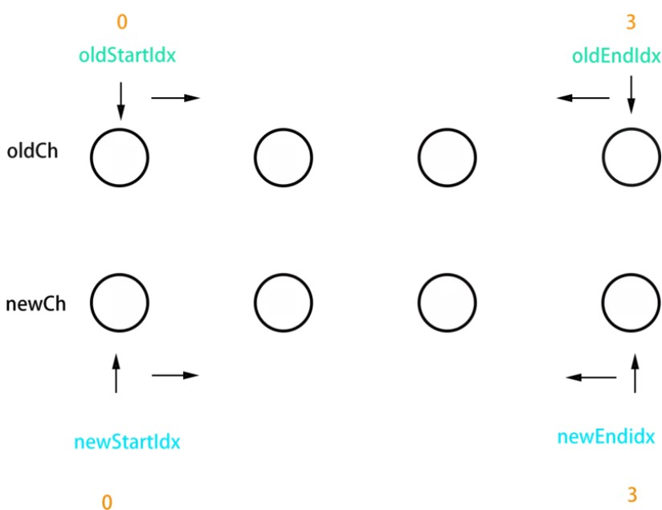

# 编译与渲染

参考: [剖析 Vue.js 内部运行机制](https://juejin.im/book/5a36661851882538e2259c0f)  
更多内容:  
[answershuto/learnVue](https://github.com/answershuto/learnVue)  
[Vue.js 技术揭秘](https://ustbhuangyi.github.io/vue-analysis/)

## new Vue

[响应式](./20_responsive.md)已经介绍，这里再提一下  
`_init`: 会初始化生命周期、事件、 props、 methods、 data、 computed 与 watch 等

```js
//部分代码，省略静态类型检查
//src\core\instance\init.js
Vue.prototype._init = function(options) {
  //...
  initLifecycle(vm) //初始化生命周期
  initEvents(vm) //事件
  initRender(vm)
  callHook(vm, 'beforeCreate') //调用钩子
  initInjections(vm)
  initState(vm)
  initProvide(vm)
  callHook(vm, 'created')
  //...
  if (vm.$options.el) {
    vm.$mount(vm.$options.el)
  }
}
```

## mount

初始化之后调用`$mount` 会挂载组件;

```js
//部分代码，省略静态类型检查
//runtime only下
//src\platforms\web\runtime\index.js
Vue.prototype.$mount = function(el, hydrating) {
  return mountComponent(this, el && query(el, this.$document), hydrating)
}
```

如果是运行时编译，即不存在 render function 但是存在 template 的情况，需要进行「编译」(compile)步骤

```js
//部分代码，省略静态类型检查
//runtime-compiler下
//src\platforms\web\entry-runtime-with-compiler.js
Vue.prototype.$mount = function(el, hydrating) {
  //...
  const options = this.$options
  // 如果render不存在，处理template
  if (!options.render) {
    let template = options.template
    if (template) {
      //如果存在template，那么把template转成DOM对象
    } else if (el) {
      //如果不存在template，那么直接拿el的父元素作为template
      template = getOuterHTML(el)
    }
    if (template) {
      //...
      const { render, staticRenderFns } = compileToFunctions(
        template,
        {
          outputSourceRange: process.env.NODE_ENV !== 'production',
          shouldDecodeNewlines,
          shouldDecodeNewlinesForHref,
          delimiters: options.delimiters,
          comments: options.comments
        },
        this
      )
      options.render = render
      options.staticRenderFns = staticRenderFns
      //...
    }
  }
  //...
  return mount.call(this, el, hydrating)
}
```

### Runtime Only 和 Runtime + Compiler

Vue 的渲染最终都是通过`render`函数进行的，可以用户自定义，也可以通过 compiler 编译生成

```js
// 需要编译器
new Vue({
  template: '<div>{{ hi }}</div>'
})

// 不需要编译器
new Vue({
  render(h) {
    return h('div', this.hi)
  }
})
```

### mountComponent

mount 的核心方法
主要是两个方法：  
先调用 vm.\_render 方法先生成虚拟 Node，再实例化一个 Watcher，在它的回调函数中会调用 `updateComponent` 方法，最终调用 vm.\_update 更新 DOM

```js
//部分代码，省略静态类型检查
//src\core\instance\lifecycle.js
export function mountComponent(vm, el, hydrating) {
  vm.$el = el
  if (!vm.$options.render) {
    vm.$options.render = createEmptyVNode //生成空的虚拟节点
    //...
  }
  callHook(vm, 'beforeMount')
  let updateComponent
  if (process.env.NODE_ENV !== 'production' && config.performance && mark) {
    //...
  } else {
    updateComponent = () => {
      vm._update(vm._render(), hydrating)
    }
  }
  new Watcher(
    vm,
    updateComponent,
    noop,
    {
      before() {
        if (vm._isMounted && !vm._isDestroyed) {
          callHook(vm, 'beforeUpdate')
        }
      }
    },
    true
  )
  hydrating = false

  // manually mounted instance, call mounted on self
  // mounted is called for render-created child components in its inserted hook
  if (vm.$vnode == null) {
    vm._isMounted = true
    callHook(vm, 'mounted')
  }
  return vm
}
```

## VNode

在 vm.\_render 方法中生成虚拟 VNode  
Virtual DOM 本质上就是个对象树，树的节点是 VNode。  
操作 DOM 是很耗费性能的一件事情，考虑通过 JS 对象来模拟 DOM 对象，毕竟操作 JS 对象比操作 DOM 省时的多

### 简单实现

Vue 的源码在[src\core\vdom\vnode.js](https://github.com/vuejs/vue/blob/dev/src/core/vdom/vnode.js)

```html
<span class="demo" v-show="isShow" id="test">
  This is a span.
</span>
<script>
  function VNode(tag, data, children, text, el) {
    this.tag = tag //标签名，比如span, div
    this.data = data //节点的信息，比如props, directives，如v-if
    this.children = children //节点的子节点，是个数组
    this.text = text //节点的text
    this.el = el //节点的DOM对象
  }
  function render() {
    return new VNode(
      'span',
      {
        /* 指令集合数组 */
        directives: [
          {
            /* v-show指令 */
            rawName: 'v-show',
            expression: 'isShow',
            name: 'show',
            value: true
          }
        ],
        /* 静态class */
        staticClass: 'demo'
      },
      [new VNode(undefined, undefined, undefined, 'This is a span.')],
      undefined,
      document.getElementById('test')
    )
  }
</script>
```

### diff 算法

主要是节点比较和节点更新，只做**同层**比较  
比较(`patchVnode`)的时候:  
旧节点和新节点一致不做处理。

- 文本节点的比较，需要修改，只修改文本
- 如果旧节点有子节点，新的没有，直接删除。
- 如果旧节点没有子节点，新的有，在旧节点上进行创建
- 如果都有子节点，并且新旧不一样，那么要用`updateChildren`方法

#### updateChildren

新旧有各自的开头和结束变量，2 个变量相互比较。也就是新旧各有两个指针(oldStartIdx, oldEndIdx; newStartIdx, newEndIdx)

- 不设 key，newCh 和 oldCh 只会进行头尾两端的相互比较
- 设 key 后，除了头尾两端的比较外，还会从用 key 生成的对象 oldKeyToIdx 中查找匹配的节点  
  如果设置了 key，就会用 key 进行比较，在比较的过程中，变量会往中间靠，一旦 StartIdx > EndIdx 表明 oldCh 和 newCh 至少有一个已经遍历完了，就会结束比较。

```js
//src\core\vdom\patch.js
function updateChildren (parentElm, oldCh, newCh) {
  let oldStartIdx = 0;
  let oldEndIdx = oldCh.length - 1;
  let oldStartVnode = oldCh[0];
  let oldEndVnode = oldCh[oldEndIdx];
  let newStartIdx = 0;
  let newEndIdx = newCh.length - 1;
  let newStartVnode = newCh[0];
  let newEndVnode = newCh[newEndIdx];
  let oldKeyToIdx, idxInOld, elmToMove, refElm;
  /*
    sameVnode: 老 VNode 节点与新 VNode 节点是相同的 VNode 节点
  */
  while (oldStartIdx <= oldEndIdx && newStartIdx <= newEndIdx) {
    if (!oldStartVnode) {
      oldStartVnode = oldCh[++oldStartIdx];
    } else if (!oldEndVnode) {
      oldEndVnode = oldCh[--oldEndIdx];
    } else if (sameVnode(oldStartVnode, newStartVnode)) {//新旧节点开头相同
      patchVnode(oldStartVnode, newStartVnode);
      oldStartVnode = oldCh[++oldStartIdx];
      newStartVnode = newCh[++newStartIdx];
    } else if (sameVnode(oldEndVnode, newEndVnode)) {//新旧节点结尾相同
      patchVnode(oldEndVnode, newEndVnode);
      oldEndVnode = oldCh[--oldEndIdx];
      newEndVnode = newCh[--newEndIdx];
    } else if (sameVnode(oldStartVnode, newEndVnode)) {//旧的开始节点=新的结束
      patchVnode(oldStartVnode, newEndVnode);
      nodeOps.insertBefore(parentElm, oldStartVnode.elm, nodeOps.nextSibling(oldEndVnode.elm));
      oldStartVnode = oldCh[++oldStartIdx];
      newEndVnode = newCh[--newEndIdx];
    } else if (sameVnode(oldEndVnode, newStartVnode)) {//旧的结束节点=新的开始
      patchVnode(oldEndVnode, newStartVnode);
      nodeOps.insertBefore(parentElm, oldEndVnode.elm, oldStartVnode.elm);
      oldEndVnode = oldCh[--oldEndIdx];
      newStartVnode = newCh[++newStartIdx];
    } else {
      //...
      //比较key
  }
  if (oldStartIdx > oldEndIdx) {
  //老节点比对完了，但是新节点还有多的，需要将新节点插入到真实 DOM 中去
    refElm = (newCh[newEndIdx + 1]) ? newCh[newEndIdx + 1].elm : null;
    addVnodes(parentElm, refElm, newCh, newStartIdx, newEndIdx);
  } else if (newStartIdx > newEndIdx) {
    //新节点比对完了，老节点还有多，将这些无用的老节点通过 removeVnodes 批量删除即可
    removeVnodes(parentElm, oldCh, oldStartIdx, oldEndIdx);
  }
}
```


参考[从一个简单列子列举 diff 算法流程.pdf](https://github.com/aaawhz/-vue2.0/blob/master/%E4%BB%8E%E4%B8%80%E4%B8%AA%E7%AE%80%E5%8D%95%E5%88%97%E5%AD%90%E5%88%97%E4%B8%BE%20diff%E7%AE%97%E6%B3%95%E6%B5%81%E7%A8%8B.pdf)

## compile

将 template 进行 compileToFunctions 得到 render 以及 staticRenderFns  
render function 在运行后会返回 VNode 节点

compile 编译可以分成 parse、optimize 与 generate 三个阶段，最终需要得到 render function

### parse

parse 会用正则等方式解析 template 模板中的指令、class、style 等数据，形成 AST（Abstract Syntax Tree：表现编程语言的语法结构，树上的每个节点都表示源代码中的一种结构）。

### optimize

optimize 的主要作用是标记 static 静态节点，这是 Vue 在编译过程中的一处优化，后面当 update 更新界面时，会有一个 patch 的过程， diff 算法会直接跳过静态节点，从而减少了比较的过程，优化了 patch 的性能。  
根据 node 的 type 来，如果 type 是 2，那么是表达式节点，static 是 false。
type 是 3，那么是静态节点

### generate

generate 是将 AST 转化成 render function 字符串的过程，得到结果是 render 的字符串以及 staticRenderFns 字符串。
在经历过 parse、optimize 与 generate 这三个阶段以后，组件中就会存在渲染 VNode 所需的 render function 了
