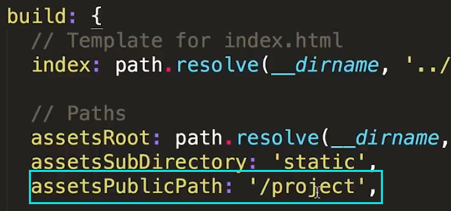
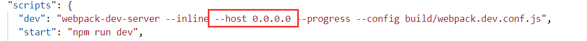
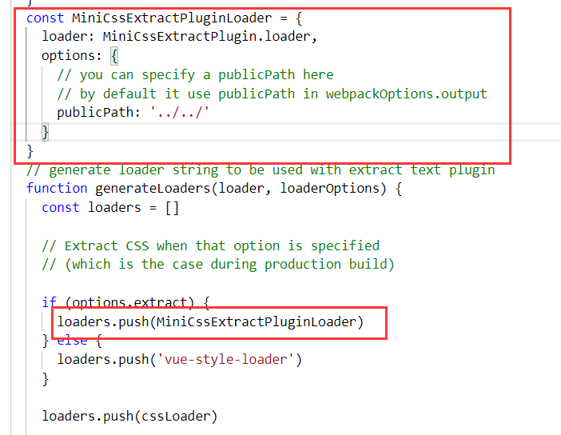
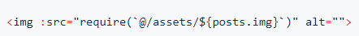

# Vue CLI

## vue-cli 2.x

生成被浏览器运行编译的代码：`npm run build`

生成目录在 `dist` 中。把 dist 文件夹放到服务器根目录即可

tomcat 直接放 webapps 下，也就是 webapps/dist 的话，assetsPublicPath 改成`"./"`，而不是`"/"`  
"/"的话会是绝对路径 localhost:8080/static/xxx

[参考](https://segmentfault.com/a/1190000011275673)

放到服务器某个文件夹下，需要修改 config/index.js

build 修改为文件夹的路径.。再重新打包



注：static 目录下的文件重写路径以后是不会处理的，需要重新改为

./static/xxx/xxx

### ip 访问

设置 host 的值是 0.0.0.0

可以是 package.json 里面，也可以是直接修改 webpack.basic.config.js 里面的 host



### image 请求路径 404

vue 开发是相对路径

build 是绝对路径

utils.js 加上 publicPath，改成相对路径



因为 webpack 的限制，绝对路径不会去解析



## vue-cli 3.x

安装

```
npm install -g @vue/cli
```

vue.config.js 常用配置

```js
const path = require('path')
function resolve(dir) {
  return path.join(__dirname, dir)
}
module.exports = {
  publicPath: './',
  lintOnSave: true,
  chainWebpack: config => {
    //alias
    config.resolve.alias
      .set('@', resolve('src'))
      .set('static', resolve('src/static'))
  },
  devServer: {
    proxy: {
      '/v1': {
        target: 'www.baidu.com', //目标地址
        changeOrigin: true, //开启代理：在本地会创建一个虚拟服务端，这样服务端和服务端进行数据的交互就不会跨域
        pathRewrite: {
          '^/v1': '/v1'
        }
      }
    }
  }
}
```

### 关于静态文件：

放在`public`目录下即可，类似 vue-cli 2.x 的 static 文件夹

### public 文件夹

参考[官网](https://cli.vuejs.org/zh/guide/html-and-static-assets.html#public-%E6%96%87%E4%BB%B6%E5%A4%B9)

```html

```

```js
data () {
  return {
    publicPath: process.env.BASE_URL
  }
}
```

### 优化

参考[vue-cli3 项目从搭建优化到 docker 部署](https://juejin.im/post/5c4a6fcd518825469414e062#heading-21)
