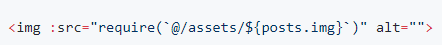

# 杂

## ElementUI

dist 打包，gulp 错误，升级 natives

修改 yarn.lock natives 改成 1.1.3

然后重新 yarn

修改 element build/config.js Element-UI 都替换成自定义,Alias 不换

package.json name 换成自定义

## vue-cli2.0

生成被浏览器运行编译的代码：npm run build

生成目录在 dist 中。把 dist 文件夹放到服务器根目录即可

tomcat 直接放 webapps 下，也就是 webapps/dist 的话，assetsPublicPath 改成`"./"`，而不是`"/"`，"/"的话会是绝对路径 localhost:8080/static/xxx

[参考](https://segmentfault.com/a/1190000011275673)

放到服务器某个文件夹下，需要修改 config/index.js

build 修改为文件夹的路径.。再重新打包

注：static 目录下的文件重写路径以后是不会处理的，需要重新改为

./static/xxx/xxx

### ip 访问

设置 host 的值是 0.0.0.0

可以是 package.json 里面，也可以是直接修改 webpack.basic.config.js 里面的 host

### image 请求路径 404

vue 开发是相对路径

build 是绝对路径

utils.js 加上 publicPath，改成相对路径

因为 webpack 的限制，绝对路径不会去解析

