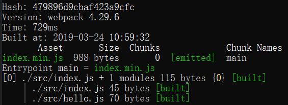

# 基本

webpack 默认只能识别 js 文件，其他文件的打包需要配置 loader 进行识别

## webpack.config.js

```js
const path = require("path")
module.exports = {
  mode: "production",
  entry: {
    main: "./src/index.js",
  },
  module: {
    rules: [
      {
        test: /.jpg$/,
        use: {
          loader: "file-loader",
        },
      },
    ],
  },
  output: {
    filename: "index.min.js",
    path: path.resolve(__dirname, "dist"), //必须是绝对路径
  },
}
```

## [命令](https://webpack.js.org/api/cli)

更多见官网 Command Line Interface

命令行敲，如果不用 npx，会找全局安装的模块

`npx webpack --config webpack.config.js`

利用 npm scripts，会优先找当前项目，npx 可以省略

`webpack --config webpack.config.js`

### webpack –config

设置配置文件

### webpack –watch

监听文件改变时自动打包。为了方便通常都用[devServer](#_devServer：webpack-dev-server的配置)代替

## 输出信息

chunk names 叫 main，是因为 entry 简写了，默认叫 main

```js
entry: {
  "main": "./index.js"
}
```



## 占位符[]
