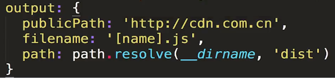
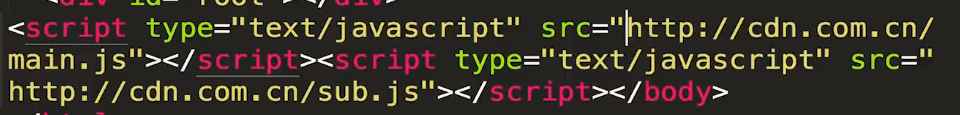
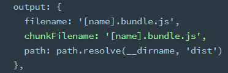

# output

## path

打包后的存储路径，应该是绝对路径

## filename

xx/[name].js

name 会作为一个变量，如果项目 entry 有多个文件，则会生成多个文件

## publicPath

打包后统一的 src 前缀

## chunkFilename

适用于异步加载（比如 ES6 的 import）。此时异步加载的文件不会在 entry 当中，entry 生成的文件对应 filename。异步加载的文件对应 chunkFilename

## libraryTarget

一般用在写插件

libraryTarget: “amd”

library: “VueToastDemo”

指定输出的打包格式为 AMD 规范（只能用 require 形式引入），指定输出的名字为 VueToastDemo

也就是打包后的 js 可以通过"VueToastDemo"这个全局变量来访问
