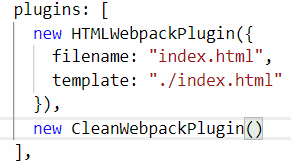
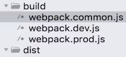
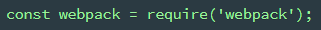
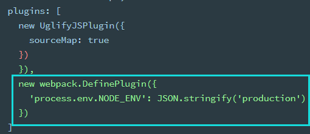

# plugins

webpack 运行到某一时刻会调用的方法

插件都需要手动引入

## HTMLWebpackPlugin

[html-webpack-plugin](https://webpack.js.org/plugins/html-webpack-plugin/#root): 管理 HTML

```bash
npm install --save-dev html-webpack-plugin
```

```js
const HtmlWebpackPlugin = require('html-webpack-plugin')
const path = require('path')

module.exports = {
  entry: 'index.js',
  output: {
    path: path.resolve(__dirname, './dist'),
    filename: 'index_bundle.js'
  },
  plugins: [new HtmlWebpackPlugin()]
}
```

在文件打包后自动在 output 目录生成 html 文件，并引入 js

filename 默认就是"index.html"。上面的配置生成的代码如下:

```html
<!DOCTYPE html>
<html>
  <head>
    <meta charset="UTF-8" />
    <title></title>
  </head>
  <body>
    <script src="index_bundle.js"></script>
  </body>
</html>
```

### 配置项

#### template

设置打包时的 html 模板。

```js
plugins: [
  new HTMLWebpackPlugin({
    filename: "index.html",
    template: "./index.html"
  }),
  new CleanWebpackPlugin()
],
output: {
  filename: "index.min.js",
  path: path.resolve(__dirname, "dist") //必须是绝对路径
}
```

### 多页面文件打包

配置 chunks

```js
new HTMLWebpackPlugin({
  filename: 'index.html',
  template: './index.html',
  chunks: ['foo'] //只引入需要的js
}),
  new HTMLWebpackPlugin({
    filename: 'main.html',
    template: './main.html',
    chunks: ['bar'] //比如foo.js只在index.html用到, bar只在main.html用到
  })
```

## 清理文件：CleanWebpackPlugin

clean-webpack-plugin v2.x



### 配置

clean-webpack-plugin 只能清除根目录下的文件

假设目录结构如下，要清除 dist 目录（`new CleanWebpackPlugin()`）会报错，因为此时 build 是根目录



需要增加配置，见[官网](https://github.com/johnagan/clean-webpack-plugin)

```js
new CleanWebpackPlugin({
  cleanOnceBeforeBuildPatterns: ['**/*', '!static-files*']
})
```

## 抽取 CSS：mini-css-extract-plugin

[官网](https://webpack.js.org/plugins/mini-css-extract-plugin)

```js
const MiniCssExtractPlugin = require('mini-css-extract-plugin')
module.exports = {
  plugins: [
    new MiniCssExtractPlugin({
      // Options similar to the same options in webpackOptions.output
      // all options are optional
      filename: '[name].css',
      chunkFilename: '[id].css',
      ignoreOrder: false // Enable to remove warnings about conflicting order
    })
  ],
  module: {
    rules: [
      {
        test: /\.css$/,
        use: [
          {
            loader: MiniCssExtractPlugin.loader, //不再使用style-loader
            options: {
              // you can specify a publicPath here
              // by default it uses publicPath in webpackOptions.output
              publicPath: '../',
              hmr: process.env.NODE_ENV === 'development'
            }
          },
          'css-loader'
        ]
      }
    ]
  }
}
```

## 内置

直接 require('webpack')

在 plugins 内使用 webpack.xxx





### HMR

webpack.HotModuleReplacementPlugin(): 模块热替换

回调等方法见[API](https://webpack.js.org/api/hot-module-replacement)

devServer 设置为 true 之后可以避免每次更新刷新整个页面，只进行局部更新

### DefinePlugin

[webpack.DefinePlugin](https://webpack.js.org/plugins/define-plugin/#root): 编译的时候创建的一个全局变量。可以变量的不同进行不同的配置

```js
// 引入 webpack
const webpack = require('webpack')
// 增加 webpack 配置
plugins: [
  new webpack.DefinePlugin({
    // 比如：开发环境写 'development'，生产环境写 'production'
    ENV: JSON.stringify('development')
  })
]

//在逻辑js中
if (ENV === 'development') {
  //do sth.
}
```

### ProvidePlugin

[ProvidePlugin](https://webpack.js.org/plugins/provide-plugin/#root):
自动加载插件，比如加载 jQuery

```js
//自动加载 jquery，将两个变量都指向jquery
plugins: [
  new webpack.ProvidePlugin({
    $: 'jquery',
    jQuery: 'jquery'
  });
]
```

### HashedModuleIdsPlugin

该插件会根据模块的相对路径生成一个四位数的 hash 作为模块 id, 建议用于生产环境

见[缓存](./10_usage.md#缓存)

### DllPlugin

例子见 Vue。

插件会生成一个名为 manifest.json 的文件，这个文件是用来让 DLLReferencePlugin
映射到相关的依赖上去的

## CopyWebpackPlugin

[copy-webpack-plugin](https://webpack.js.org/plugins/copy-webpack-plugin): 复制文件

```bash
npm install copy-webpack-plugin --save-dev
```

比如把 src 下的 doc 文件夹全部复制到 dist 目录中的 doc 文件夹

```js
const CopyPlugin = require('copy-webpack-plugin')

module.exports = {
  plugins: [
    new CopyPlugin([
      { from: path.join(srcPath, 'doc'), to: path.join(distPath, 'doc') },
      { from: 'other', to: 'public' }
    ])
  ]
}
```
