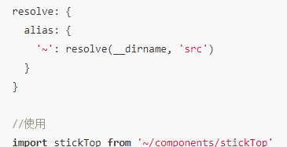

# resolve

配置模块如何解析。例如，当在 ES2015 中调用 import "lodash"，resolve 选项能够对
webpack 查找 "lodash" 的方式去做修改

- 尽量减少 resolve.modules, resolve.extensions, resolve.mainFiles,
  resolve.descriptionFiles 中类目的数量，因为他们会增加文件系统调用的次数

只写一些 js, vue, jsx 等，css, png 还是写完整

## alias

创建 import 或 require 的别名，来确保模块引入变得更简单



### vue.config.js

```js
const path = require("path");
function resolve(dir) {
  return path.join(__dirname, dir);
}
module.exports = {
  publicPath: "./",
  lintOnSave: true,
  productionSourceMap: false, //不要map
  chainWebpack: (config) => {
    //alias
    config.resolve.alias
      .set("@", resolve("src"))
      .set("assets", resolve("src/assets"))
      .set("common", resolve("src/common"));
  },
};
```
