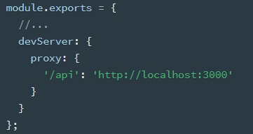
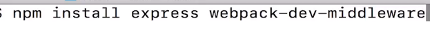

# mode

环境构建，值为 production 和 delepment

如果是 production，会自动启用 UglifyJSPlugin 进行压缩

- 也可以在命令行接口中使用 --optimize-minimize 标记，来启用 UglifyJSPlugin

## webpack-merge

为了避免重复配置，通常会准备一个通用配置，然后再分别部署开发和生产环境。

merge 可以进行合并

**以下内容都针对开发环境**

## [devtool](https://webpack.js.org/configuration/devtool#devtool)

```js
mode: "development",
devtool: "source-map",
```

会减慢编译速度，所以就开发用。匹配规则 `^(inline-|hidden-|eval-)?(nosources-)?(cheap-(module-)?)?source-map$`。

### source-map

仅用于开发环境，报错时会生成一个.map 文件，用来映射，定位到原本没合并的 js 的第一行第几列。

方便调试

```
dist
  - main.js
  - main.js.map
```

main.js.map

```
{"version":3,"file":"main.js","mappings":"AASAA,SAASC,KAAKC,YATd,WACE,MAAMC,EAAUH,SAASI,cAAc,OAKvC,OAFAD,EAAQE,UAAY,CAAC,QAAS,WAAWC,KAAK,KAEvCH,CACT,CAE0BI","sources":["webpack://webpack-demo/./src/index.js"],"sourcesContent":["function component() {\n  const element = document.createElement('div');\n\n  // Lodash, currently included via a script, is required for this line to work\n  element.innerHTML = ['Hello', 'webpack'].join(\" \")\n\n  return element;\n}\n\ndocument.body.appendChild(component());"],"names":["document","body","appendChild","element","createElement","innerHTML","join","component"],"sourceRoot":""}
```

在 `main.js` 中会存在 sourceMappingURL 指向 map

```js
压缩代码略
//# sourceMappingURL=main.js.map
```

### inline-source-map

和 source-map 作用一样。

打包时候的 inline 生成的 map 是合并到 output 生成的 js 里。而 source-map 是单独一个 map 文件

### cheap-source-map

同 source-map，但是只会定位到第几行，没有第几列

### module

webpack 中对一个模块会进行多次处理，比如 sass 转 css，经过 sass-loader 做一次转换，再用 css-loader 做一次转换，之后打包到一起。  
每次转换都会生成 sourcemap，如果需要找到最初的转换，可以用 `module` 把每一次的 loader 的 sourcemap 关联起来

### cheap-module-source-map

推荐生产环境报错时排查错误用。一般来说生产环境不需要开启 devtool

不仅包括本身的代码，还会映射 loader、第三方引入模块

### eval

不再生成 map 文件，而是使用 eval 关键字，并指向源文件。速度最快

但有时候定位不太准

### cheap-module-eval-source-map（推荐）

类似 eval，但还会包括 loader、第三方模块等报错

定位也可能不准

### nosources

上边的 main.js.map 会包含 sourcesContent，也就是源码。如果不需要这部分内容，可以配置 `devtool: "nosources-source-map"`

## devServer

[webpack-dev-server](https://webpack.js.org/configuration/dev-server/#devserver)：webpack-dev-server 的配置

创建一个服务器，并实时重新加载。只要代码改变就会重新打包，刷新浏览器

需要额外安装

`npm install --save-dev webpack-dev-server`

在 npm scripts 内使用

```json
"dev": "webpack-dev-server --inline --host 0.0.0.0 --progress --config build/webpack.dev.conf.js"
```

实际上也会进行打包，但是不生成 dist 等文件夹，而是直接放到了内存中，文件夹看不到生成的内容

```js
devServer: {
  allowedHosts: 'all',
  hot: true,
  historyApiFallback: {
    rewrites: [
      { from: /^\/mobile\/.*$/, to: '/mobile.html' },
    ],
  },
  host: 'localhost.test.com',
  port: 8098,
  open: true,
  proxy: {
    "/api": {
      target: "http://www.baidu.com/",
      pathRewrite: {'^/api' : ''}
      changeOrigin: true
    }
  }
  server: {
    type: "https",
  },
}
```

### 涉及的模块

#### http-proxy-middleware

webpack 内置，可以使用 proxy 进行代理



### contentBase

### open

自动打开默认浏览器，并访问地址

### allowedHosts

允许访问的服务器

### proxy

[官网](https://webpack.js.org/configuration/dev-server/#devserverproxy)  
webpack-dev-server 实现 proxy 的功能是依赖的 http-proxy-middleware

```js
devServer: {
  // 设置代理
  proxy: {
    // 将本地 /api/xxx 代理到 localhost:3000/api/xxx
    '/api': 'http://localhost:3000',

    // 将本地 /api2/xxx 代理到 localhost:3000/xxx
    '/api2': {
        target: 'http://localhost:3000',
        pathRewrite: {
            '/api2': ''
        }
    }
}
```

#### changeOrigin

默认是 false，请求头中 host 仍然是浏览器发送过来的 host  
为 true 后请求头（request header）的中的 Host 变成 target URL

```js
proxy: {
  "/api": {
    target: "http://www.baidu.com/",
    pathRewrite: {'^/api' : ''}
    changeOrigin: true
  }
}
```

### port

端口号

### hot

为 true 时进行热模块更新。只加载改变的内容，不会刷新整个页面

需要引入 webpack 内置的[HotModuleReplacementPlugin](./03_plugins.md#模块热替换hot-module-replacemment)

还要加额外的代码。

用在 CSS 上，loader 会自己进行处理。

如果自己写的 JS 改变了就要加额外的代码

在需要热更新的 JS 上进行判断，比如重新执行一个方法

```js
if (module.hot) {
  module.hot.accept('./hello.js', function() {
  Hello();
})
```

### server

可以配置证书和 http 协议

## 扩展：webpack-dev-middleware

把 webpack 处理后的的文件传给服务器

比如用 Express 代替 webpack-dev-server 实现实时加载的功能



准备一个文件比如叫 server.js。如果是 express，直接敲命令 node server.js

在 node 内使用 webpack 见官网[API](https://webpack.js.org/api/node) Node Interface

```js
const express = require("express")
const webpack = require("webpack")
const webpackDevMiddleware = require("webpack-dev-middleware")
const config = require("./webpack.config.js") //引入webpack配置文件
// 在node中直接使用webpack
const compiler = webpack(config)

const app = express()
//使用webpack-dev-middleware中间件
//第一个参数是webapck打包，第二个是打包的额外配置项
app.use(
  webpackDevMiddleware(compiler, {
    publicPath: config.output.publicPath,
  })
)

app.listen(3000, () => {
  console.log("server is running")
})
```
