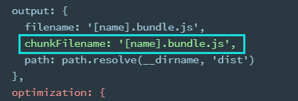

# 优化：optimization

## Tree Shaking：只打包用到的模块

只能用在 ES module 上，也就是只能 import, 不能用在 require

mode 是 production 时会自动开启

mode 是 development 需要手动加入

```js
optimization: {
  usedExports: true
},
output: {
  filename: "index.min.js",
  path: path.resolve(__dirname, "dist") //必须是绝对路径
}
```

### package.json

开启 tree shaking 之后 webpack 只解析有导出(export)的模块

像是 babel-pollyfill，并没有导出，而是
全局重写的 promise 等，为了保证类似 pollyfill 模块的正常使用，需要在 package.json 内单独配置这些

常用的比如 import xx.css

```json
"sideEffects": ["*.css"]
```


### sideEffects

参考[Webpack 中的 sideEffects 到底该怎么用？](https://zhuanlan.zhihu.com/p/40052192)  
总结：  
在 package.json 里面设置`sideEffects: false`是为了告诉 webpack，这个包理论上是没有副作用的。做 Tree Shaking 的时候当做无副用作的包处理

### 作用

webpack 入口文件有很多依赖的模块。实际情况中，虽然依赖了某个模块，但其实只使用其中的某些功能。  
通过 tree-shaking，将没有使用的模块摇掉，这样来达到删除无用代码的目的

### 原理

[参考](https://juejin.im/post/5a4dc842518825698e7279a9)  
利用的是 ES6 module 的依赖关系确定性  
ES6 module 的特点

- 只能在顶层出现
- 模块名只能是字符串常量
- 导入后的模块在当前 js 是不可变的
  这样就可以进行静态分析，不需要执行引入模块的代码。

### 缺陷

无法消除类的方法。由于`prototype`的继承，分析依赖会比较困难  
例如下面是一个"senhai.js", 如果删掉整个"senhai.js"，对原生`Array`的自定义`unique`方法也没了，可能引起报错

```js
function Senhai() {}

Senhai.prototype.servant = function () {}

var a = 'Saber' + 'Alter',
  b
if (a == 'QB') {
  b = Array
} else {
  b = Senhai
}
b.prototype.unique = function () {
  // 将 array 中的重复元素去除
}

export default Senhai
```

## Code Spliting: splitChunks


抽取公共的依赖文件到单个文件里面。适用于同步代码

如果是[异步引入](https://webpack.js.org/guides/code-splitting/#root)，比如 Promise，那么 webpack 会自动处理，不需要配置 optimization，但如果配置了 splitChunks，也会影响异步引入生成的结果

```js
chunks: 'async', //异步代码进行code splitting, 配成"all"打包所有
```

### 配置




注释内的 webpackChunkName 表示动态引入的插件名字

到时候打包的名字会叫 lodash.bundle.js

splitChunks 的配置见官网[split-chunks-plugin](https://webpack.js.org/plugins/split-chunks-plugin/)

解释见 Dell Lee
[慕课网](https://coding.imooc.com/class/316.html#mid=22363)4.5，4.6 节

## runtimeChunk


设置为"single"之后，根据提供的选项将运行时代码拆分成单独的块

见[缓存](./10_usage.md#缓存)

## 常见优化手段

- 更新到最新版本

- 尽可能使用 include，少用 plugin，比如开发环境不需要压缩

- tree shaking: 只能用在 ES module 上

- [noParse](https://webpack.js.org/configuration/module/#modulenoparse)  
  防止 webpack 解析 noParse 内的文件。这些文件不会依赖其他模块，也就是不会有`import`, `require`, `define`的调用  
  对于不依赖任何其他的插件来说可以提高构建的性能

```js
module.exports = {
  //...
  module: {
    noParse: /jquery|lodash/,
  },
}
```

- 减少[resolve](./04_loader.md#自定义loader)
- 合理使用[sourceMap](./06_mode.md#cheap-module-eval-source-map)
- [Externals](https://webpack.js.org/configuration/externals/#root)  
  html 中已经用 CDN 引入了第三方插件，就没必要打包

  ```html
  <script src="https://code.jquery.com/jquery-3.1.0.js"></script>
  ```

  ```js
  module.exports = {
    //...
    externals: {
      jquery: 'jQuery',
    },
  }
  ```

  在业务内仍然可以使用

  ```js
  //仍然可以import
  import $ from 'jquery'

  $('.my-element').animate(/* ... */)
  ```

- 其他:
  [官网](https://webpack.js.org/guides/build-performance/)
- 用`dllplugin`配置第三方模块，第一次打包后不再反复打包
  - DllPlugin 可以把我们需要打包的第三方库打包成一个 js 文件和一个 json 文件，这个 json 文件中会映射每个打包的模块地址和 id
  - DllReferencePlugin 通过读取这个 json 文件来使用打包的这些模块
- Happypack: JS 是单线程的，同样 NodeJS 也是，那么 webpack 也只能一个一个操作打包。  
  用 Happypack 可以进行多**进程**打包，对于复杂项目可以加快打包速度，小项目没有必要
- [IgnorePlugin](https://webpack.js.org/plugins/ignore-plugin/#root)  
  比如忽略某个模块下的某些文件夹，比如本地化语言文件夹

```js
//忽略moment下的locale目录
new webpack.IgnorePlugin({
  resourceRegExp: /^\.\/locale$/,
  contextRegExp: /moment$/,
})

//只引入需要的语言
import moment from 'moment'
import 'moment/locale/zh-cn' // 手动引入中文语言包
moment.locale('zh-cn')
```

### dllplugin

1. 新建一个配置文件，比如叫`webpack.dll.config.js`  
   入口文件配置第三方不需要改动的内容，异步加载的组件没必要放进去  
   出口在 dist 下

```js
onst path = require('path')
const webpack = require('webpack')

module.exports = {
    entry: {
      // 依赖的库数组
      vendor: [
        'babel-polyfill',
        'vue',
        'element-ui'
      ]
    },
    output: {
      path: path.join(__dirname, 'dist'),
      filename: '[name].js',
      library: '[name]_[hash]',
    },
    plugins: [
      new webpack.DllPlugin({
        // DllPlugin的name属性需要和libary保持一致
        name: '[name]_[hash]',
        path: path.join(__dirname, 'dist', '[name]-manifest.json'),
        // context需要和webpack.config.js保持一致
        context: __dirname,
      }),
    ],
}
```

2. 运行这个 js，生成 js 和 json
3. webpack.config.js 中通过 `DLLReferencePlugin` 来使用 DllPlugin 生成的 DLL Bundle

```js
const path = require('path')
const webpack = require('webpack')
module.exports = {
  mode: 'production',
  // 编译入口
  entry: {
    main: './src/index.js',
  },
  // 目标文件
  output: {
    path: path.join(__dirname, 'dist/'),
    filename: '[name].js',
  },
  // dll相关配置
  plugins: [
    new webpack.DllReferencePlugin({
      context: __dirname,
      // manifest就是我们第一步中打包出来的json文件
      manifest: require('./dist/vendor-manifest.json'),
    }),
  ],
}
```
