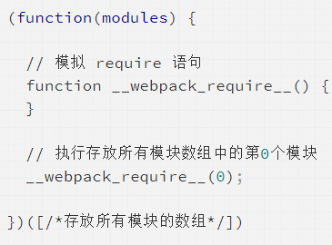

# 流程

1.  初始化：启动构建，读取与合并配置参数，加载 Plugin，实例化 Compiler。

2.  编译：从 Entry 发出，针对每个 Module 串行调用对应的 Loader
    去翻译文件内容，再找到该 Module 依赖的 Module，递归地进行编译处理。

3.  输出：对编译后的 Module 组合成 Chunk，把 Chunk 转换成文件，输出到文件系统。

## 初始化

## 编译

## 输出

输出文件可以被浏览器识别，是因为

输出的文件中通过 \__webpack_require_\_
函数定义了一个可以在浏览器中执行的加载函数来模拟 Node.js 中的 require 语句

\_\_webpack_require\_\_还做了缓存优化：
执行加载过的模块不会再执行第二次，执行结果会缓存在内存中，当某个模块第二次被访问时会直接去内存中读取被缓存的返回值
