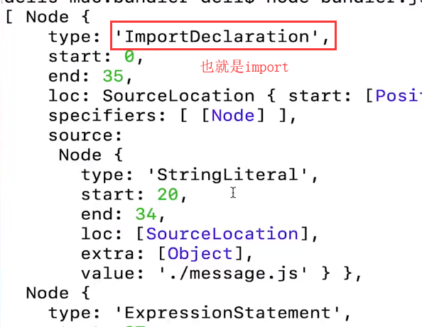

# 实现小型 webpack

[Dell Lee ](https://coding.imooc.com/lesson/316.html#mid=22920)  
知乎[理解 webpack 原理，手写一个 100 行的 webpack](https://zhuanlan.zhihu.com/p/58151131)  
调用 NodeJS 的 API

比如 fs 模块

## 读取单个源文件并解析

使用\@babel/parser 解析字符串，生成 AST

```js
const ast = parser.parse(content, {
  sourceType: "module", //ES6 module形式
})
```

其中 ast.program.body 如下



\@babel/traverse 解析 AST 里面的 import 语法

### demo

```js
const fs = require("fs")
const path = require("path")
const parser = require("@babel/parser") //解析字符串
const traverse = require("@babel/traverse").default //对AST进行解析
const babel = require("@babel/core") //将AST转成浏览器可以允许的代码

const moduleAnalyser = (filename) => {
  const content = fs.readFileSync(filename, "utf-8")
  const ast = parser.parse(content, {
    sourceType: "module", //ES6 module形式
  })
  const dependencies = {}
  traverse(ast, {
    ImportDeclaration({ node }) {
      //分析依赖: 找到type是ImportDeclaration的节点
      const dirname = path.dirname(filename)
      //node.source.value: 依赖的文件名，即import xx from "sth.js"的sth.js
      // 此时的sth是相对路径，转成绝对路径
      const newFile = "./" + path.join(dirname, node.source.value)
      // 对象内的键值对是 相对路径: 绝对路径
      // 例如dependencies["./sth.js"] =  ["./src/sth.js"]
      dependencies[node.source.value] = newFile
    },
  })
  const { code } = babel.transformFromAst(ast, null, {
    presets: ["@babel/preset-env"], //ES6转ES5
  })
  return {
    filename,
    dependencies,
    code,
  }
}

const moduleInfo = moduleAnalyser("./src/index.js")
console.log(moduleInfo)
```

## 遍历所有依赖

读取入口文件的依赖 A 后，对依赖 A 进行解析，分析依赖 A 的依赖 B、C、D 等等

### demo

```js
const makeDependenciesGraph = (entry) => {
  const entryModule = moduleAnalyser(entry)
  const graphArray = [entryModule]
  for (let i = 0; i < graphArray.length; i++) {
    const item = graphArray[i]
    const { dependencies } = item
    if (dependencies) {
      for (let j in dependencies) {
        graphArray.push(moduleAnalyser(dependencies[j]))
      }
    }
  }
  const graph = {}
  graphArray.forEach((item) => {
    graph[item.filename] = {
      dependencies: item.dependencies,
      code: item.code,
    }
  })
  return graph
}

const graghInfo = makeDependenciesGraph("./src/index.js")
```

## 生成函数

放在闭包内避免影响全局

### demo

```js
const generateCode = (entry) => {
  const graph = JSON.stringify(makeDependenciesGraph(entry))
  return `
    (function(graph){
      function require(module) { 
        function localRequire(relativePath) {
          return require(graph[module].dependencies[relativePath]);
        }
        var exports = {};
        (function(require, exports, code){
          eval(code)
        })(localRequire, exports, graph[module].code);
        return exports;
      };
      require('${entry}')
    })(${graph});
  `
}

const code = generateCode("./src/index.js")
```
