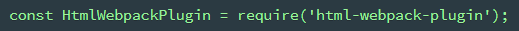
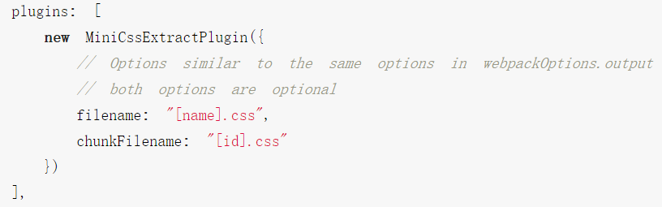
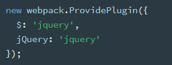
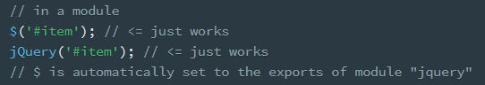

# plugins

webpack 运行到某一时刻会调用的方法

插件都需要手动引入

比如



## 管理 HTML：HTMLWebpackPlugin

html-webpack-plugin

在文件打包后自动在 output 目录生成 html 文件，并引入 js

filename 默认就是"index.html"

### 配置项

#### template

设置打包时的 html 模板。

```js
plugins: [
  new HTMLWebpackPlugin({
    filename: "index.html",
    template: "./index.html"
  }),
  new CleanWebpackPlugin()
],
output: {
  filename: "index.min.js",
  path: path.resolve(__dirname, "dist") //必须是绝对路径
}
```

### 多页面文件打包

配置 chunks

```js
new HTMLWebpackPlugin({
  filename: 'index.html',
  template: './index.html',
  chunks: ['foo'] //只引入需要的js
}),
  new HTMLWebpackPlugin({
    filename: 'main.html',
    template: './main.html',
    chunks: ['bar'] //比如foo.js只在index.html用到, bar只在main.html用到
  })
```

## 清理文件：CleanWebpackPlugin

clean-webpack-plugin v2.x


### 配置

clean-webpack-plugin 只能清除根目录下的文件

假设目录结构如下，要清除 dist 目录（`new CleanWebpackPlugin()`）会报错，因为此时 build 是根目录


需要增加配置，见[官网](https://github.com/johnagan/clean-webpack-plugin)

```js
new CleanWebpackPlugin({
  cleanOnceBeforeBuildPatterns: ['**/*', '!static-files*']
})
```

## 抽取 CSS：mini-css-extract-plugin



```js
module: {
  rules: [
    {
      test: /\.css$/,
      use: [
        {
          loader: MiniCssExtractPlugin.loader,
          options: {
            // you can specify a publicPath here
            // by default it use publicPath in webpackOptions.output
            publicPath: '../'
          }
        },
        'css-loader'
      ]
    }
  ]
}
```

## 内置

直接 require('webpack')

在 plugins 内使用 webpack.xxx


### 模块热替换：[Hot Module ReplacemMent](https://webpack.js.org/guides/hot-module-replacement)

webpack.HotModuleReplacementPlugin()

回调等方法见[API](https://webpack.js.org/api/hot-module-replacement)

HMR: Hot Module ReplacemMent

devServer 设置为 true 之后可以避免每次更新刷新整个页面，只进行局部更新

### 依赖定义：DefinePlugin

允许创建一个在编译时可以配置的全局常量

### ProvidePlugin

自动加载插件，比如加载 jQuery





### HashedModuleIdsPlugin

该插件会根据模块的相对路径生成一个四位数的 hash 作为模块 id, 建议用于生产环境

见[缓存](./10_usage.md#缓存)

### DllPlugin

例子见 Vue。

插件会生成一个名为 manifest.json 的文件，这个文件是用来让 DLLReferencePlugin
映射到相关的依赖上去的
