# loader

静态资源处理见[Asset Management](https://webpack.js.org/guides/asset-management)

尽可能使用 include 属性，应用于必要的模块，提供性能

loader 内的 use 具有顺序，从后往前

下面是简写。完整见[file-loader](#url-loader)

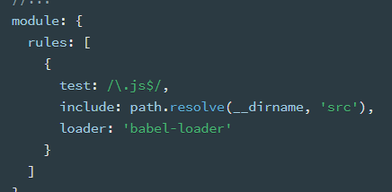

## 图片/字体

### file-loader

通常用来处理图片和字体，实际上任何类型都可以

file-loader 本质上把文件挪到打包后的目录，并返回 webpack 一个地址

比如还是用 js

更多 options 见官网

```js
const path = require('path')
module.exports = {
  entry: {
    main: './src/index.js'
  },
  module: {
    rules: [
      {
        test: /.js$/,
        use: {
          loader: 'file-loader',
          options: {
            //loader的配置
            name: '[name].[ext]', //和源文件一样的名字，一样的后缀
            outputPath: 'images/' //打包后放置的文件夹
          }
        }
      }
    ]
  }
}
```

入口文件内容

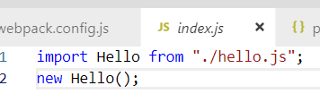

打包后

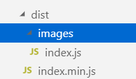

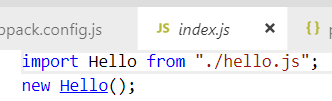

### url-loader

把文件转成 base64。通常就用在图片

可以设置 limit 属性（单位是字节），小于 limit 时进行 Base64 转换，大于时和 file-loader 一样，只是挪文件位置

```js
module: {
    rules: [{
      test: /.js$/,
      use: [{
        loader: "url-loader",
        options: {//loader的配置
          name: "[name].[ext]", //和源文件一样的名字，一样的后缀
          outputPath: "images/", //超过limit后，打包放置的文件夹
          limit: 1024 //以byte为单位
        }
      }]
    }]
  },
```

## CSS

style-loader，css-loader

css-loader 解析样式，style-loader 转成 style 标签

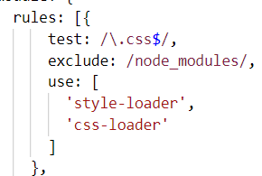

### css-loader 配置项

#### importLoaders

解析 css 文件时，如果当前 css 内还\@import 了别的 css 文件，默认是不会进 loader 的

配置 importLoaders 为 2 以后，确保\@import 的 css 文件也进 loader

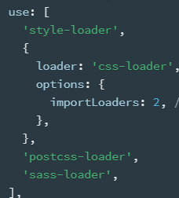

#### modules

```js
loader: "css-loader",
options: {
  importLoaders: 2,
  modules: true
}
```

CSS 模块化，让引入的 CSS 只在当前文件生效，避免全局

导入 CSS 的时候，使用.xxx 来当类名

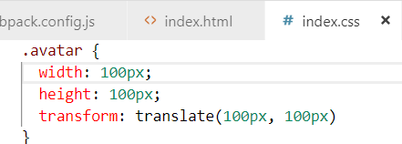

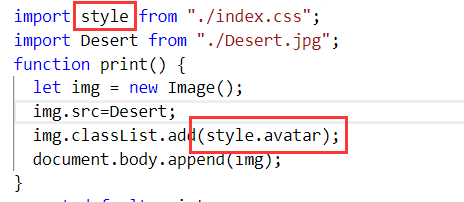

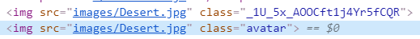

### 处理 Sass:

安装 node-sass, sass-loader

SCSS 源代码会先交给 sass-loader 把 SCSS 转换成 CSS；

把 sass-loader 输出的 CSS 给 css-loader，找出 CSS 中依赖的资源、压缩 CSS 等；

把 css-loader 输出的 CSS 给 style-loader，转成 style 标签

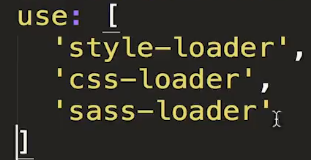

### 加前缀

postcss-loader

根据[官方](https://webpack.js.org/loaders/postcss-loader)文档，需要添加一个 postcss.config.js 配置文件

加前缀还要安装 autoprefixer

`npm install postcss-loader autoprefixer --save-dev`

配置文件内引入 autoprefixer

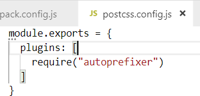

```js
module: {
  rules: [
    {
      test: /\.css$/,
      use: [
        {
          loader: 'style-loader'
        },
        {
          loader: 'css-loader'
        },
        {
          loader: 'postcss-loader'
        }
      ]
    }
  ]
}
```

## JS

### babel

`npm install --save-dev babel-loader @babel/core`

`npm install @babel/preset-env --save-dev`

babel-loader 是 babel 和 webpack 之间通信的桥梁

preset-env 是将 JS 转成对应 ECMAScript 版本的工具，包含了转成 ES5 的各种规则

可以在 webpack 配置文件的 options 内直接写，也可以在项目根目录新建一个[.babelrc](https://babeljs.io/setup#installation),
把 options 内的配置都挪到.babelrc 里面

```js
{
  test: /\.js/,
  exclude: /node_modules/,
  use: [{
    loader: "babel-loader",
    options: {
      presets: ["@babel/preset-env"]
    }
  }]
}
```

#### pollyfill（适合业务代码）

比如 IE 兼容 Promise 对象

`npm install --save @babel/polyfill`

在需要兼容的页面的 JS 顶部引入

```js
import '@babel/polyfill'
```

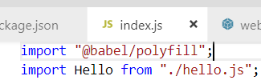

[官网说明](https://babeljs.io/docs/en/babel-polyfill)

pollyfill 会通过全局配置的方式进行解析，容易污染其他代码。适合业务代码

自己写插件：可以选择 transform-runtime

#### transform-runtime（适合自己开发库）

[官网](https://babeljs.io/docs/en/babel-plugin-transform-runtime)

`npm install --save @babel/runtime`

如果用到 corejs，目前官网推荐是 2.x 版本

需要额外安装

`npm install --save @babel/runtime-corejs2`

```js
options: {
  "plugins": [
    ["@babel/plugin-transform-runtime", {
      "absoluteRuntime": false,
      "corejs": 2,
      "helpers": true,
      "regenerator": true,
      "useESModules": false
    }]
  ]
}
```

#### presets

引入安装的\@babel/preset-env

preset 如果有多个配置，同样也是从后往前

##### useBuiltIns

如果不需要所有的语法都转成 ES6，只是用到的语法去处理

不需要再 import

[官网说明](https://babeljs.io/docs/en/babel-preset-env#usebuiltins)

useBuiltIns 还需要依赖 core-js。官网目前推荐的是 2.x

`npm install --save core-js@2`

The polyfill is provided as a convenience but you should use it with
\@babel/preset-env and the useBuiltIns option

```js
options: {
  presets: [
    [
      '@babel/preset-env',
      {
        useBuiltIns: 'usage'
      }
    ]
  ]
}
```

##### targets

[官网](https://babeljs.io/docs/en/babel-preset-env#targets)

设置浏览器版本

```js
options: {
  presets: [
    [
      '@babel/preset-env',
      {
        useBuiltIns: 'usage',
        targets: {
          ie: '10' //最低版本
        }
      }
    ]
  ]
}
```

## 数据

JSON 本身就支持，不需要安装额外的 loader

如果是其他，CSV、TSV 可以用 csv-loader，XML 用 xml-loader

## 自定义 loader

本质上就是一个函数，但是不能用箭头函数，this 指向会被改变

函数内需要通过 this.query 获取到配置参数

见[loaders](https://webpack.js.org/api/loaders/)，简单 demo 见 Dell Lell
