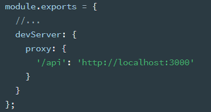
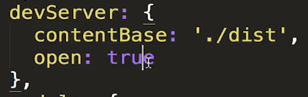
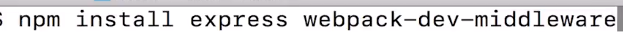

# mode

环境构建，值为 production 和 delepment

如果是 production，会自动启用 UglifyJSPlugin 进行压缩

- 也可以在命令行接口中使用 --optimize-minimize 标记，来启用 UglifyJSPlugin

## webpack-merge

为了避免重复配置，通常会准备一个通用配置，然后再分别部署开发和生产环境。

merge 可以进行合并

**以下内容都针对开发环境**

## [devtool](https://webpack.js.org/configuration/devtool#devtool)

```js
mode: "development",
devtool: "source-map",
```

会减慢编译速度，所以就开发用

### source-map

仅用于开发环境，报错时会生成一个.map 文件，用来映射，定位到原本没合并的 js 的第一行第几列。

方便调试

### inline-source-map

和 source-map 作用一样。

打包时候的 inline 生成的 map 是合并到 output 生成的 js 里。而 source-map 是单独一个 map 文件

### cheap-source-map

同 source-map，但是只会定位到第几行，没有第几列

### cheap-module-source-map

推荐生产环境报错时排查错误用。一般来说生产环境不需要开启 devtool

不仅包括本身的代码，还会映射 loader、第三方引入模块

### eval

不再生成 map 文件，而是使用 eval 关键字，并指向源文件。速度最快

但有时候定位不太准

### cheap-module-eval-source-map（推荐）

类似 eval，但还会包括 loader、第三方模块等报错

定位也可能不准

## [devServer](https://webpack.js.org/configuration/dev-server/#devserver)：webpack-dev-server 的配置

webpack-dev-server

创建一个服务器，并实时重新加载。只要代码改变就会重新打包，刷新浏览器

需要额外安装

`npm install --save-dev webpack-dev-server`

在 npm scripts 内使用

```json
"dev": "webpack-dev-server --inline --host 0.0.0.0 --progress --config build/webpack.dev.conf.js"
```

实际上也会进行打包，但是不生成 dist 等文件夹，而是直接放到了内存中，文件夹看不到生成的内容

### 涉及的模块

#### http-proxy-middleware

webpack 内置，可以使用 proxy 进行代理



### 配置项



#### contentBase

#### open

自动打开默认浏览器，并访问地址

#### allowedHosts

允许访问的服务器

#### proxy

#### port

端口号

#### hot

为 true 时进行热模块更新。只加载改变的内容，不会刷新整个页面

需要引入 webpack 内置的[HotModuleReplacementPlugin](./03_plugins.md#模块热替换hot-module-replacemment)

还要加额外的代码。

用在 CSS 上，loader 会自己进行处理。

如果自己写的 JS 改变了就要加额外的代码

在需要热更新的 JS 上进行判断，比如重新执行一个方法

```js
if (module.hot) {
  module.hot.accept('./hello.js', function() {
  Hello();
})
```

#### hotOnly

通常和 hot 一起用，为 true 时，如果修改的模块不支持热更新，就不会刷新页面，而是抛出警告。

不写就是只要改变内容就热更新

## 扩展：webpack-dev-middleware

把 webpack 处理后的的文件传给服务器

比如用 Express 代替 webpack-dev-server 实现实时加载的功能



准备一个文件比如叫 server.js。如果是 express，直接敲命令 node server.js

在 node 内使用 webpack 见官网[API](https://webpack.js.org/api/node) Node Interface

```js
const express = require('express')
const webpack = require('webpack')
const webpackDevMiddleware = require('webpack-dev-middleware')
const config = require('./webpack.config.js') //引入webpack配置文件
// 在node中直接使用webpack
const compiler = webpack(config)

const app = express()
//使用webpack-dev-middleware中间件
//第一个参数是webapck打包，第二个是打包的额外配置项
app.use(
  webpackDevMiddleware(compiler, {
    publicPath: config.output.publicPath
  })
)

app.listen(3000, () => {
  console.log('server is running')
})
```
