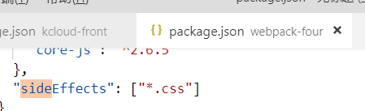
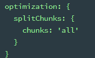
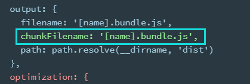
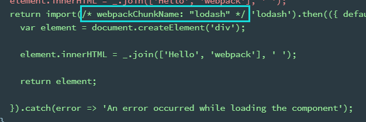
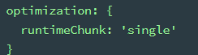

# 优化：optimization

## Tree Shaking：只打包用到的模块

只能用在 ES module 上，也就是只能 import, 不能用在 require

mode 是 production 时会自动开启

mode 是 development 需要手动加入

```js
optimization: {
  usedExports: true
},
output: {
  filename: "index.min.js",
  path: path.resolve(__dirname, "dist") //必须是绝对路径
}
```

### package.json

开启 tree shaking 之后 webapck 只解析有导出(export)的模块

像是 babel-pollyfill，并没有导出，而是
全局重写的 promise 等，为了保证类似 pollyfill 模块的正常使用，需要在 package.json 内单独配置这些

常用的比如 import xx.css

```json
"sideEffects": ["*.css"]
```



### 作用

webpack 入口文件有很多依赖的模块。实际情况中，虽然依赖了某个模块，但其实只使用其中的某些功能。  
通过 tree-shaking，将没有使用的模块摇掉，这样来达到删除无用代码的目的

### 原理

[参考](https://juejin.im/post/5a4dc842518825698e7279a9)  
利用的是 ES6 module 的依赖关系确定性  
ES6 module 的特点

- 只能在顶层出现
- 模块名只能是字符串常量
- 导入后的模块在当前 js 是不可变的
  这样就可以进行静态分析，不需要执行引入模块的代码。

### 缺陷

无法消除类的方法。由于`prototype`的继承，分析依赖会比较困难  
例如下面是一个"senhai.js", 如果删掉整个"senhai.js"，对原生`Array`的自定义`unique`方法也没了，可能引起报错

```js
function Senhai() {}

Senhai.prototype.servant = function() {}

var a = 'Saber' + 'Alter',
  b
if (a == 'QB') {
  b = Array
} else {
  b = Senhai
}
b.prototype.unique = function() {
  // 将 array 中的重复元素去除
}

export default Senhai
```

## Code Spliting: splitChunks



抽取公共的依赖文件到单个文件里面。适用于同步代码

如果是[异步引入](https://webpack.js.org/guides/code-splitting/#root)，比如 Promise，那么 webpack 会自动处理，不需要配置 optimization，但如果配置了 splitChunks，也会影响异步引入生成的结果

```js
chunks: 'async', //异步代码进行code splitting, 配成"all"打包所有
```

### 配置





注释内的 webpackChunkName 表示动态引入的插件名字

到时候打包的名字会叫 lodash.bundle.js

splitChunks 的配置见官网[split-chunks-plugin](https://webpack.js.org/plugins/split-chunks-plugin/)

解释见 Dell Lee
[慕课网](https://coding.imooc.com/class/316.html#mid=22363)4.5，4.6 节

## runtimeChunk



设置为"single"之后，根据提供的选项将运行时代码拆分成单独的块

见[缓存](./10_usage.md#缓存)

## 常见优化手段

1.  更新到最新版本

2.  尽可能使用 include，少用 plugin，比如开发环境不需要压缩

3.  减少[resolve](./04_loader.md#自定义loader)

4.  用[dllplugin](./03_plugins.md#DllPlugin)配置第三方模块，第一次打包后不再反复打包

5.  合理使用[sourceMap](./06_mode.md#cheap-module-eval-source-map)
6.  其他:
    [官网](https://webpack.docschina.org/guides/build-performance/)
