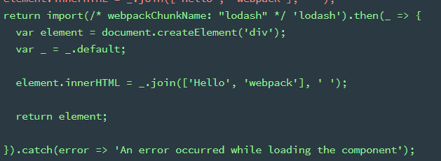
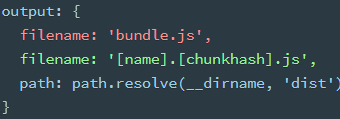
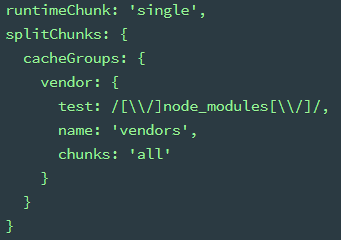
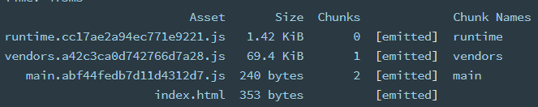
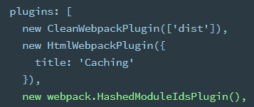

# 使用

## 模块化

### import 按需加载

import('path/to/module') -\> Promise

#### webpackChunkName

设置 output 的 filename/chunkFilename。比如下图导出会叫被命名为 lodash.bundle.js
，而不是 [id].bundle.js

## 缓存

确保 webpack
编译生成的文件能够被客户端缓存，而在文件内容变化后，能够请求到新的文件

### 修改文件名[chunkhash]

每次编译的时候，只要内容修改，那么文件名会改变。

如果内容无修改，那么文件名可能会变，可能不会

### optimization.runtimeChunk

runtime 指的是 webpack 的运行环境(具体作用就是模块解析, 加载) 和 模块信息清单

模块信息清单在每次有模块变更(hash 变更)时都会变更，可以单独把这部分代码打包出来

optimization.runtimeChunk 就是告诉 webpack 是否要把这部分单独打包出来

通过 cacheGroups，将第三方库(library)（例如 Vue）提取到单独的 vendor 文件中

### HashedModuleIdsPlugin

上面的 vendor 是根据 module.id 来的，而每次修改的时候 module.id 都会+1。为了让 vendor 不根据 module.id 变化，引入 HashedModuleIdsPlugin，改成根据模块的路径生成

